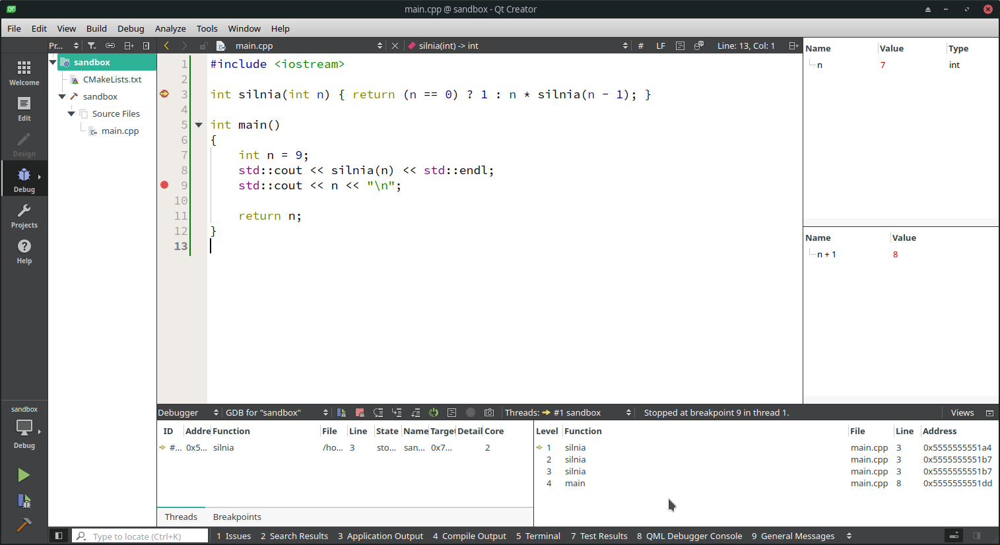
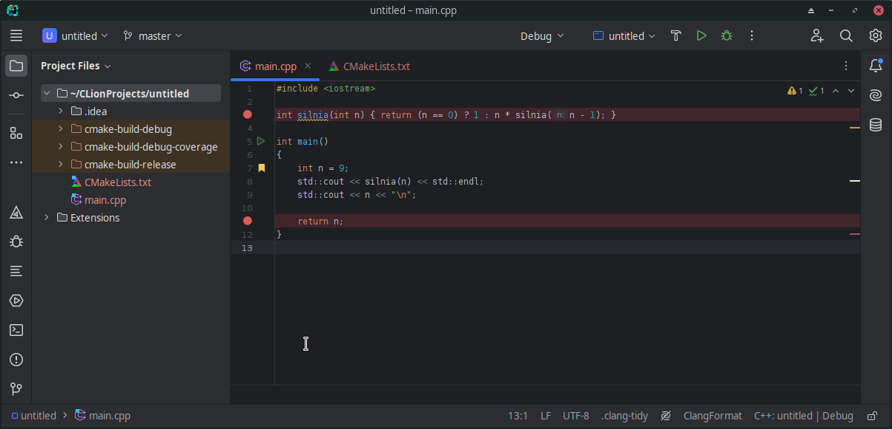
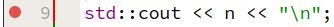
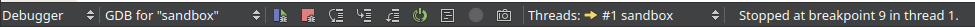
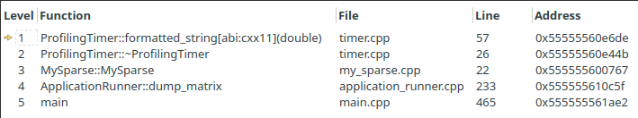
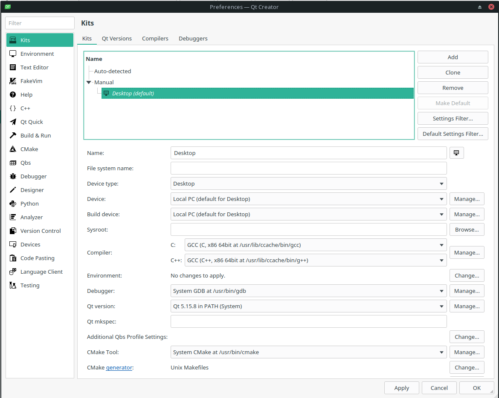
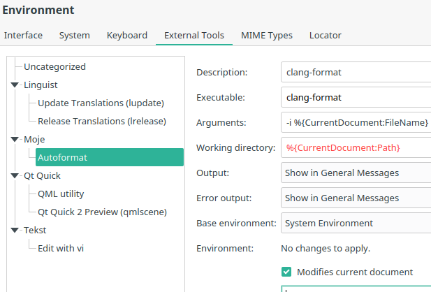
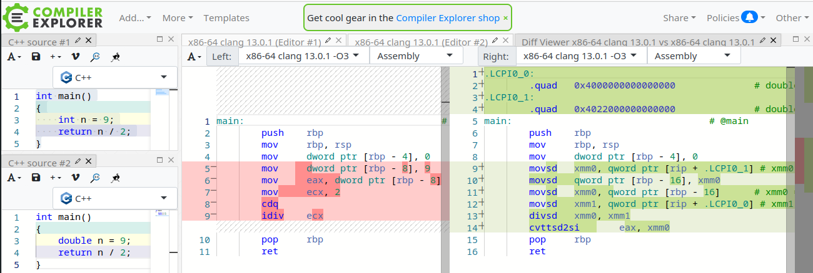

## Narzędzia

Łatwość użytkowania nigdy nie była naczelnym celem projektu Języka C++. Wydaje się, że zawsze była ona wtórna wobec innych jego cech, a zwłaszcza łatwości kompilacji napisanych w nim programów do efektywnego kodu wykonywalnego. Z założenia C++ jest bowiem językiem "dla profesjonalistów", dlatego programowanie w C++ charakteryzuje się stosunkowo stromą *learning curve*. Oznacza to, że potrzeba stosunkowo dużo informacji, by móc się nim efektywnie posługiwać, i całkiem sporo pracy, by posługiwanie się nim zaczęło sprawiać przyjemność.

Żeby ułatwić sobie życie i skrócić czas nauki, należy koniecznie wraz z samym językiem uczyć się sposobów posługiwania się nim. Jednym z elementów "ekosystemu" C++ są narzędzia, czyli programy zaprojektowane przez programistów dla programistów, których celem jest ułatwienie pisania efektywnego i poprawnego kodu w C++.

Aby posługiwać się C++ na elementarnym poziomie, potrzebujesz (poza systemem operacyjnym) dwóch programów:
- kompilator C++
- edytor tekstu

Jeżeli na tym poprzestaniesz, to będziesz pracować narzędziami na poziomie lat 70. ubiegłego wieku. To mniej więcej tak, jak by wzorem średniowiecznej szlachty kąpać się co najwyżej raz w roku. Można, ale po co.

Jeżeli chcesz, by praca z C++ była w miarę komfortowa, potrzebujesz przede wszystkim tego:
- zintegrowane środowisko programistyczne (ang. IDE)

### IDE ###

Z punktu widzenia osób uczących się C++ cała bieda w tym, że nie istnieje jedno środowisko programistyczne (IDE, *integrated development environment*) dla języka C++. Język C++ nie należy do żadnej firmy, nie istnieje więc ani wiodący kompilator, ani wiodący edytor, ani wiodące zintegrowane środowisko programistyczne.

Niektóre narzędzia są ograniczone do jednej platformy (np. tylko do Windows), niektóre są uniwersalne. Musisz wybrać jedno z nich i trzymać się go przez co najmniej semestr. Wikipedia podaje dość długą listę zintegrowanych środowisk programistycznych dla C++: https://en.wikipedia.org/wiki/Comparison_of_integrated_development_environments. Spośród cech pożądanych w IDE należy wyróżnić:

- koszt (co najmniej darmowa licencję studencka)
- zintegrowany debugger
- obsługa projektów (najlepiej: w systemie CMake)
- autouzupełnianie
- statyczna analiza kodu
- zintegrowany zestaw narzędzi kompilatora
- obsługa refaktoryzacji kodu

Od lat nie używam Windows, dlatego nie mogę doradzić, czego używać w tym systemie. Podobno **Visual Studio Code** jest OK. Ja używam wieloplatformowego narzędzia **QtCreator**. Rozsądnie wyglądające alternatywy to **Clion** (z darmową licencją akademicką), **CodeLite**, i **Cevelop**. W szczególności, QtCreator, Clion i Visual Studio Code są wykorzystywane w projektach komercyjnych. Wielu studentów zaczyna programować w C++ w wieloplatformowym środowisku Code::Blocks. Problem z nim jest taki, że łatwo w nim zacząć, ale trudno skończyć; inaczej: łatwo zaczyna się w nim pracę, ale trudno pisze zaawansowane projekty. 

Tak wygląda standardowe okno w programie QtCreator (podczas sesji z debugerem):



A tak wygląda okno programu CLion (podczas edycji):



Każdy z tych programów to "kombajn" z dziesiątkami, jeśli nie setkami opcji. Większość z nich przeznaczona jest dla zaawansowanych użytkowników, nie musisz ich od razu wszystkich znać, żeby pisać ciekawe aplikacje w C++. Oba programy są intuicyjne w obsłudze, posiadają znakomitą dokumentację (np.: https://www.jetbrains.com/clion/learn/). QTCreator jest bardziej zorientowany na pisanie programów w Qt, ale doskonale sprawdza się w każdym innym projekcie języka C++, z kolei CLion jest w dużym stopniu zgodny z wieloma innymi popularnymi produktami firmy Jetbrains, np. Android Studio (aplikacje pod system Android) czy PyCharm (python), więc przy mianie technologi / języka programowania nie trzeba się wszystkiego uczyć od nowa. 

Kolejny problem polega na tym, że zintegrowane środowiska programistyczne to zaawansowane edytory tekstu połączone wieloma narzędziami zewnętrznymi. To oznacza, że zwykle wymagają konfiguracji. Innymi słowy, użytkownik może się zdziwić, że tuż po instalacji program nie działa, albo działa w sposób ograniczony. Dzieje się tak w sytuacji, gdy nie zainstalowaliśmy tych dodatkowych narzędzi (czasami instalowanymi jako programy zewnętrzne, czasami jako "wtyczki").

W przypadku QtCreatora warto sprawdzić, czy mamy zainstalowane:
- kompilator (np. `gcc`, `clang`)
- debugger (np. `gdb`)
- `cmake`
- `make` (lub `ninja`, lub inny system budowania programów)
- `clangd`
- `clang-format`
- `Qt` (QtCreator wymaga instalacji biblioteki Qt nawet, jeżeli jej nie używamy)

### Zintegrowany debuger ###

Debuger to program pozwalający śledzić wykonywanie programu. Innymi słowy, jest to program, przy pomocy którego możemy przerwać działanie programu (np. napisanego w C++) i dokonać inspekcji jego stanu. Programiści z reguły nie posługują się debugerami bezpośrednio, lecz raczej preferują nakładki graficzne na swoje ulubione zintegrowane środowisko programistyczne. Przykład sesji z takim zintegrowanym debugerem przedstawia powyższy zrzut ekranu z programu QtCreator. 

Podstawowym działaniem podczas pracy z debugerem jest ustalenia w kodzie programu tzw. punktów przerwania (ang. *breakpoints*). Zwykle wystarczy w tym celu kliknąć obok numeru wiersza, co powinno skutkować wyświetleniem czerwonego kółka:

 

Debuger w programie QtCreator uruchamia się trójkątem z "robaczkiem" symbolizującym błąd w programie, a w CLion - po prostu ikonką "robaczka":

- QTCreator (okolice lewego dolnego rogu okna aplikacji) :  

- CLion (okolice prawego górnego rogu okna aplikacji) : 

Debugerem w zintegrowanych środowiskach programistycznych można sterować za pomocą menu głównego (mało wygodne, ale łatwe do zapamiętania), skrótów klawiaturowych lub przycisków na belce tytułowej okienka interfejsu debugera. Poniżej przykład z programu QtCreator:

  

Znaczenie każdego z przycisków można łatwo sprawdzić za pomocą pomocy tooltipów. Najważniejsze, obecne w każdym zintegrowanym debugerze, to:

-  Uruchom / kontynuuj debugowanie 
-  Zakończ pracę z debugerem (*stop debugger*)
-  Zatrzymaj się za całą bieżącą instrukcją (*step over*) 
-  Zatrzymaj się za bieżącą instrukcją lub na początku wywołania najbliższej funkcji, o ile bieżąca instrukcja wymaga wywołania funkcji (*step into*)
-  Zatrzymaj się za bieżącą funkcją (*step out*)

Obok okienka debugera zwykle wyświetla się też okno ze zmiennymi lokalnymi, które może wyglądać tak:

 

aczkolwiek nowoczesne IDE, jak QtCreator czy CLion wyświetlają też wartości zmiennych jako tzw. "adontacje" przy kodzie źródłowym kodu źródłowego programu. Kolejnym ważnym oknem, z którego korzysta się przy debugowaniu programów, jest tzw. *call stack*:

  

W powyższym przykładzie widzimy, że debuger (w innych oknach) wyświetla informacje o stanie programu zatrzymanego w wierszu 57 pliku `timer.cpp` (żółta strzałeczka na lewym marginesie), że ten wiersz został wywołany z wiersza 26 tego samego pliku, ten z kolei został wywołany w wierszu 22 pliku `my_sparse.cpp`, ten z wiersza 233 pliku `application_runner.cpp`, a ten z wiersza 465 pliku `main.cpp`. W lewej kolumnie widzimy też nazwę każdej z funkcji wywoływanej w danym stanie programu. 

### Projekty

Języka C++ nie stworzono z myślą o niewielkich programach, które zmieszczą się w jednym pliku. Poza programami szkolnymi i studenckimi, programy w C++ z reguły składają się z kilku, kilkunastu, kilkuset, a nawet tysięcy plików źródłowych. Projekty to sposób radzenia sobie z tą złożonością przez programistów i/lub zintegrowane środowiska programistyczne. Projekty zawierają informacje o tym, z jakich plików składa się program lub zestaw programów, z jakich bibliotek korzystają, jak mają być one kompilowane, gdzie i pod jakimi nazwami mają zostać zapisane wyniki kompilacji, gdzie kompilator ma przechowywać pliki pośrednie kompilacji itp. Niestety, nie ma tu żadnych standardów. Microsoft Visual Studio Code ma swój domyślny format projektów, świat Linuksa ma swoje (np. `Makefile`), poszczególne IDE mają swoje (np. `Code::Blocks` czy `CodeLite`), istnieją także rozwiązania uniwersalne. Należy do nich zdobywający bardzo dużą popularność system CMake.

Początkujący programiści C++ boją się projektów. To błąd. Jeżeli jakieś zintegrowane środowisko programistyczne potrafi działać nawet bez projektów (podobno Dev-C++ tak potrafi), to z reguły wiąże się to z wyłączeniem większości udogodnień oferowanych przez współczesne IDE, a więc możliwości debugowania kodu czy też korzystania z autouzupełniania czy dynamicznej analizy kodu podczas jego pisania. Bez projektów środowiska programistyczne są w stanie dostrzec co najwyżej jeden plik. Nie tak działa C++.

### CMake

CMake to uniwersalny system definiowania projektów w C++. Jego uniwersalność polega na tym, że ten sam projekt działać będzie praktycznie w każdej współczesnej wersji systemów operacyjnych, w tym Windows, Linux, Unix, MacOS i z każdym współczesnym kompilatorem C++, co ułatwia rozwijanie oprogramowania w grupach (w tym składających się z osób pracujących zdalnie) oraz pracę z narzędziami dostępnymi w chmurze. Programista pisze program zgodny ze standardem C++, a resztą zajmuje się CMake. 

Projekty CMake zawsze definiujemy tu w pliku o nazwie `CMakeLists.txt`. Przykładowy plik `CMakeLists.txt` wygląda następująco:

``` cmake
cmake_minimum_required(VERSION 3.10)
project(lista1)
set(CMAKE_CXX_STANDARD 17)

add_executable(zad1 zad1.cpp)
add_executable(zad2 zad2.cpp)
add_executable(zad3a zad3a.cpp)
add_executable(zad3b zad3b.cpp zad3b.h)

target_link_libraries(zad2 PUBLIC fmt)
```

Załadowanie tego pliku do IDE obsługującego system `cmake` (np. QtCreator lub CLion) i uruchomienie kompilacji spowoduje wygenerowanie 4 plików wykonywalnych, `zad1`, `zad2`, `zad3a` i `zad3b`, co odczytujemy z argumentów funkcji `add_executable`. Każdy z nich będzie generowany z jednego lub 2 plików, np. `zad1` zostanie wygenerowany z `zad1.cpp`, a `zad3b` z `zad3b.cpp` i `zad3b.h`. Prawda, że proste?Warto zwrócić uwagę na to, że w skryptach CMake argumentów funkcji nie oddziela się przecinkami. Dodatkowo, na podstawie postaci argumentów funkcji ` target_link_libraries` widzimy, że program `zad2` korzysta z zewnętrznej (tzn. nienależącej do biblioteki standardowej C++) biblioteki `fmt`. Tu trzeba pamiętać, że drugi argument ma postać `PUBLIC` lub `PRIVATE`, a dopiero kolejne zawierają nazwy bibliotek, z którymi ma łączyć się program (tu: `zad2`). Ponadto projekt nazywa się `lista1` (co definiuje funkcja `project`). Łatwo się też domyślić, że instrukcja `set(CMAKE_CXX_STANDARD 17)` ustala minimalny standard języka, w jakim ma być kompilowany program (lub programy). Z kolei instrukcja `cmake_minimum_required(VERSION 3.10)` informuje `CMake`, w jakiej wersji systemu `CMake` napisano dany skrypt: wersję 3.10 powinien umieć przetworzyć program `cmake` w wersji 3.10 lub dowolnej późniejszej. W szczególności w chwili pisania tych słów w moim komputerze zainstalowana jest wersja 3.28.3.

Projekty przechowujemy w osobnych katalogach, dzięki czemu utrzymujemy w pracy porządek. Każdy projekt posiada główny skrypt `CMakeLists.txt` (i być może inne pliki `CMakeLists.txt` w podprojektach). Ten skrypt przechowuje się w repozytorium systemu kontroli wersji razem z plikami źródłowymi. 

CMake to bardzo rozbudowany system, sama jego biegła znajomość to w niemal gwarancja uzyskania dobrej pracy, na razie jednak w zupełności wystarczyć powinien powyższy przykład. Kolejne etapy wtajemniczenia w `cmake` to obsługa zewnętrznych bibliotek, ale tym zajmiemy się później.

### Zestawy narzędzi, czyli *Toolchains* i *kits*

Zintegrowane środowiska programistyczne zwykle posługują się zestawami narzędzi. Mogą one występować pod różnymi nazwami, np. *toolchain* lub *kit*. Są one niezależne od definicji umieszczonych w `CMakeLists.txt` lub innych plikach definiujących projekt jako zbiór plików źródłowych i bibliotek. Zestawy narzędzi wprowadzono, by umożliwić programistom szybką zmianą kompilatora (lub innego narzędzia z zestawu, lub fragmentu środowiska kompilatora) np. w celu przetestowania kompilacji programu w różnych konfiguracjach. Dla programisty C++ istotne jest to, że bez poprawnego zdefiniowania choć jednego zestawu narzędzi, nasze ulubione IDE niczego nie skompiluje, co będzie przyczyną frustracji i może nawet prowadzić do zniechęcenia i porzucenia danego IDE.

W (niespolonizowanym) QtCreatorze zestawy narzędzi nazywają się "kit". Można je skonfigurować, wybierając w menu `Edit/Preferences/Kits`, por. poniższy obrazek:



Warto zwrócić uwagę na to, że definicja samego "kit"-u obejmuje 4 zakładki (poziome, na górze okna): `Kits`, `Qt Versions`, `Compilers` i `Debuggers`. Każda musi być zdefiniowana poprawnie, aby zestaw narzędzi był użyteczny. Z kolei `Kits` to tylko niewielki fragment możliwości dostosowania środowiska programistycznego do własnych potrzeb (por. lista w kolumnie po lewej, od `Kits` po `Testing`). Ja w nowych instalacjach QtCreatora zawsze:

- włączam statyczną analizę kodu (`Edit`/`Preferences`/`C++`/`use clangd`) ;
- podpinam formatowanie kodu źródłowego zewnętrznym programem `clang-format` (`Edit`/`Preferences`/`Environment`), a następnie wypełniam okno dialogowe jak na poniższym rysunku;
- podpinam to narzędzie do skrótu klawiaturowego (sąsiednia zakładka `Keyboard`w opcjach).

 

Oczywiście trzeba wcześniej zainstalować te programy (u mnie są one instalowane wraz z pakietami `cling` i `clang`). Dodatkowo warto skonfigurować program `clang-format` zgodnie z własnymi upodobaniami. Tu jest mój plik konfiguracyjny, trzymam go w swoim katalogu domowym: [download .clang-format](./.clang-format).

### Narzędzia dostępne w internecie

Istnieje kilka "zintegrowanych środowisk programistycznych" napisanych jako aplikacje webowe i udostępnionych w Sieci. Posiadają one różne zakresy możliwości. Na przykład [OnlineGDB](https://www.onlinegdb.com/online_c++_compiler) umożliwia debugowanie programów (i obsługuje kilkadziesiąt języków programowania). Z kolei [Compiler Explorer](https://godbolt.org) to narzędzie umożliwiające równoległe wyświetlanie kodu źródłowego i odpowiadającego mu kodu w assemblerze. Na przykład, na poniższym obrazku możemy porównać, czym, z punktu widzenia kompilatora (i procesora) różni się dzielenie liczb typu `int` (okienko po środku) i `double` (po prawej) - okienka te przedstawiają obraz programów z okienek po lewej skompilowanych z C++ do asemblera. Warto nadmienić, że serwis ten obsługuje kilkadziesiąt języków programowania, w tym tak ciekawe, jak Java, Kotlin czy Python, które są kompilowane do [kodu bajtowego](https://pl.wikipedia.org/wiki/Kod_bajtowy) (*bytecode*).




***

 Ostatnia zmiana: 22 lutego 2024

