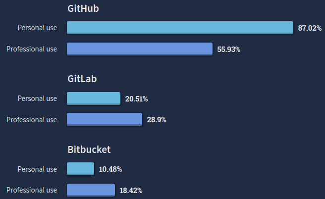

## BitBucket, GitHub i Gitlab

BitBucket, GitHub i GitLab to najpopularniejsze dziś serwisy chmurowe rozproszonego systemu wersji git, por. [ankieta](https://survey.stackoverflow.co/2022/#section-version-control-version-control-platforms0) przeprowadzona w serwisie StackOverflow w 2022 r.:



Należy wybrać jeden z nich. Następnie go skonfigurować. W zasadzie konfiguracja sprowadza się do skonfigurowania bezpiecznego połączenia z serwisem, ułatwiającego interakcję z nimi. W tym celu wystarczy w Googlu zapytać np. "GitHub + ssh configuration" i znaleźć stronę, na której możemy skonfigurować nasz serwis. Np. dla BitBucketa jest to strona [SSH keys](https://bitbucket.org/account/settings/ssh-keys/).  Na tej stronie będzie przycisk `Add key` lub podobny. Wyświetli się okienko jak to poniżej:


Musimy teraz w polu`Key` wpisać swój klucz publiczny. W systemie Linux generuje się go poleceniem

```bash
> ssh-keygen
```

które w katalogu `.ssh` głównego katalogu naszego konta generują dwa pliki: jeden z kluczem prywatnym, a drugi - z publicznym. Ten publiczny kopiujemy do okienka konfiguracyjnego serwisu BitBucket, GitHub lub GitLab. I koniec. Teraz możemy komunikować się z tym serwisem za pomocą protokołu SSH, np.

```bash
> git clone git@github.com:zkoza/cpp-issp.git
```

bez konieczności każdorazowego podawania hasła.

W przypadku niejasności - Google pomoże. Każdy z opisywanych tu serwisów ma doskonałą dokumentację ich konfiguracji.
