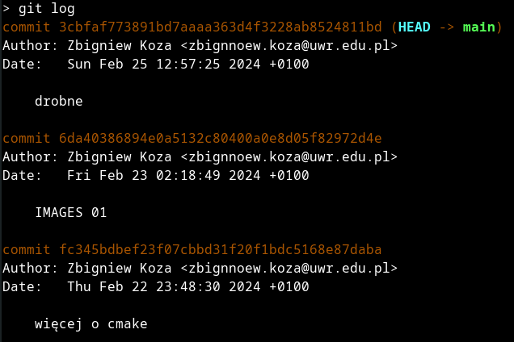
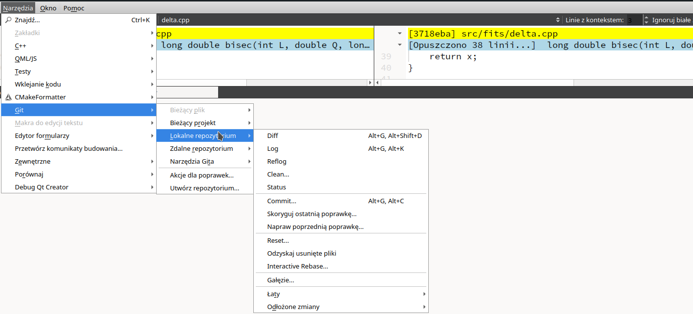

# Git

Git to obecnie najpopularniejszy, rozproszony system wersjonowania oprogramowania. Wersjonowanie polega na tworzeniu "migawek" czy swoistych "zdjęć" aktualnego stanu oprogramowania, powszechnie zwanych komitami (z angielskiego *commit*). Dzięki temu w każdej chwili można porównać np. bieżący stan jakiegoś pliku z tym sprzed jakichś zmian. Z kolei "rozproszony" oznacza, że nie istnieje jeden centralny serwer przechowujący repozytorium - zamiast tego każdy użytkownik danego repozytorium posiada u siebie lokalnie (czyli na własnym komputerze) pełną kopię całego repozytorium, z całą historią zmian. Oba te elementy, czyli migawki ("wersjonowanie") i rozproszenie (brak centralnego serwera) uzupełniane są o trzeci fundamentalny element: gałęzie (ang. *branches*). Łącznie tworzą system który bardzo, bardzo, bardzo ułatwia zarządzanie projektami programistycznymi (zwłaszcza tymi dużymi) i pracę w grupie. Taka praca z grubsza polega na tym (w bardzo dużym uproszczeniu), że jednym z "uczestników" grupy jest serwer ulokowany w chmurze (zwykle na serwisie BitBucket, GitHub lub GitLab, ale może to być też serwer prywatny lub firmowy), który służy jako uniwersalny pośrednik między członkami zespołu przechowujący "backup" projektu i ułatwiający synchronizację między członkami zespołu, z których każdy pracuje we własnym tempie nad innymi fragmentami projektu. W systemie git istnieje gałąź główna (zwykle zwana *master* lub *main*) przechowująca migawki oprogramowania w stanie, w którym ono działa stabilnie (niektóre z nich mogą być oznaczone specjalną etykietą ("otagowane", z ang. *tagged*) , np. numerem wersji programu). Programiści z ostatniej migawki w tej gałęzi tworzą osobną gałąź, która co prawda jest widoczna dla wszystkich, ale obowiązuje umowa, że nie pracuje się na nieswoich gałęziach. Na takiej bocznej gałęzi implementuje się nowa funkcjonalność lub usuwa zgłoszony błąd lub podejmuje inne czynności modyfikujące program. Ponieważ taka praca zwykle wymaga eksperymentowania i program od czasu do czasu po prostu przestaje działać prawidłowo, całą te pracę wykonuje się na osobnej gałęzi. Gdy pracujący na niej programista uzna, że jego zadnie zostało wykonane, zgłasza tzw. *pull request* (inna nazwa: *merge request*), jego poprawki są recenzowane przez innego członka (lub członków) zespołu i w przypadku akceptacji - włączane do gałęzi głównej (tę operacje nazywa się z angielskiego merdżowaniem, ang. *merging*). Gałąź robocza w tym momencie przestaje być użyteczna, zwykle się ją usuwa i tworzy nową, do realizacji nowego zadania. Cała trudność tego stylu pracy polega na tym, że zwykle jednocześnie otwartych jest kilkanaście czy nawet kilkadziesiąt gałęzi roboczych, w tym kilka w stanie "*pull request*", a praca w każdej z nich przebiuega we własnym tempie, co przypomina programowanie współbieżne. Ktokolwiek programował współbieżnie ten wie, że jego najtrudniejszą częścią jest synchronizacja. Popularność systemu git bierze się stąd, że dostarcza on znakomite narzędzia ułatwiające pracę w takim "współbieżnym środowisku programistycznym", w którym zmiany w gałęzi głównej pojawiają się często i w sposób zasadniczo niekontrolowany (a na pewno nie planowany) przez nikogo. Innymi słowy - mogę pracować nad swoim zdaniem przez 2 tygodnie, w tym czasie w gałęzi głównej mogło pojawić się kilkadziesiąt nowych migawek (komitów), a ja i tak mam spore szanse automatycznie wmerdżować swoją pracę do gałęzi głównej, a jeśli ta automatyka nie zadziała (co przypomina tzw. wyścig w programowaniu współbieżnym), to mam narzędzia do rozstrzygnięcia konfliktów, których nie można rozwiązać automatycznie.                       

### Rady dla osób początkujących

- Załóż sobie konto na jednym z serwisów (alfabetycznie) : [bitbucket.org](/bitbucket.org), [github.com]() lub [gitlab.com](). Z punktu widzenia osób początkujących wszystkie oferują podobne funkcjonalności, z punktu widzenia użytkowników zaawansowanych różnią się cennikami (w tym limitami zasobów w wersji darmowej) i dodatkowymi usługami (jak systemy kontroli przepływu pracy, organizacji automatycznego testowania itp.). Najpopularniejszy jest chyba GitHub, m.in. dlatego, że był jednym z pierwszych publicznych serwisów dla systemu git i w tamtych czasach zaczęto go powszechnie wykorzystywać w projektach typu OpenSource. Pozostałe dwa serwisy są jednak także bardzo dobre i oczywiście każdy z nich wykorzystywany jest też komercyjnie. Tu jest jedno opisów i porównań tych serwisów: [Github vs Gitlab vs Bitbucket](https://disbug.io/en/blog/github-vs-gitlab-vs-bitbucket). Historycznie ja jako pierwszy zacząłem używać BitBucket tylko z tego powodu, że wówczas w ramach licencji darmowej pozwalał na tworzenie repozytoriów prywatnych z dość dużą maksymalną liczbą użytkowników. Twoje priorytety mogą być inne.   

- Nowe projekty zakładaj w repozytorium chmurowym (BitBucket, GitHub, GitLab,...), klonuj je u siebie (czyli importuj puste repozytorium z serwera w chmurze) i od tej pory pracuj normalnie jak z repozytorium git. Przykład polecenia klonującego bieżący "podręcznik" za pomocą połączenia SSH:
  ```bash
  git clone git@github.com:zkoza/cpp-issp.git
  ```

  Alternatywne polecenie wykorzystuje do komunikacji z serwerem protokół HTTP:

  ```bash
  git clone https://github.com/zkoza/cpp-issp.git
  ```

  Konfigurację połączenia SSH opisuję gdzie indziej - dzięki niemu możesz się łączyć z serwerem bez konieczności każdorazowego podawania hasła. 

- Przed wykonaniem pierwszej migawki swojego projektu skonfiguruj swoje dane osobowe:

  ```bash
  git config --global user.name "Grzegorz Brzęczyszczykiewicz-Łękowodzki"
  git config --global user.email grzegorz.brzeczyszczykiewicz.lekowodzki@example.com
  ```

  Jeśli zamierzasz pracować na gałęziach, to pewnie będziesz potrzebować narzędzia do merdżowania. Ja używam programu `kdiff3`:

  ```bash 
  git config --global merge.tool kdiff3
  ```

- Zapoznaj się z podstawowymi koncepcjami gita.

  - **Katalog roboczy** (*working area*).  Gdy pracujemy nad projektem i dokonujemy w nim jakichś zmian, np. zapisując nową wersję jakiegoś pliku, to te zmiany zapisywane są w naszym katalogu roboczym (ang. *working directory* - to pojęcie występuje w dokumentacji systemu Git). Mówiąc "katalog roboczy" ma się na myśli katalog główny (to ten, w którym występuje podkatalog `.git`) projektu wraz z wszystkimi podkatalogami (z wyjątkiem podkatalogu `.git`).

  - **Repozytorium** to zbiór plików z informacjami umożliwiającymi odtworzenie w twoim katalogu roboczym dowolnej wersji twojego projektu (=migawki, czyli komitu)  zapisanej w tym repozytorium. Repozytorium projektu przechowywane jest w jego katalogu `.git`. 

  - **Migawka**, w slangu komuterowym - komit (ang. *commit*) - to wersja twojego projektu "zamrożona i zapamiętana" w określonej chwili czasu w repozytorium. Migawki mają swoje unikatowe identyfikatory (tzw. klucze SHA1). Poniższy rysunek to zrzut ekranu z fragmentu wyniku polecenia `git log` dla projektu, który czytasz. Te długie liczby szesnastkowe po słowach commit to właśnie ich identyfikatory, a napisy "drobne", "IMAGES 01" i "więcej o CMake" to komentarze do migawek.   

    

  - **Indeks** Git to obszar przejściowy (ang. *staging area*) pomiędzy katalogiem roboczym a repozytorium.  Gdy pracujesz nad projektem, w pewnym momencie dochodzisz do wniosku, że osiągnął on stan wart utrwalenia (np. przed synchronizacją z inną gałęzią). Zwykle zmianom uległo kilka, czasem kilkadziesiąt, zdarza się, że kilkaset plików (np. gdy zmieniasz nazwę jakiejś funkcji lub importujesz nową bibliotekę lub ktoś pomyli umówiony standard kodowania końca wierszy). Wśród tych zmian mogą być też takie, w których usuwasz jakieś pliki lub zmieniasz ich nazwy. Tak poważnych operacji nie robi się w jednym kroku, lepiej i bezpieczniej jest przygotować migawkę stopniowo, plik po pliku. Może to wyglądać tak:

    ```bash    
    git status
    git diff plik1.cpp
    vim plik1.cpp
    git diff plik1.cpp
    git add plik1.cpp
    git status
    git diff plik2.cpp
    vim plik2.cpp
    git diff plik2.cpp
    git add plik2.cpp
    ... (i tak dalej z każdym plikiem)
    ```

    Tutaj 

    - `git status` informuje, w których plikach dokonano zmian od ostatniego komita i czy w katalogu roboczym pojawiły się nowe pliki nieuwzględnione w repozytorium.
    - `git diff` informuje, jakich zmian dokonano w danym pliku od jego ostatniego zatwierdzenia w migawce. 
    - `vim` to edytor tekstu. Zwykle po komendzie `git diff` zauważasz, że twój plik nie jest w najlepszej kondycji i coś w nim jeszcze poprawiasz (np. usuwasz niepotrzebne komentarze czy nadajesz zmiennym bardziej użyteczne nazwy). Oczywiście `vim` to ostateczność, ja normalnie używam QtCreator-a.  
    - `git add plik` dodaje `plik` do indeksu, ale nie tworzy migawki

    Dopiero gdy w ten sposób przetworzę wszystkie pliki, tworzę migawkę poleceniem `git commit`. Może to trwać wiele godzin i wymagać wielokrotnego "dodawania" tego samego pliku poleceniem `git add`, gdyż zmiany w kolejnych plikach mogą wywoływać zmiany w już zatwierdzonych (np. wskutek zmiany nazw funkcji). Dla ciekawskich: indeks git znajduje się w jednym pliku (binarnym) o nazwie `index`, który przechowywany jest w katalogu `.git` projektu.         

    Ten obrazek może nieco pomóc w zrozumieniu, czym jest index ([żródło](https://www.javatpoint.com/git-index)):

    

- Zapoznaj się z podstawowymi poleceniami Git-a

  - Praca z repozytorium lokalnym (każde z poniższych poleceń ma dziesiątki dodatkowych opcji!):

    - `git add plik1 plik2 ...`   - dodaje plik lub pliki do indeksu

    - `git mv plik nowa_nazwa` - zmienia nazwę pliku i zapisuje tę informację w indeksie 

    - `git rm plik1 plik2 ...`  - usuwa plik z indeksu (i kolejnych migawek w repozytorium)

    - `git diff plik1` - wyświetla różnice między bieżącym stanem pliku a jego ostatnią "skomitowaną" (zatwierdzoną w repozytorium) wersją.  

    - `git status` - podaje stan katalogu roboczego względem indeksu i lokalnego repozytorium.

    - `git commit -m"komunikat"` - tworzy migawkę w repozytorium

    - `git log` - wyświetla informacje o migawkach 

    - `git log plik` - wyświetla informacje o migawka, które zmieniały dany plik

    - `git checkout plik` - przywraca z repozytorium do katalogu roboczego stan danego pliku zapisany w ostatniej migawce. Innymi słowy, anulujemy w ten sposób wszystkie nasze zmiany od ostatniego komitu.  

    - `git help nazwa_polecenia` - git ma niezwykle rozbudowany system pomocy!  Spróbuj `git gelp git` lub (Linux) `man gittutorial`. Niemniej, ja chyba wolę czytać dokumentację w przeglądarkach WWW.  

    - `git config --list` - wyświetla listę wszystkich parametrów konfiguracyjnych twojej instalacji i/lub projektu. W systemie Linux one są zwykle zapisane w pliku `.gitconfig`.  Możesz mieć jeden taki plik w swoim katalogu domowym (wtedy mówimy o ustawieniach globalnych, opcja `--global` do komendy `git config`) lub katalogu głównym projektu (ustawienia lokalne). Na przykład w tej chwili polecenie 

      ```bash
      git config --list --global
      ```

      zwraca

      ```
      user.email=zbignnoew.koza@uwr.edu.pl
      user.name=Zbigniew Koza
      merge.tool=kdiff3
      ```

      co oznacza, że mam w konfiguracji błąd. Mogę go naprawić poleceniem `git config --global user.email`, jak to opisałem powyżej,  lub bezpośrednio edytując plik `.gitconfig`.

  - Nieco bardziej zaawansowana praca z repozytorium lokalnym:

    - `git branch` - tworzy nową gałąź
    - `git switch nazwa_gałęzi` - przechodzi na inną gałąź, co zwykle wiąże się z podmianą plików w katalogu roboczym projektu
    - `git merge nazwa_gałęzi` - dołącza zmiany wykonane na bieżącej gałęzi do gałęzi `nazwa_gałęzi`. 
    - `git mergetool` - uruchamia program do scalania (merdżowania) gałęzi i usuwania konfliktów, np. `kdiff3`. 
    - `git blame plik` - informuje, kto jest ostatnim autorem każdego wiersza  przechowywanego w repozytorium pliku `plik`.

  - Praca z repozytorium zdalnym:

    - `git push` - wysyła ("popycha") wszystkie nasze nowe migawki na serwer zdalny (domyślnie zwany `origin`) 
    - `git pull` - pobiera ("zaciąga") wszystkie nowe migawki, które mogły się pojawić na serwerze (`origin`) od ostatniej synchronizacji poleceniem `git pull`, a następnie łączy (merdżuje) je z naszym repozytorium.
    - `git fetch` - jak `git pull`, ale bez łączenia z lokalnym repozytorium.  Dzięki temu podejrzeć, jakie zmiany zaszły w repozytorium zdalnym.   


### Przykład

Gdy w tej chwili wykonam w swoim katalogu roboczym komendę `git status`, otrzymuję następujący wynik:

```
> git status
Na gałęzi main
Twoja gałąź i „origin/main” się rozeszły
i mają odpowiednio 1 i 1 różne zapisy.
  (use "git pull" if you want to integrate the remote branch with yours)

Nieśledzone pliki:
  (użyj „git add <plik>...”, żeby uwzględnić, co zostanie złożone)
	01a.md
	img/01/git-index.png
	img/01/git-log.png

nie dodano nic do złożenia, ale są nieśledzone pliki (użyj „git add”, aby śledzić)
```

Najwyraźniej na innym laptopie dokonałem jakichś zmian w repozytorium i zapomniałem zaciągnąć je na obecnie używaną maszynę. Dodatkowo w katalogu roboczym pojawiły się 3 pliki nieprzechowywane w repozytorium: ten, który czytasz `01a.md` i  dwa obrazy PNG. Można bezpiecznie wykonać `git pull` (w razie konfliktu z nowymi plikami, git przerwie merdżowanie).

```  
> git pull
podpowiedź: You have divergent branches and need to specify how to reconcile them.
podpowiedź: You can do so by running one of the following commands sometime before
podpowiedź: your next pull:
podpowiedź: 
podpowiedź:   git config pull.rebase false  # merge
podpowiedź:   git config pull.rebase true   # rebase
podpowiedź:   git config pull.ff only       # fast-forward only
podpowiedź: 
podpowiedź: You can replace "git config" with "git config --global" to set a default
podpowiedź: preference for all repositories. You can also pass --rebase, --no-rebase,
podpowiedź: or --ff-only on the command line to override the configured default per
podpowiedź: invocation.
fatal: Należy podać, jak godzić rozbieżne gałęzie.
```

Oho! To mój pierwszy kontakt (zaciąganie) z serwerem na tym laptopie. Muszę wybrać domyślną strategię merdżowania zmian. Ja używam starej metody (zwykły merge), więc piszę

 ``` 
 > git config --global pull.rebase false
 ```

Teraz ponownie próbuję wykonać `git pull`:

```
> git pull
Auto-scalanie toc.md
KONFLIKT (zawartość): Konflikt scalania w toc.md
Automatyczne scalanie nie powiodło się; napraw konflikty i złóż wynik.
```

Pech! Widocznie wcześniej zrobiłem komit lokalny z plikiem `toc.md` i jakiś komit na drugim laptopie, w tym samym pliku i mniej więcej w tym samym katalogu. Automatyczne łączenie repozytorium z serwera z moim lokalnym nie powiodło się.  Spróbuję rozwiązać konflikty za pomocą `kdiff3`.

```
> git mergetool 
Merging:
toc.md

Normal merge conflict for 'toc.md':
  {local}: modified file
  {remote}: modified file
```

No cóż, program rozwiązał konflikty automatycznie, nie pokażę obrazka z działania `kdiff3`. Jeszcze raz `git status`, żeby sprawdzić, w jakim stanie znajduje się projekt.

``` 
git status
Na gałęzi main
Twoja gałąź i „origin/main” się rozeszły
i mają odpowiednio 1 i 1 różne zapisy.
  (use "git pull" if you want to integrate the remote branch with yours)

Wszystkie konflikty naprawione, ale wciąż trwa scalanie.
  (użyj „git commit”, żeby zwieńczyć scalanie)

Zmiany do złożenia:
	zmieniono nazwę: "01-narz\304\231dzia.md" -> 01-narzedzia.md
	zmieniono:       toc.md

Nieśledzone pliki:
  (użyj „git add <plik>...”, żeby uwzględnić, co zostanie złożone)
	01a.md
	img/01/git-index.png
	img/01/git-log.png
	toc.md.orig
	toc_BACKUP_86190.md
	toc_BASE_86190.md
	toc_LOCAL_86190.md
	toc_REMOTE_86190.md
```

Program pisze, że można wykonać `git pull`, ale informuje też, że "wciąż trwa scalanie", czyli merdżowanie ze zdalnym repozytorium. Dodatkowo widzimy 5 nowych plików z `BACKUP`, `BASE`, `LOCAL`, `REMOTE` i `.orig` w nazwie. Zgodnie z radą, wykonujemy `git commit`:

```
> git commit
```

Program sam zaproponuje komentarz do scalenia (dlatego pominąłem opcje `-m` ), który jest zbyt długi i nudny, by go tu przytaczać. Sprawdzamy stan repozytorium:

```
> git status
Na gałęzi main
Twoja gałąź jest do przodu względem „origin/main” o 2 zapisy.
  (użyj „git push”, aby opublikować swoje zapisy)

Nieśledzone pliki:
  (użyj „git add <plik>...”, żeby uwzględnić, co zostanie złożone)
	01a.md
	img/01/git-index.png
	img/01/git-log.png
	toc.md.orig
	toc_BACKUP_86190.md
	toc_BASE_86190.md
	toc_LOCAL_86190.md
	toc_REMOTE_86190.md

nie dodano nic do złożenia, ale są nieśledzone pliki (użyj „git add”, aby śledzić)
```

Jak widać, git nie sugeruje już, byśmy zaciągnęli zmiany - one zostały pomyślnie scalone z naszym lokalnym repozytorium. Informuje za to, że nasze repozytorium jest o 2 migawki (komity) do przodu względem repozytorium zdalnego (`origin/main`) i że w katalogu roboczym mamy 8 nieśledzonych (czyli niezapisanych w repozytorium plików). Zgodnie z radą, używam `git add`, by dodać 3 pliki do indeksu. Mogę to zrobić od razu jednym, poleceniem:

```
> git add 01a.md img/01/git-index.png img/01/git-log.png
```

Teraz tworzę nową migawkę projektu (`git commit`): 

```
> git commit -m"opis git-a"
[main f483fda] opis git-a
 3 files changed, 133 insertions(+)
 create mode 100644 01a.md
 create mode 100644 img/01/git-index.png
 create mode 100644 img/01/git-log.png
```

Ponownie sprawdzam stan repozytorium:

```
> git status
Na gałęzi main
Twoja gałąź jest do przodu względem „origin/main” o 3 zapisy.
  (użyj „git push”, aby opublikować swoje zapisy)

Nieśledzone pliki:
  (użyj „git add <plik>...”, żeby uwzględnić, co zostanie złożone)
	toc.md.orig
	toc_BACKUP_86190.md
	toc_BASE_86190.md
	toc_LOCAL_86190.md
	toc_REMOTE_86190.md

nie dodano nic do złożenia, ale są nieśledzone pliki (użyj „git add”, aby śledzić)
```

Zostały tylko pliki, które zostały wygenerowane podczas scalania, gdy jego pierwsza próba się nie powiodła.  Mogę (a nawet powinienem, żeby nie zaśmiecać obszaru roboczego projektu) je ręcznie usunąć.  

```bash
> rm toc.md.orig toc_BACKUP_86190.md toc_BASE_86190.md toc_LOCAL_86190.md toc_REMOTE_86190.md
```

Teraz popycham swoje zmiany w repozytorium na serwer:

```
> git push 
Wymienianie obiektów: 21, gotowe.
Zliczanie obiektów: 100% (19/19), gotowe.
Kompresja delt z użyciem do 12 wątków
Kompresowanie obiektów: 100% (13/13), gotowe.
Zapisywanie obiektów: 100% (13/13), 50.60 KiB | 25.30 MiB/s, gotowe.
Razem 13 (delty 7), użyte ponownie 0 (delty 0), paczki użyte ponownie 0
remote: Resolving deltas: 100% (7/7), completed with 5 local objects.
To github.com:zkoza/cpp-issp.git
   b81b075..f483fda  main -> main
```

Operacja zakończyła się powodzeniem. Na koniec sprawdzam stan lokalnego repozytorium:

```
> git status
Na gałęzi main
Twoja gałąź jest na bieżąco z „origin/main”.

nic do złożenia, drzewo robocze czyste
```

Koniec kolejnego etapu pracy. Tekst, który przed chwila napisałem jest już dostępny na GitHubie.  

Warto jeszcze dodać, że współczesne zintegrowane środowiska programistyczne (IDE) posiadają zwykle zintegrowaną obsługę systemu kontroli wersji git. Trzeba tylko rozumieć, do czego te wszystkie opcje służą... Poniżej fragment menu "Git" z programu QtCreator z okienkiem "git diff" w tle:

  


I tu już naprawdę koniec, sorki, nie da się w tak krótkim opracowaniu napisać o systemie git więcej. 
