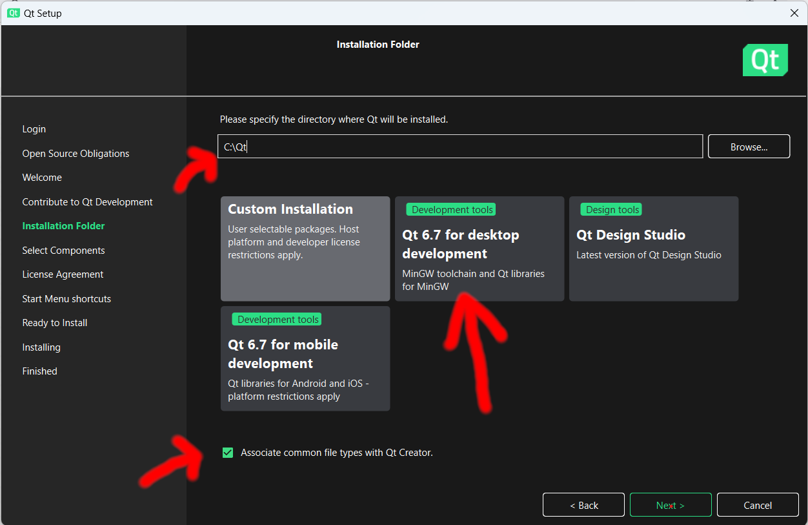
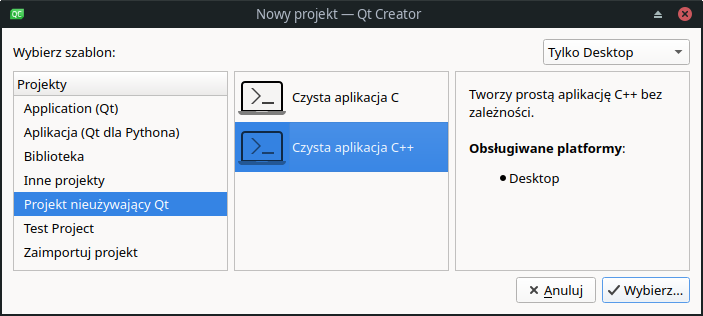
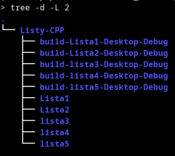

## QtCreator: instalacja i konfiguracja

QtCreator to jedno z kilku nowoczesnych, profesjonalnych narzędzi programistycznych (obok CLion i Visual Studio Code) dostępnych dla zastosowań niekomercyjnych za darmo. Jest ono dystrybuowane wraz z biblioteką Qt - jedną z najbardziej wszechstronnych bibliotek języka C++ przeznaczonych do tworzenia aplikacji desktopowych oraz na urządzenia mobilne i wbudowane (ang. embedded). QtCtreator nieźle radzi też sobie z edycją programów w językach Python i JavaScript, istnieją też wtyczki wspomagające programowanie w językach Go i Rust. To, co w nim chyba jest najcenniejsze, to fakt, że działa dokładnie tak samo na różnych platformach, a więc na różnych wersjach systemu Windows, w różnych dystrybucjach systemów Linux i Unix oraz na różnych wersjach macOS. Jest dobrze zintegrowany z system budowania CMake, rozproszonymi systemami kontroli wersji (m.in. git, mercurial), z platformą clangd do automatycznego formatowania kodu źródłowego, a także z systemami automatyzacji testów (m.in. z Google Test), profilowania kodu (np. valgrind) czy statycznej analizy kodu. Oczywiście jest też ściśle zintegrowany z debugerem C++ oraz narzędziami Qt do szybkiego tworzenia aplikacji (np. Qt Designer). Ze względu na swoją objętość (związaną z oparciem się na ogromnej bibliotece Qt) i szereg funkcji pomyślanych o zastosowaniach profesjonalnych, QtCreator może budzić opory i strach wśród osób zaczynających programowanie w C++. Trochę słusznie, trochę niesłusznie. Jeśli zacznie się programować w środowiskach z łatwym "wejściem" (np. code::blocks, nieskonfigurowany Visual Studio Code, DevC++), to łatwo będzie zacząć pisanie prostych programów, natomiast pisanie czegokolwiek bardziej poważnego zacznie sprawiać ogromne trudności. QtCreator może sprawiać na samym początku problemy, których nie mamy, pisząc programy w prostym edytorze i kompilując je "z ręki" np. poleceniem g++ (Co to jest projekt i dlaczego nie mogę pracować bez niego? Czy muszę uczyć się języka CMake? Dlaczego QtCreator nie widzi kompilatora? Gdzie są pliki wykonywalne mojego programu? Jak uruchomić mój program tak, by działał `std::cin`? Jak do mojego programu przekazać argumenty wiersza poleceń?). Odpowiedzi na te pytanie nie są jednak trudne do znalezienia, a użycie profesjonalnego środowiska programistycznego szybko przynosi efekty w postaci skrócenia czasu pisania i testowania programów. 

### Instalacja

Instalacja QtCreatora zwykle sprawia studentom spore trudności, choć doprawdy, nie wiem, dlaczego: mnie to z reguły nie sprawia trudności. Niewykluczone, że to dlatego, że od latu używam wyłącznie systemu Linux. Poniżej opiszę instalację w systemie Linux i Windows. Mam nadzieję, że instalacja w macOS jest przebiega podobnie do instalacji w systemie Windows. 

#### Linux

Linux jest jak koń, jaki jest, każdy widzi. Standardowa instalacja programu QtCreator sprowadza się do zainstalowania kilku paczek. To, jakie to paczki, zależy od dystrybucji Linuksa. W Manjaro Linux w menedżerze pakietów wyszukujemy pakiet qtcreator:


Alternatywnie, nazwy pakietu wyszukujemy komendą pamac:

```bash
> pamac search qtcreator --no-aur
```

co może dać następującą odpowiedź:

```txt
qtcreator-devel  12.0.2-2										extra
    Lightweight, cross-platform integrated development environment (development files)
qtcreator  12.0.2-2 [Zainstalowane] 							extra
    Lightweight, cross-platform integrated development environment
```

Pakiet `qtcreator` instalujemy w standardowy dla danej dystrybucji sposób (np. `pamac install qtcreator`). Wraz z nim doinstalowane będą jego zależności, które zwykle dzielą się na niezbędne i opcjonalne.  Ich listę można odczytać w instalatorze graficznym lub w konsoli, np. tak (fragment):

```bash
> pamac info qtcreator
Nazwa                   : qtcreator
Wersja                  : 12.0.2-2
Opis                    : Lightweight, cross-platform integrated development environment
URL                     : https://www.qt.io
Licencje                : GPL-3.0-only
Rozmiar zainstalowanego : 120,5 MB
Zależy od               : clang=16.0.6 
                          clazy 
                          gcc-libs 
                          glibc 
                          qt6-5compat 
                          qt6-base 
                          qt6-declarative 
                          qt6-quick3d 
                          qt6-tools 
                          qt6-serialport 
                          qt6-svg 
                          qt6-webengine
                          yaml-cpp 
                          zstd
Opcjonalne zależności   : qt6-doc: integrated Qt documentation [Zainstalowane]
                          qt6-examples: welcome page examples [Zainstalowane]
                          gdb: debugger [Zainstalowane]
                          cmake: cmake project support [Zainstalowane]
                          x11-ssh-askpass: ssh support
                          git: git support [Zainstalowane]
                          mercurial: mercurial support
                          breezy: bazaar support
                          valgrind: analyze support [Zainstalowane]
                          perf: performer analyzer [Zainstalowane]
                          mlocate: locator filter [Zainstalowane]
```

Spośród zależności opcjonalnych zdecydowanie należy zainstalować debuger, przykłady i dokumentację. Niemal na pewno przyda się też integracja z systemem git, a przy pewnym poziomie zaawansowania - z programami `perf` i `valgrind`. 

#### Windows (i zapewne tak samo w macOS)

Zaczynamy od pobrania i uruchomienia instalatora Qt. 

Jeśli masz już zainstalowany Qt Creator i chcesz go uaktualnić, wskazane jest najpierw odinstalować starszą wersję. W tym celu w eksploratorze Windows znajdź i uruchom `Qt Maintenance Tool`, po czym wybierz  `Uninstall only`. Uwaga: tak było w 2023 roku, a jak należy postępować teraz - nie wiem. 

Pobierz instalator Qt z oficjalnej strony pobierania znajdującej się pod adresem  [www.qt.io/download-qt-installer](https://www.qt.io/download-qt-installer). Witryna powinna wykryć Twój system operacyjny i automatycznie pobrać zgodny z nim program instalacyjny. Pobrany instalator będzie miał nazwę w rodzaju `qt-unified-windows-x64-4-online`. Po pobraniu uruchom go (np. kliknij dwukrotnie jego ikonkę).

Instalacja Qt i QtCreatora poprzez program instalacyjny przebiega w kilku krokach. W przypadku  większości z nich można użyć ustawień domyślnych i po prostu kliknąć **"Next"** lub **"Agree**". Od tej reguły występuj jednak kilka ważnych wyjątków omówionych poniżej. 

- **Krok 1:** rejestracja w serwisie Qt. Jako identyfikator użytkownika należy podać działający e-mail. Koniecznie trzeba też zatwierdzić regulamin usług ("service terms").  

- **Krok 2:** Wybór licencji i wyrażenie stosownych zgód. Należy koniecznie zaznaczyć, że zapoznało się z warunkami używania wersji Open Source Qt, nie wpisywać nazwy firmy i zaznaczyć opcję "I'm an individual and do not use Qt for any company".  
  

- **Krok 3:** Zgoda na wysyłanie pseudoanonimowych informacji o sposobach wykorzystywania programu. Można jej udzielić, ale nie ma takiej konieczności. 
  

- **Krok 4:** Wybór katalogu instalacyjnego (domyślnie: `c:\Qt`) oraz rodzaju instalacji. Folder prawdopodobnie jest dobry, chyba że brakuje nam miejsca na dysku `C:`. Jeśli zaś chodzi o rodzaj instalacji, to unikamy kafelków z napisem "ARM", "Android" itp. W przypadku jak poniżej klikamy "*Qt 6.7 for desktop development (MinGW toolchain and Qt Libraries for MinGW)*". Tu wyjaśnienie: MinGW to darmowy klon kompilatora g++ dla systemu Windows. Musisz go mieć, jeśli chcesz korzystać z Qt pod Windows. W systemie macOS zamiast MinGW prawdopodobnie ujrzymy coś w rodzaju "Xcode".       
  

- **Krok 5:** *Licence agreement*. Klikamy stosowną zgodę, np. "I have read and agree to the terms contained in the licence agreement". 

- **Krok 6:** Zakładka "Start menu shortcuts" z domyślną wartością "Qt". Nie wydaje mi się, by cokolwiek warto było tu zmieniać. Klikamy "Next". To tam w menu Start w twoim systemie pojawią się skróty do plików związanych z Qt oraz QtCreator-em. 

- Krok 7: Zakładka "Ready to install". Nie ma nad czym deliberować, klikamy "Next".
  
  
  Zajmująca ponad 5 GB instalacja może potrwać całkiem długo, więc uzbrajamy się w cierpliwość. Na moim starożytnym komputerze pierwsze uruchomienie programu QtCreator trwało i trwało... 

### Konfiguracja

QtCreator powinien zacząć działać poprawnie tuż po instalacji, o ile instalacja przebiegła poprawnie...  Najważniejszym elementem konfiguracji są tzw. zestawy narzędzi (ang. *kits*). Okno ich konfiguracji można wyświetlić, wybierając w menu kolejno pozycje `Edycja`/`Ustawienia` / `Zestawy narzędzi`.  Powinno się wyświetlić okienko jak poniżej:


 Jak widać, w mojej konfiguracji QtCreatora mam zdefiniowane dwa zestawy narzędzi: `Desktop` i `Qt5`. Tak naprawdę różnią się tylko tym, że `Desktop` korzysta z najnowszej wersji Qt (6.6.2), a zestaw o nazwie `Qt5` wykorzystuje bibliotekę Qt w wersji 5. W systemach Linux obecność obu tych bibliotek jest w chwili pisania tego tekstu standardem, gdyż część aplikacji korzysta z Qt6, a część z Qt5. W przypadku błędnej konfiguracji zwykle przy nazwie zestawu narzędzi pojawia się żółty trójkącik z wykrzyknikiem. Powyższe ustawienia to tylko  przykład działającej konfiguracji. Zamiast `Unix Makefiles` jako CMake generator można też wybrać `Ninja`, o ile taki wybór jest dostępny. W systemie Windows / macOS kompilator niemal na pewno będzie nazywał się inaczej (np. MingW w Windows), na pewno będziemy też widzieć inne ścieżki do programów.

Kolejna karta to `Wersje Qt`:


Jeżeli QtCreator nie wykryje biblioteki Qt automatycznie, można (a nawet trzeba) ustawić ją (lub je) ręcznie, jak w powyższy,m przykładzie. 

Trzecia karta zawiera listę dostępnych kompilatorów:


Część z nich zapewne będzie wykryta automatycznie, część można ustawić ręcznie. Jeden kompilator C i jeden C++ z tej listy należy wskazać w definicji zestawu narzędzi na pierwszej karcie tego okna dialogowego. 

Ostatnia karta zawiera listę dostępnych debugerów i może wyglądać następująco: 


Ważne, by lista ta nie była pusta i by na pierwszej karcie (`Zestawy narzędzi`) ustawiony był jeden z nich. 

Generalnie, jeśli nie jesteś zawodowcem lub choćby pół-zawodowcem i jeżeli nie potrzebujesz posługiwać się różnymi wersjami Qt lub różnymi kompilatorami, to nie definiuj więcej niż jednego zestawu narzędzi. Nie kombinuj. QtCreator ma być Twoim przyjacielem, ma po prostu działać, konfiguracja ma być funkcjonalna i "przezroczysta" - nie chcesz o niej ciągle rozmyślać. Ja mam dwie, bo studenci przysyłają mi programy w obu wersjach Qt (5 i 6). 

### Test konfiguracji

Najłatwiej sprawdzić, czy wszystko działa, kompilując najprostszy program, najlepiej taki, który korzysta z Qt. Z menu `Plik` wybierz `Nowy projekt`, potem wymierz szablon `Application (Qt)`  i `Aplikacja Qt Widgets`, następnie przeklikaj kolejne okna dialogowe, wybierając domyślne opcje. Po wygenerowaniu kodu źródłowego kliknij znajdującą się w okolicach lewego dolnego rogu okna QtCreatora zieloną strzałkę, co powinno spowodować kompilację i uruchomienie programu. Jeśli wszystko jest OK, instalacja jest prawidłowa.   


Uwaga! Dopóki nie będziesz korzystać z Qt, kolejne projekty rozpoczynaj od wyboru szablonów  `Projekt nieużywający Qt` i `Czysta aplikacja C++`: 



### Konfiguracja nieco bardziej zaawansowana

#### Gdzie jest moja konsola?

QtCreator został zaprojektowany z myślą o programach pisanych w Qt a nie w klasycznym C++. W Qt domyślnie nie ma klasycznej konsoli. Dlatego w standardowej konfiguracji, `std::cin` nie działa. Aby go włączyć, należy poinformować QtCreator, że powinien uruchomić nasz program w terminalu. Konfiguracją uruchamiania steruje się w panelu `Projekty` (skrót klawiaturowy: ctrl-5) - por. poniższy rysunek:


#### Gdzie jest mój plik wykonywalny? W którym katalogu będzie uruchomiony?

Odpowiedzi na oba te pytania znajdują się w panelu `Projekty` - por. poprzedni punkt. Jeżeli chcemy sami zdefiniować katalog, w którym ma być umieszczany plik wykonywalny i wszystkie inne pliki generowane przez kompilator, powinniśmy kliknąć opcję `Budowanie` w sekcji `Budowanie i uruchamianie`:


#### Jak zdefiniować argumenty wiersza poleceń?

Odpowiedź na to pytanie także znajduje się w panelu `Projekty`.  Argumenty wiersza poleceń wpisujemy w polu "Argumenty linii komend",  por. rysunek w rozdziale "Gdzie jest moja konsola?". Np. po wpisaniu w tym polu "-N10 -T"


QtCreator uruchomi nasz program tak, jak byśmy uruchomili go z konsoli z podanymi argumentami:

```bash 
> ./a.out -N10 -T
```

Bardzo się to przydaje podczas debugowania programu. 

#### Konfiguracja budowania ("Debugowa", "Profil",...) - o co tu chodzi? 

Panel w lewym dolnym rogu okna QtCreatora zawiera tajemniczy przycisk z ikonką w kształcie monitora (górny przycisk na poniższym rysunku):


Przycisk ten służy konfiguracji całego panelu, czyli konkretnego znaczenia pozostałych trzech przycisków:

-    - przycisk kompilacji i uruchamiania programu w bieżącej konfiguracji
-    - przycisk kompilacji i uruchamiania programu w debugerze dla bieżącej konfiguracji
-    - przycisk kompilacji ("budowania") programu w bieżącej konfiguracji

Po jego przyciśnięciu pojawi się menu, które może wyglądać następująco:


Qt Creator potrafi obsługiwać kilka projektów naraz. Tu mam zrzut ekranu w sytuacji, gdy miałem załadowany własny projekt (`transfer_matrix_p3`) i jednocześnie projekt studencki (`lista3` ).  Każdy z nich może być kompilowany innym zestawem narzędzi (tu akurat używałem tylko jednego zestawu, `Desktop`). W ramach jednego zestawu narzędzi możliwe jest używanie kilku zestawów flag kompilatora. Z kolei każdy projekt może prowadzić do utworzenia kilku "targetów", czyli plików wykonywalnych (tu mamy trzy pliki wykonywalne: `zad1`, `zad2` i `zad3`). 

Kolumna "Budowanie" w powyższym menu kontekstowym zasługuje na szczególną uwagę, gdyż występujące w niej pozycje występują w wielu oknach konfiguracji QtCreatora i jest to też jeden z najczęściej dokonywanych przez użytkownika wyborów konfiguracji budowania programu. 

- `Debug` ("Debugowa") - Ten tryb kompilacji wybieramy, jeżeli chcemy móc stosunkowo łatwo uzyskiwać informacje o ewentualnych błędach w programie. Kompilacja w tym trybie umożliwia bezproblemowe uruchamianie programu pod kontrola debugera. Może też włączyć autodiagnostykę programu wykonywaną w czasie jego wykonywania (o ile program został napisany w odpowiedni sposób). **Jest to domyślny tryb kompilacji**. Nie używaj jednego, jeżeli nie masz ku temu dobrego powodu. 
- `Release` ("Release'owa") - Tryb kompilacji nastawiony na możliwie jak największą  szybkość uzyskiwanego programu wykonywalnego. Słowo "Release" oznacza tu "wydanie" (kolejnej wersji produktu). Jest to kompilacja, którą można udostępnić klientowi. Klient nie będzie chciał debugować kupionego przez siebie programu, za to będzie zadowolony, jeżeli ten program będzie zajmował mało miejsca i działał szybko. Programy kompilowane w trybie Release mogą działać nawet ponad 10 razy szybciej niż w trybie Debug. 

Powyższe dwa tryby są powszechnie używane w zintegrowanych środowiskach programistycznych (np. w Code::blocks czy Visual Studio Code). QtCreator obsługuje też kilka innych trybów kompilacji (np. `RelWIthDebInfo`, `MinSizeRel`). Nie używaj ich, dopóki nie oswoisz się z systemem CMake.

Każdej kombinacji projektu, zestawu narzędzi i trybu budowania odpowiada inny katalog. Np. w katalogu  studenta, który rozwiązał 5 list z programowania w C++, układ katalogów może wyglądać następująco: 




Pliki dla każdej listy zadań przechowywane są w osobnych katalogach (które zawierają własny plik konfiguracyjny projektu w systemie CMake,  `CMakeLists.txt`). Równolegle do każdego z nich QtCreator tworzy katalog z plikami generowanymi przez kompilator (o nazwie zaczynającej się od `build-`). Na przykład katalog `build-Lista1-Desktop-Debug` związany jest z projektem `Lista1`, zestawem narzędzi kompilatora `Desktop` i trybem kompilacji `Debug`. Jeśli korzystamy z systemu kontroli wersji, np. git, to nigdy nie umieszczamy w nim katalogów budowania (`build*`). 

------

Ostatnia zmiana: 13 maja 2024
