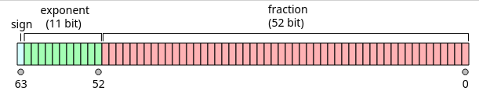

# Typy wbudowane

Pierwszy komputer, [ENIAC](https://en.wikipedia.org/wiki/ENIAC), zajmował 170 metrów kwadratowych, zawierał m.in. 18 000 lamp elektronowych, był programowany za pomocą ręcznie wpinanych wtyków kablowych i, jak głosi anegdota, pobierał tyle prądu, że gdy go włączano, to w Filadelfii przygasały światła. Dzisiejsze komputery budowane są w technice półprzewodnikowej, a ich sercem są procesory, które zamiast lamp posiadają miliardy tranzystorów sterujących stanem maleńkich kondensatorów. W tych kondensatorach zapisywane są programy i dane. Oczywiście nie programujemy ich poprzez wtyki kablowe i nie interesuje nas, który kondensator jest naładowany, a który rozładowany. Zamiast tego posługujemy się abstrakcyjnym modelem komputera, w którym stanowi kondensatora odpowiada liczba zero lub jeden. Na tym poziomie abstrakcji programy wyglądają tak:

```
...001001010100010011110101001001010100101010001010... (miliony cyfr) ... 0100111110...
```

Programy działają na danych. Dane zapisane są w półprzewodnikowej pamięci RAM, a więc w kondensatorach, na tym poziomie wyglądają więc tak samo, jak programy:    

```
...001001010100010011110101001001010100101010001010... (miliony cyfr) ... 0100111110...
```

Aby tak zaprojektowany system działał szybko i był możliwie łatwy w projektowaniu, bitów nie przetwarza się pojedynczo, lecz w grupach o stałej długości. Naturalną długością słowa we współczesnych komputerach i smartfonach jest 64 bity.  Jest to tzw. **[słowo](https://en.wikipedia.org/wiki/Word_(computer_architecture))**. Procesory potrafią też operować na grupach bitów zajmujących ułamek długości słowa, ale współcześnie raczej nie mniejszych niż 8-bitowych. 8 bitów to (współcześnie) **[bajt](https://en.wikipedia.org/wiki/Byte)**. Procesory 64-bitowe potrafią też działać na grupach 16-bitowych i 32-bitowych. 

### Reprezentacje liczb całkowitych 

#### Podstawowe typy całkowite 

I tu wracamy do C++. C++ posiada osobne typy danych do operacji arytmetycznych (całkowitoliczbowych) na grupach bitów o różnej długości:

- `char`  
- `short`
- `int`
- `long int` 
- `long long int`

Problem w tym, że C++ musi działać nie tylko na współczesnych procesorach x86-64, ale i ARM,  PowerPC, SPARC i in., a także na (być może "muzealnych") procesorach 32-bitowych, a nawet 16-bitowych.  Dlatego standard nie określa dokładnie, jaka jest wewnętrzna reprezentacja każdego z  powyższych typów podstawowych. We współczesnych systemach 64-bitowych `char` to 8 bitów, `short` to 16, a `int` to 32, a `long long int` to 64 bity. Problem jest z typem `long int`: w systemie Windows jest on równoważny typowi `int` (32 bity), a w systemach UNIX, Linux czy macOS jest on równoważny typowi `long long int` (64 bity).  Ponieważ ta nieokreśloność była powodem licznych kłopotów, wprowadzono też typy o ściśle określonej budowie:

- `int8_t`, `int16_t`, `int32_t` i `int64_t`. 

Ich użycie wymaga włączenia do programu pliku `<cstdint>` (czyli instrukcji `#include <cstdint>`).    

Powyższe typy umożliwiają reprezentowanie liczb dodatnich, ujemnych i zera. Oczywiście nie można na skończonej liczbie bitów zapisać dowolnej liczby całkowitej: dla każdego z tych typów istnieje najmniejsza i najmniejsza liczba, którą można w nim reprezentować. Dla typu, który mieści się w N bitach wszystkie reprezentowalne liczby mieszczą się w zakresie  

$$
-2^{N-1} \le n \le 2^{N-1} - 1.
$$
Na przykład dla 8-bitowego typu `int8_t` dopuszczalne wartości należą do przedziału [-128,..., 127]. `   

Do określenia odpowiedniości między układem bitów a wartością liczby powszechnie stosuje się [kod uzupełnień do dwóch](https://pl.wikipedia.org/wiki/Kod_uzupe%C5%82nie%C5%84_do_dw%C3%B3ch), który od wersji C++20 został uznany za obowiązujący.  Jest to normalny zapis liczby w układzie dwójkowym, w którym jednak bitowi "najstarszemu" przypisuje się wagę ujemną. Na przykład ośmiobitowa liczba o reprezentacji bitowej `11000011` odpowiada liczbie `1*(-128) + 1*64 + 0*32 + 0*16 + 0*8 + 0*4 + 1*2 + 1*1`, czyli 67. 
$$
11000011_{U2} = -2^7 + 2^6 + 2^1 + 2^0 = -61.
$$

#### Typ int jest wyróżniony

Spośród powyższych typów do operacji arytmetycznych (czyli `+`, `-`, `*`,  `/`) zaleca się używać typu `int`. Użycie każdego innego powinno mieć jakieś uzasadnienie, np. chęci oszczędzania pamięci, jeżeli mamy do czynienia z bardzo dużymi tablicami, w których wpisujemy stosunkowo małe liczby.  

#### Typy nieujemne

Jak wiemy, typ `int` odpowiada liczbie całkowitej o niezbyt dużej wartości bezwzględnej. W arytmetyce mamy jednak także liczby naturalne, które nigdy nie są ujemne.  W C++ odpowiadają im typy, które w swojej nazwie mają słowo kluczowe `unsigned`, czyli:

- `unsigned char`, `unsigned short`, `unsigned int`, `unsigned long` i `unsigned long long`,

a także typy o ściśle określonej liczbie bitów:

- `uint8_t`, `uint16_t`, `uint32_t`, `uint64_t`.

Odwzorowanie reprezentacji liczbowej tych typów na liczby jest proste: używamy po prostu układu dwójkowego. Na przykład 8-bitowa liczba o reprezentacji bitowej  `11000011` odpowiada liczbie `1*(128) + 1*64 + 0*32 + 0*16 + 0*8 + 0*4 + 1*2 + 1*1`, czyli 195. 
$$
11000011_{unsigned} = 2^7 + 2^6 + 2^1 + 2^0 = 195.
$$
Typy nieujemne (bezznakowe) używane są stosunkowo rzadko. Preferuj typy ze znakiem, zwłaszcza `int`.  

### Reprezentacje typów zmiennopozycyjnych

Jednym z podstawowych zastosowań komputerów są obliczenia inżynierskie. Nieprzypadkowo pierwszy program uruchomiony na wspomnianym wyżej ENIAC-u wyznaczał tablice balistyczne dla wojska. Obliczenie inżynierskie dość trudno prowadzić, posługując się wyłącznie liczbami całkowitymi. Dlatego współczesne procesory mają możliwość interpretowania grupy bitów jako liczby rzeczywistej, a raczej - rozsądnego przybliżenia liczby rzeczywistej. Te reprezentacje nazywamy liczbami zmiennopozycyjnymi. W standardzie C++ mamy trzy takie typy:

- `float` 	 (32 bity)
- `double`    (64 bity)
- `long double`   (128, 80 lub 64 bity)

Typy te nie są w stanie przechować dokładnych wartości liczb rzeczywistych (poza stosunkowo nielicznymi wyjątkami liczb wymiernych, których mianowniki są potęgami dwójki, np. jak 1/2 czy 5/8). Dlaczego? Bo jeżeli mamy do dyspozycji skończoną liczbę bitów, np. 64, to możemy na nich zapisać co najwyżej $2^64 \appox 10^{19}$ różnych liczb. Typem używanym domyślnie jest `double`. Typu `float` używa się dość rzadko, głównie w grafice komputerowej. Typ `long double` używany jest jeszcze rzadziej, chyba tylko w bardzo, bardzo specyficznych zastosowaniach inżynierskich. 

Wewnętrzna reprezentacja liczb zmiennopozycyjnych (nazwa, powiedzmy, historyczna - ENIAC pracował na liczbach stałopozycyjnych) składa się z 3 liczb całkowitych: znaku (*z*), mantysy (*m*) i wykładnika (*w*) (zwanego też cechą):   
$$
x = z \cdot m \cdot b^w, \quad b = 2
$$
Baza (*b*) nie jest nigdzie zapisywana. Znak (*z*) zapisany jest w najbardziej znaczącym bicie, któremu przypisujemy wartość `+1` lub `-1`: `+1` oznacza liczbę nieujemną, a `-1` - ujemną. Oznacza to, że w reprezentacji zmiennopozycyjnej liczba 0 (zero) może być reprezentowana jako liczba nieujemna lub ujemna (sic!) i nie ma to nic wspólnego z C++. Z kolei wykładnik i mantysę najłatwiej zrozumieć przez porównanie do zapisu liczb w reprezentacji inżynierskiej.  Na przykład liczbę `3,14` można zapisać jako `314E-2` lub $314 \cdot 10^{-2}$, gdzie za bazę przyjęliśmy liczbę 10 a nie 2. W tym przypadku znak $z = 1$, mantysa $m = 314$, a wykładnik $w = -2$ (i dodatkowo baza $b = 10$). 

Graficznie znak, wykładnik i mantysę dla liczb 64-bitowych (czyli double) można przedstawić następująco:




Liczby w reprezentacji zmiennopozycyjnej obejmują bardzo szeroki zestaw liczb, np. liczby typu double obejmują zakres od ok. $10^{-324}$ do ok. $10^{308}$. Trzeba jednak pamiętać, że im dalej od zera, tym zagęszczenie liczb reprezentowanych dokładnie jest mniejsze: między 1 i 2 jest tyle samo liczb, co między 2 i 4, między 4 i 8 etc. Por. rysunek:

​       

Liczby zmiennopozycyjne obejmują 3 specjalne kombinacje bitów, które nie odpowiadają żadnej liczbie. Są to:

- NAN (*Not A Number*)
- INF (nieskończoność)
- -INF (minus nieskończoność)

NAN to np. wartość zwracana przez `sqrt(-1.0)`. Wartością każdej operacji na NAN jest NAN. 

Właściwości typu `long double` zależą od platformy sprzętowej i kompilatora. W komputerach z procesorami klasy x86 kompilator gcc używa tu reprezentacji 80-bitowej, ale samą liczbę przechowuje na 128 bitach, natomiast MSVC używa reprezentacji 64-bitowej.  

### Typy logiczne

Istnieje tylko jeden typ logiczny: `bool` o wartości `true` lub `false`. Standard nie rozstrzyga, w jaki sposób zmienne tego typu są implementowane. Nie wiadomo, czy jest to jeden bit, jeden bajt czy nawet kilka bajtów. To świadomy wybór. Ponieważ zmienna musi być adresowalna, a najmniejszym adresowalnym fragmentem pamięci jest bajt, więc zmienna typu `bool` zajmuje co najmniej 1 bajt. Niemniej, tablice zmiennych typu `bool` mogą (i zwykle są) optymalizowane w ten sposób, by ich kolejnym elementom odpowiadał zaledwie 1 bit.

### Typ void

`void` jest bardzo specyficznym typem określanym jako typ niepełny. Nie wolno tworzyć zmiennych tego typu, nie istnieją też referencje do typu `void`.  Mogą istnieć funkcje zwracające `void`, co oznacza, że nie zwracają one żadnej wartości. Mogą istnieć wskaźniki do typu `void`; używa się ich do ominięcia systemu kontroli typów języka C++.        

### Wskaźniki 

O tym gdzie indziej.  

------


## Literatura

- [Fundamental types](https://en.cppreference.com/w/cpp/language/types)
- [Floating point arithmetic](https://en.wikipedia.org/wiki/Floating-point_arithmetic)
- [IEEE-754 Floating Point Converter](https://www.h-schmidt.net/FloatConverter/IEEE754.html)
- [IEEE 754 Calculator](http://weitz.de/ieee/) (dobry do badania zjawiska znoszenia się składników)
