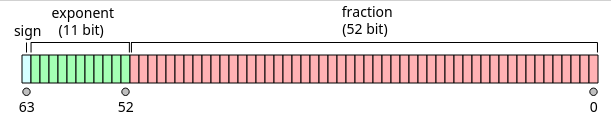
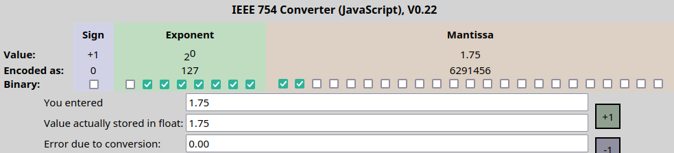
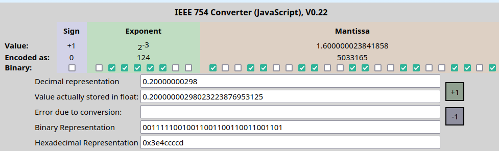
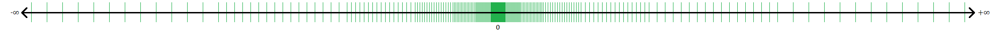

# Typy wbudowane

Pierwszy komputer, [ENIAC](https://en.wikipedia.org/wiki/ENIAC), zajmował 170 metrów kwadratowych, zawierał m.in. 18 000 lamp elektronowych, był programowany za pomocą ręcznie wpinanych wtyków kablowych i, jak głosi anegdota, pobierał tyle prądu, że gdy go włączano, to w Filadelfii przygasały światła. Dzisiejsze komputery budowane są w technice półprzewodnikowej, a ich sercem są procesory, które zamiast lamp posiadają miliardy tranzystorów sterujących stanem maleńkich kondensatorów. W tych kondensatorach zapisywane są programy i dane. Oczywiście nie programujemy ich poprzez wtyki kablowe i nie interesuje nas, który kondensator jest naładowany, a który rozładowany. Zamiast tego posługujemy się abstrakcyjnym modelem komputera, w którym stanowi kondensatora odpowiada liczba zero lub jeden. Na tym poziomie abstrakcji programy wyglądają tak:

```
...001001010100010011110101001001010100101010001010... (miliony cyfr) ... 0100111110...
```

Programy działają na danych. Dane zapisane są w półprzewodnikowej pamięci RAM, a więc w kondensatorach, na tym poziomie wyglądają więc tak samo, jak programy:    

```
...001001010100010011110101001001010100101010001010... (miliony cyfr) ... 0100111110...
```

Aby tak zaprojektowany system działał szybko i był możliwie łatwy w projektowaniu, bitów nie przetwarza się pojedynczo, lecz w grupach o stałej długości. Naturalną długością słowa we współczesnych komputerach i smartfonach są 64 bity. Jest to tzw. **[słowo](https://en.wikipedia.org/wiki/Word_(computer_architecture))** (choć pojęcie to ma wiele znaczeń zwyczajowych, np. w procesorach x86 "słowo" oznaczało pierwotnie 16 bitów i tak już zostało). Procesory potrafią też operować na grupach bitów zajmujących ułamek długości słowa, ale współcześnie raczej nie mniejszych niż 8-bitowych. 8 bitów to (współcześnie) **[bajt](https://en.wikipedia.org/wiki/Byte)** używany głównie do zapisywania liter (tekstu).  Procesory 64-bitowe potrafią też działać na grupach 16-bitowych i 32-bitowych.

### Reprezentacje liczb całkowitych

#### Podstawowe typy całkowite

I tu wracamy do C++. C++ posiada osobne typy danych do operacji arytmetycznych (całkowitoliczbowych) na grupach bitów o różnej długości:

- `char`
- `short`
- `int`
- `long int`
- `long long int`

Problem w tym, że C++ musi działać nie tylko na współczesnych procesorach x86-64, ale i ARM,  PowerPC, SPARC i in., a także na (być może "muzealnych") procesorach 32-bitowych, a nawet 16-bitowych.  Dlatego standard nie określa dokładnie, jaka jest wewnętrzna reprezentacja każdego z  powyższych typów podstawowych. We współczesnych systemach 64-bitowych `char` to 8 bitów, `short` to 16, a `int` to 32, a `long long int` to 64 bity. Problem jest z typem `long int`: w systemie Windows jest on równoważny typowi `int` (32 bity), a w systemach UNIX, Linux czy macOS jest on równoważny typowi `long long int` (64 bity).  Ponieważ ta nieokreśloność była powodem licznych kłopotów, wprowadzono też typy o ściśle określonej budowie:

- `int8_t`, `int16_t`, `int32_t` i `int64_t`.

Ich użycie wymaga włączenia do programu pliku `<cstdint>` (czyli instrukcji `#include <cstdint>`).

Powyższe typy umożliwiają reprezentowanie liczb dodatnich, ujemnych i zera. Oczywiście nie można na skończonej liczbie bitów zapisać dowolnej liczby całkowitej: dla każdego z tych typów istnieje najmniejsza i najmniejsza liczba, którą można w nim reprezentować. Dla typu, który mieści się w N bitach wszystkie reprezentowalne liczby mieszczą się w zakresie

$$
-2^{N-1} \le n \le 2^{N-1} - 1.
$$
Na przykład dla 8-bitowego typu `int8_t` dopuszczalne wartości należą do przedziału [-128,..., 127].

Do określenia odpowiedniości między układem bitów a wartością liczby powszechnie stosuje się [kod uzupełnień do dwóch](https://pl.wikipedia.org/wiki/Kod_uzupe%C5%82nie%C5%84_do_dw%C3%B3ch), który od wersji C++20 został uznany za obowiązujący.  Jest to normalny zapis liczby w układzie dwójkowym, w którym jednak bitowi "najstarszemu" przypisuje się wagę ujemną. Na przykład ośmiobitowa liczba o reprezentacji bitowej `11000011` odpowiada liczbie `1*(-128) + 1*64 + 0*32 + 0*16 + 0*8 + 0*4 + 1*2 + 1*1`, czyli 67.
$$
11000011_{U2} = -2^7 + 2^6 + 2^1 + 2^0 = -61.
$$

#### Typ int jest wyróżniony

Spośród powyższych typów do operacji arytmetycznych (czyli `+`, `-`, `*`,  `/`) zaleca się używać typu `int`. Użycie każdego innego powinno mieć jakieś uzasadnienie, np. chęci oszczędzania pamięci, jeżeli mamy do czynienia z bardzo dużymi tablicami, w których wpisujemy stosunkowo małe liczby.

#### Typy nieujemne

Jak wiemy, typ `int` odpowiada liczbie całkowitej o niezbyt dużej wartości bezwzględnej. W arytmetyce mamy jednak także liczby naturalne, które nigdy nie są ujemne.  W C++ odpowiadają im typy, które w swojej nazwie mają słowo kluczowe `unsigned`, czyli:

- `unsigned char`, `unsigned short`, `unsigned int`, `unsigned long` i `unsigned long long`,

a także typy o ściśle określonej liczbie bitów:

- `uint8_t`, `uint16_t`, `uint32_t`, `uint64_t`.

Odwzorowanie reprezentacji liczbowej tych typów na liczby jest proste: używamy po prostu układu dwójkowego. Na przykład 8-bitowa liczba o reprezentacji bitowej  `11000011` odpowiada liczbie `1*(128) + 1*64 + 0*32 + 0*16 + 0*8 + 0*4 + 1*2 + 1*1`, czyli 195.
$$
11000011_{unsigned} = 2^7 + 2^6 + 2^1 + 2^0 = 195.
$$
Typy nieujemne (bezznakowe) używane są stosunkowo rzadko. Preferuj typy ze znakiem, zwłaszcza `int`.

### Reprezentacje typów zmiennopozycyjnych

Jednym z podstawowych zastosowań komputerów są obliczenia inżynierskie. Nieprzypadkowo pierwszy program uruchomiony na wspomnianym wyżej ENIAC-u wyznaczał tablice balistyczne dla wojska. Obliczenie inżynierskie dość trudno prowadzić, posługując się wyłącznie liczbami całkowitymi. Dlatego współczesne procesory mają możliwość interpretowania grupy bitów jako liczby rzeczywistej, a raczej - rozsądnego przybliżenia liczby rzeczywistej. Te reprezentacje nazywamy liczbami zmiennopozycyjnymi. W standardzie C++ mamy trzy takie typy:

- `float` 	 (32 bity)
- `double`    (64 bity)
- `long double`   (128, 80 lub 64 bity)

Typy te nie są w stanie przechować dokładnych wartości liczb rzeczywistych (poza stosunkowo nielicznymi wyjątkami liczb wymiernych, których mianowniki są potęgami dwójki, np. jak 1/2 czy 5/8). Dlaczego? Bo jeżeli mamy do dyspozycji skończoną liczbę bitów, np. 64, to możemy na nich zapisać co najwyżej $2^{64}\approx 10^{19}$ różnych liczb. Typem używanym domyślnie jest `double`. Typu `float` używa się dość rzadko, głównie w grafice komputerowej. Typ `long double` używany jest jeszcze rzadziej, chyba tylko w bardzo, bardzo specyficznych zastosowaniach inżynierskich.

Wewnętrzna reprezentacja liczb zmiennopozycyjnych (nazwa, powiedzmy, historyczna - ENIAC pracował na liczbach stałopozycyjnych) składa się z 3 liczb całkowitych: znaku (*z*), mantysy (*m*) i wykładnika (*w*) (zwanego też cechą):
$$
x = z \cdot m \cdot b^w, \quad b = 2
$$
Baza (*b*) nie jest nigdzie zapisywana. Znak (*z*) zapisany jest w najbardziej znaczącym bicie, któremu przypisujemy wartość `+1` lub `-1`: `+1` oznacza liczbę nieujemną, a `-1` - ujemną. Oznacza to, że w reprezentacji zmiennopozycyjnej liczba 0 (zero) może być reprezentowana jako liczba nieujemna lub ujemna (sic!) i nie ma to nic wspólnego z C++. Z kolei wykładnik i mantysę najłatwiej zrozumieć przez porównanie do zapisu liczb w reprezentacji inżynierskiej.  Na przykład liczbę `3,14` można zapisać jako `314E-2` lub $314 \cdot 10^{-2}$, gdzie za bazę przyjęliśmy liczbę 10 a nie 2. W tym przypadku znak $z = 1$, mantysa $m = 314$, a wykładnik $w = -2$ (i dodatkowo baza $b = 10$).

Graficznie znak, wykładnik i mantysę dla liczb 64-bitowych (czyli double) można przedstawić następująco:



Dla liczb 32-bitowych (`float`) podział ten ilustruje poniższy [rysunek](https://www.h-schmidt.net/FloatConverter/IEEE754.html):



Znak (*z*) jest przechowywany w bicie najstarszym, numer 32 licząc od prawej i zaczynając licznie od wartości 1. Tu bit ten jest wyłączony, co oznacza, że *z = 1*. Wykładnik (*exponent*)  jest obliczany z bitów o numerach 24-31 przez odjęcie liczby 127 od wartości wykładnika odczytanej w układzie dwójkowym (bez znaku, czyli w trybie *unsigned*). Na powyższym przykładzie wykładnik reprezentowany jest przez liczbę `01111111`, której wartość dwójkowa to 1 + 2 + ... + 64 = 127. Odejmujemy od niej 127 i otrzymujemy "prawdziwą" wartość wykładnika: $w = 0$. Mantysa (*m*)  jest przechowywana w bitach o numerach od 1 do 23 jako ułamek zapisany w układzie dwójkowym znormalizowany tak, by jego wartość mieściła się w przedziale półotwartym [1, 2). Część całkowita takiego ułamka zawsze równa jest 1 (w układzie dwójkowym). Cyfra ta nie jest zapisywana. Bit nr 23 ma wagę 1/2, bit 22 ma wagę 1/4 itd. Na powyższym obrazku mantysa ma więc wartość `1,11` = 1 + 1/2 + 1/4 = 1,75 - zgadza się.

Większości liczb rzeczywistych nie można zapisać dokładnie. Spójrzmy na  reprezentację liczby 0.2 w zmiennej typu `float`:



Komputer nie przechowuje liczby 0.2, lecz jej najbliższe przybliżenie: 0.20000000298023223876953125 (czyli $2^{-3} \cdot (1 + 1/2 + 1/16 + 1/32 + 1/256 + 1/512 + 2^{-12} + 2^{-13} +  2^{-16} + 2^{-17} +  2^{-20} + 2^{-21} + 2^{-23}$).

Liczby w reprezentacji zmiennopozycyjnej obejmują bardzo szeroki zestaw liczb, np. liczby typu double obejmują zakres od ok. $10^{-324}$ do ok. $10^{308}$. Trzeba jednak pamiętać, że im dalej od zera, tym zagęszczenie liczb reprezentowanych dokładnie jest mniejsze: między 1 i 2 jest reprezentowanych dokładnie tyle samo liczb, co między 2 i 4, między 4 i 8 etc. Por. rysunek:



Liczby zmiennopozycyjne obejmują 3 specjalne kombinacje bitów, które nie odpowiadają żadnej liczbie. Są to:

- NAN (*Not A Number*)
- INF (nieskończoność)
- -INF (minus nieskończoność)

NAN to np. wartość zwracana przez `sqrt(-1.0)`. Wartością każdej operacji na NaN jest NaN.

Właściwości zmiennych typu `long double` zależą od platformy sprzętowej i kompilatora. W komputerach z procesorami klasy x86 kompilator gcc używa tu reprezentacji 80-bitowej, ale samą liczbę przechowuje na 128 bitach, natomiast MSVC używa reprezentacji 64-bitowej.

Na koniec uwaga o tym, skąd nazwa "liczba zmiennopozycyjna". Na pewno każdy widział kalkulator dla księgowych, w którym wszystkie obliczenia zaokrąglane są do 2 miejsc po przecinku. Mamy więc wyświetlacz, powiedzmy, 10-cyfrowy, z czego 8 cyfr to część całkowita ("złotówki") i dwie to część dziesiętna ("grosze"). To jest reprezentacja stałoprzecinkowa. Z kolei reprezentacja zmiennopozycyjna to taka, w której pozycja przecinka dziesiętnego nie jest ustalona (jest "zmienna"). Kalkulator z dwiema cyframi po przecinku wykorzystuje ten sam wzór, co kalkulator z reprezentacją zmiennopozycyjną


$$
x = z \cdot m \cdot b^w,
$$
jednak wykładnik *w* ma w nim ustaloną wartość -2  (i oczywiście dla księgowych $b = 10$):    $x = z \cdot m \cdot 10^{-2}$. W pewnym więc sensie reprezentacja zmiennopozycyjna to w rzeczywistości reprezentacja "stałowykładnikowa", a reprezentacja zmiennopozycyjna to reprezentacja "zmiennowykładnikowa". Dlaczego dziś już nie używa się liczb stałopozycyjnych? Bo ich zakres jest bardzo ograniczony. Gdyby liczbę rzeczywistą zapisać na 32 bitach w formacie stałopozycyjnym z bitem znaku, 15 bitami na część całkowitą i 16 bitami na część ułamkową, to największa liczba w takim systemie miałaby wartość ok. 65000,  a najmniejsza dodatnia - ok. 0,00001.

### Typy logiczne

Istnieje tylko jeden typ logiczny: `bool` o wartości `true` lub `false`. Standard nie rozstrzyga, w jaki sposób zmienne tego typu są implementowane. Nie wiadomo, czy jest to jeden bit, jeden bajt czy nawet kilka bajtów. To świadomy wybór. Ponieważ zmienna musi być adresowalna, a najmniejszym adresowalnym fragmentem pamięci jest bajt, więc zmienna typu `bool` zajmuje co najmniej 1 bajt. Niemniej, tablice zmiennych typu `bool` mogą (i zwykle są) optymalizowane w ten sposób, by ich kolejnym elementom odpowiadał zaledwie 1 bit.

### Typ void

Słowo kluczowe `void` definiuje  bardzo specyficzny typem będący tzw.  typem niepełnym. Nie wolno tworzyć zmiennych tego typu, nie istnieją też referencje do typu `void`.  Mogą istnieć funkcje zwracające `void`, co oznacza, że nie zwracają one żadnej wartości. Mogą istnieć wskaźniki do typu `void`; używa się ich do ominięcia systemu kontroli typów języka C++. 

### Wskaźniki

Szerzej o tym gdzie indziej. Tu nadmienię jedynie, że wskaźniki to ciągi bitów, a więc mogą być interpretowane jako liczby. W latach 70. XX w. w języku C dość powszechną praktyką było zapisywanie wartości zmiennych wskaźnikowych w zmiennych całkowitych (`int`) i odwrotnie. Prowadziło to jednak do tak wielu bardzo trudnych w diagnostyce błędów, że zaniechano tej praktyki.     

### Literały

Literały to wyrażenia, których wartości są znane wprost z tekstu programu i nie wymagają przechowywania w zmiennych. Problem z nimi jest następujący: jak zapisać literał tak, by jego reprezentacja maszynowa była jednoznaczna. Kwestię tę wyjaśnią przykłady:

```c++
auto i = 1;     // i jest typu int
auto j = 5'000'000'000; // j jest typu int64_t, bo 5 miliardów nie mieści się na 32 bitach 
auto u = 1u;            // u jest typu unsigned int
auto v = 5'000'000'000; // v jest typu uint64_t, bo 5 miliardów nie mieści się na 32 bitowej zmiennej typu unsigned int
auto c = 'c';   // c jest typu char
auto m = 1L;    // m jest typu long int
auto n = 1ULL;  // n jest typu unsigned long long
auto d = 1.0;   // d jest typu double
auto f = 1.0f;  // f jest typu float
auto x = 1.0L; // x jest typu long double
auto b = true;  // b jest typu bool 
```

Dodatkowo liczby całkowite można zapisywać w systemie dziesiętnym, dwójkowym, ósemkowym i szesnastkowym:

```c++
int i = 10; // liczba w zapisie dziesiętnym
int j = 012; // liczba 10 zapisana w systemie ósemkowym - zapis zaczyna się o 0, po którym następuje cyfra ósemkowa (0..7)
int k = 0xa; // liczba 10 zapisana w systemie szesnastkowym - zapis zaczyna się od 0x, cyfry 0..9,a,..e
int m = 0b1010; // liczba 10 zapisana w systemie dwójkowym - zapis zaczyna się od 0b, cyfry 0, 1
```

Z kolei liczby zmiennopozycyjne można zapisywać w notacji inżynierskiej:

```c++
double x = 1e-3;   // 10 do potęgi -3
double y = 1.2e7;  // 1.2 razy 10 do potęgi 7
float z = 1.3e-3f; // 1.3 razy 10 do potęgi -3 
```

### auto

Słowo kluczowe `auto` to popularny sposób definiowania typu zmiennej czy obiektu. Można go użyć tylko wraz z inicjalizatorem, gdyż kompilator domyśla się typu zmiennej właśnie na podstawie typu incjalizatora. Powyżej znajduje się wiele przykładów użycia `auto`. Warto jeszcze zauważyć, że w instrukcji

```c++
auto x = foo(i);
```

jakakolwiek zmiana deklaracji typu zwracanego przez `foo` automatycznie obejmie też zmianę typu zmiennej `x`, co zwykle ułatwia refaktoryzację kodu.

### Operator sizeof

 Jeżeli chcesz sprawdzić, ile bajtów w twoim systemie zajmuje zmienna (lub wartość wyrażenia) dowolnego typu, to możesz zastosować operator `sizeof`:

```c++
std::cout << sizeof(unsigned long long int) << " " << sizeof(void*) << " " << sizeof('a' + 1) << "\n";
```

### Silna statyczna kontrola typów

Język C++ jest językiem z [silną statyczną kontrolą danych](https://en.wikipedia.org/wiki/Strong_and_weak_typing). Kompilator musi wiedzieć, jaki typ reprezentuje każda zmienna lub obiekt programu, żeby  mógł  stwierdzić, jakie ma stosować operacje na nich.

Na przykład jeśli kompilator posiada informację, że zmienna `x` zajmuje 32 bajty, to zależnie od tego, czy zdefiniowano ją jako `float`, `int` czy `unsigned int`, tę samą instrukcję może zinterpretować inaczej. Na przykład jeśli bitowa reprezentacja `x` to `10111111110000000000000000000000`, to instrukcja

```c++
std::cout << x;
```

może wyświetlić wartość

- `-1077936128`, jeżeli `x` jest typu `int` 
-  `-1.5`, jeżeli typem `x` jest `float` 
-  `3217031168`, jeżeli  `x` zdefiniowano jako `unsigned`

### Podsumowanie

Po lekturze tego rozdziału powinno się kojarzyć: 

- typ całkowitoliczbowe:
  - `bool`;
  - `char`, `short`, `int`, `long`, `long long`;
  - `unsigned char`, `unsigned short`, `unsigned int`, `unsigned long`, `unsigned long long`; 
  - `int8_t`, `int16_t`, `int32_t`, `int64_t`;
  -  `uint8_t`, `uint16_t`, `uint32_t`, `uint64_t`, `uint128_t`;
- typy zmiennopozycyjne:
  - `float`, `double`, `long double`
- zapis literałów (np. `1u`,  `0X00FF`, `3.14e-9`, `'a'`)
- jaką rolę pełni `auto` w deklaracjach zmiennych 
- operator `sizeof`

## Dalsza lektura

- [Binarne kodowanie liczb](https://eduinf.waw.pl/inf/alg/006_bin/0018.php) (brawa dla nauczyciela, który włożył tyle pracy w ten serwis)
- [Standard IEEE 754](https://eduinf.waw.pl/inf/alg/006_bin/0022.php) (ten sam autor)
- [Fundamental types](https://en.cppreference.com/w/cpp/language/types)
- [Floating point arithmetic](https://en.wikipedia.org/wiki/Floating-point_arithmetic)
- [Double-precision floating-point format](https://en.wikipedia.org/wiki/Double-precision_floating-point_format)
- [IEEE-754 Floating Point Converter](https://www.h-schmidt.net/FloatConverter/IEEE754.html)
- [IEEE 754 Calculator](http://weitz.de/ieee/) (dobry do badania zjawiska znoszenia się składników)
