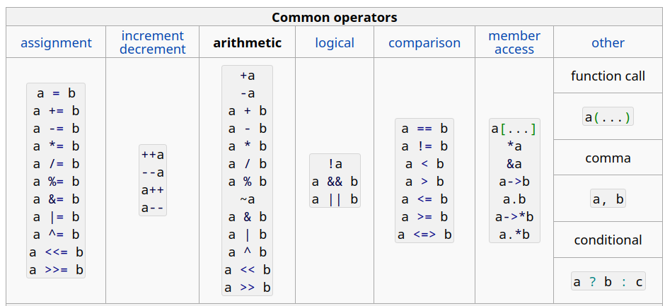
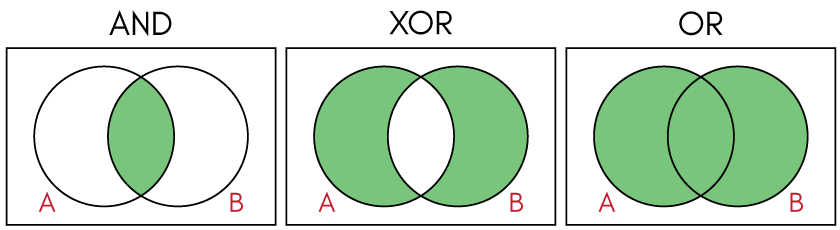
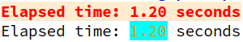
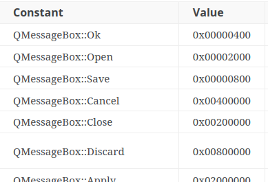

## Elementarne operacje na typach wbudowanych

Skoro już wiemy, jak wewnętrznie reprezentowane są (czy też: mogą być) typy elementarne, pora na na jakąś akcję. Zacznijmy od tabeli skopiowanej z portalu [CppReference](https://en.cppreference.com/w/cpp/language/operator_arithmetic):




Najczęściej używane podzielono w niej na 7 grup: operatory przypisania, inkrementacji i dekrementacji, arytmetyczne, logiczne, porównawcze, dostępu do składowej i inne. Omówię je w nieco innej kolejności niż przedstawia je powyższa tabela.

### 1. Operatory arytmetyczne

##### Promocje i konwersje standardowe

Zgodnie z powyższą tabelą, w C++ wyróżnia się 13 operatorów, w tym 3 jednoargumentowe i 10 dwuargumentowych. Podstawowa zasada mówi, że jeżeli którykolwiek argument jest typu całkowitoliczbowego (np. `char` lub `bool`) i jego reprezentacja jest krótsza niż reprezentacja typu `int`, to ten argument jest ***promowany*** do typu `int`. Dlatego instrukcja (zwróć uwagę na `opertor +`)

```c++
std::cout << +'a' <<  "\n"; // Nie używaj tej sztuczki: preferuj zapis jawny, np. int('a')
```

nie wyświetla znaku `'a'`, lecz odpowiadającą mu liczbę typu `int` (tu: kod ASCII znaku `a`, czyli 97). Dla typu `bool` wartość `false` promowana jest do wartości 0, a `true` do wartości 1 (oczywiście w typie `int`).

W przypadku operatorów dwuargumentowych dokonywane jest uzgodnieni ich typów tak, by typ "mniej ważny" został zamieniony na typ "bardziej ważny" bez zmiany wartości danego argumentu (o ile jest to możliwe), przy czym dla "krótkich" typów całkowitych najpierw wykonywana jest ich promocja do typu `int`. "Ważność" typów przedstawia się mniej więcej następująco: `long double` > `double`> `float`> `long long` > `long` > `int` > `short` > `signed char` > `bool`.   Jeżeli któryś z argumentów jest bez znaku (czyli posiada modyfikator `unsigned`), a drugi ma znak, to "zwycięża" typ argumentu o dłuższej reprezentacji, a jeżeli ich długości są sobie równe, to zwycięża typ bez znaku. Jeżeli oba są typami całkowitymi bez znaku o różnej długości reprezentacji bitowej, to "zwycięża" ten, który ma więcej bitów. Po uzgodnieniu typów obu argumentów wyznaczany jest wynik operacji, który ma taki sam typ, jak uzgodnione argumenty.

Przykłady:

 ``` c++
 auto i = '1' + 1   // i jest typu int i ma wartość 49, czyli wartość kodu ASCII litery '1' plus 1
 auto x = 1 + 1.0   // x jest typu double i ma wartość 2.0
 auto u = 1 - 2u    // u jest typu unsigned int i ma wartość 4294967295 (o ile unsigned reprezentowany jest na 32 bitach)
 auto z = 2 - true; // z jest typu int i ma wartość 2 - 1 = 1. Nie lubię tej konwersji. 
 auto q = -true;    // To poprawne wyrażenie o wartośći -1 w typie int, ale nie pisz tak
 double z = 1/2;    // z ma wartość 0, bo typem wyniku opertora dzielenia w wyrażeniu 1/2 jest int, a nie double
 ```

Dlaczego to jest takie skomplikowane? Bo każdy z typów C++ ma dobre zastosowania, choć w w większości bardzo specjalistyczne. Typy te mają bezpośrednie odpowiedniki w instrukcjach i możliwościach większości procesorów i pozwalają na bardzo dokładną kontrolę sposobu wykorzystania pamięci operacyjnej. Istnieją dużo łatwiejsze w użyciu języki, np, Python, w którym istnieją tylko 4 podstawowe typy arytmetyczne: `bool`, `int`, `float` i  `complex`, które podlegają prostej, wręcz naturalnej regule konwersji: `complex` > `float` > `int` >`bool`. Nie ma tu aż 3 typów zmiennopozycyjnych, liczb całkowitych nie dzieli się na "ze znakiem" i "bez znaku", w każdej z tych grup nie ma 5  różnych typów.  Ale też w przeciwieństwie do C++, (czysty) Python nie jest używany do pisania kompilatorów czy tworzenia zaawansowanego oprogramowania inżynierskiego działającego na bardzo dużych zbiorach danych czy na nietypowym sprzęcie.

#### Operatory jednoargumentowe `+` i `-`

- Operator `+` nie robi nic (poza ewentualną promocją całkowitą), a operator `-` zwraca liczbę przeciwną do danej. Nigdy nie użyłem pierwszego z nich.

```c++
int n = 1;
std::cout << +n << " " << -n << "\n"; // wyświetla 1 -1
```
#### Cztery podstawowe operacje arytmetyczne, czyli  +, -, *, /
operatory `+`, `-`, `*`, `/` mają z grubsza takie znaczenie, jak w szkole: reprezentują dodawanie, odejmowanie, mnożenie i dzielenie liczb. Jest jednak jeden haczyk: one działają inaczej, jeżeli ich argumentami są liczby całkowite, a inaczej, gdy zmiennopozycyjne. Z tego punktu widzenia w C++ mamy po dwa operatory  `+`, `-`, `*`, `/`  w zależności od tego, czy działają na liczbach całkowitych czy zmiennopozycyjnych. Odpowiadają im inne instrukcje assemblera, mogą być wykonywane w zupełnie innych rejestrach procesora.

-  Dla argumentów całkowitych:
   - Wynik dzielenia jest liczbą całkowitą - z wyniku dokładnego "odrzuca się" część ułamkową. Dlatego np. `5/4` ma wartość `1`, a `3/-2` to `-1`.
   - Jeżeli podczas dzielenia w mianowniku (czyli jako dzielnik) pojawi się zero, to mamy *[undefined behavior](https://en.cppreference.com/w/cpp/language/ub)*, program zwykle pada.
   - Jeżeli dokładna wartość wyniku dodawania, odejmowania lub mnożenia nie mieści się w zmiennej o docelowym typie, to mamy do czynienia z tzw. ***przepełnieniem*** (*overflow*). Dla typów bez znaku wynik uzyskuje się w [arytmetyce modulo $2^B$](https://pl.wikipedia.org/wiki/Arytmetyka_modularna), gdzie B to liczba bitów, w jakich reprezentowany jest ten typ.  Dla typów ze znakiem (np. `int`) język nie określa sposobu wyznaczania wyniku - jest to kolejny przykład tzw. *undefined behavior*.
   
     W związku z tym, po dodaniu 1 do największej liczby reprezentowanej w typie `unsigned`, otrzyma się 0. Co więcej, istnieją liczby różne od zera, które podniesione do kwadratu mają wartość zero. Np. w arytmetyce 32-bitowej
   
     ```c++
     unsigned n = 0x10000; // dwójkowo: 1 i 16 zer, czyli 0b1'0000'0000'0000'0000
     std::cout << n << " * " << n << " = " << n * n << "\n";                     // zero
     std::cout << n + 1 << " * " << n << " = " << (n + 1) * n << "\n"; // wynik mniejszy od każdego z czynnków
     ```
     daje następujący wynik:
   
     ```txt
     65536 * 65536 = 0
     65537 * 65536 = 65536
     ```
     Jeżeli w powyższym fragmencie kodu zamienimy tym zmiennej `n ` z `unsigned` na `int`, to otrzymamy program o nieokreślonym zachowaniu (*undefined behavior*).
   
-  Dla argumentów zmiennopozycyjnych:
   -  Jeżeli wartość wyniku przekracza zakres typu, w którym miałaby być zapisana, to tę wartość oznacza się jako `INF` (lub `-INF`).
      -  `INF` podlega "rozsądnym" operacjom arytmetycznym, np. `5 + INF` ma wartość `INF`, a `5/INF` ma wartość `0`.  
   -  Jeżeli wartości części ułamkowej wyniku nie można zapisać w mantysie dla danego typu, to wynik się zaokrągla
   -  Wynikiem niektórych operacji może być tzw. NaN (*Not a Number*), np. `0.0/0.0`, `INF - INF`, `sqrt(-1.0)`. 
      -  Dowolna operacja na `NaN` zwraca `NaN`.
   

#### Operator %

Operator `%` wyznacza resztę z dzielenia. Oba argumenty muszą być całkowite. Jeżeli w wyrażeniu `n % m` jeden z argumentów jest ujemny, to znak wyniku jest taki, jak znak pierwszego argumentu (czyli np.`4 % 3 ` = 1, `4 % -3` = 1, `-4 % 3 ` = -1 i  `-4 % -3` = -1).

#### Operatory bitowe: ~, &, |, ^, << i >>

Operatory bitowe: `~`, `&`, `|`, `^`, `<<`, `>>` działają nie na liczbach, tylko na poszczególnych bitach.

-  Operator ~ neguje ("odwraca") bity swojego argumentu.

   ```c++
   int n = 2;   // n = 0b00000000000000000000000000000010
   int m = ~n;  // m = 0b11111111111111111111111111111101 = -3
   ```

- Operator `&` wyznacza iloczyn bitowy swoich argumentów (*bitwise and*) - bit wyniku = 1, jeżeli oba odpowiadające mu bity argumentów są równe 1.
   ```c++
   int n = 14;    // n = 0b00000000000000000000000000001110
   int m = 11;    // m = 0b00000000000000000000000000001011
   int k = n & m; // k = 0b00000000000000000000000000001010 = 12
   ```
-  Operator `|` wyznacza sumę bitową swoich argumentów (*bitwise or*) - bit wyniku = 1, jeżeli choć jeden z odpowiadających mu bitów argumentów jest  równy 1
   ```c++
   int n = 14;    // n = 0b00000000000000000000000000001110
   int m = 11;    // m = 0b00000000000000000000000000001011
   int k = n | m; // k = 0b00000000000000000000000000001111 = 15
   ```
-  Operator `^` wyznacza różnicę symetryczną swoich argumentów (*bitwise xor*) - bit wyniku = 1, jeżeli odpowiadające mu bity argumentów mają różne wartości (tj. `0^0` = 0, `1^1` = 0, `0^1` = 1, `1^0` = 1)

   ```c++
   int n = 14;    // n = 0b00000000000000000000000000001110
   int m = 11;    // m = 0b00000000000000000000000000001011
   int k = n ^ m; // k = 0b00000000000000000000000000000101 = 5
   ```
-  Operator `<<` przesuwa bity w lewo: ` a << b ` to `a` z bitami przesuniętymi w lewo o `b` pozycji.  `b`  nie może być ujemne. Bity, które się nie mieszczą w typie wyniku, są odrzucane.  Zasadniczo operacja ta równoważna jest mnożeniu przez $2^b$, nawet jeśli `a` jest ujemne (od C++20).   
   ```c++
   int n = 14;     // n = 0b00000000000000000000000000001110
   int m = 2;      // m = 0b00000000000000000000000000000010
   int k = n << m; // k = 0b00000000000000000000000000111000 = 4*n = 56
   ```
-  Operator `>>` przesuwa bity w prawo: ` a >> b ` to `a` z bitami przesuniętymi w prawo o `b` pozycji.  `b`  nie może być ujemne. Bity, które się nie mieszczą w typie wyniku, są odrzucane.  Operacja ta równoważna jest dzieleniu przez $2^b$ (z odrzuceniem części ułamkowej), nawet jeśli `a` jest ujemne (od C++20). 
   ```c++
   int n = 14;     // n = 0b00000000000000000000000000001110
   int m = 2;      // m = 0b00000000000000000000000000000010
   int k = n >> m; // k = 0b00000000000000000000000000000011 = n/4 = 3
   ```

Podsumowanie operacji `&`, `|` i `^`, w postaci tabeli: 

|  a   |  b   | a & b | a \| b | a ^ b |
| :--: | :--: | :---: | :----: | :---: |
|  0   |  0   |   0   |   0    |   0   |
|  0   |  1   |   0   |   1    |   1   |
|  1   |  0   |   0   |   1    |   1   |
|  1   |  1   |   1   |   1    |   0   |

A tu [obrazek](https://www.codingame.com/playgrounds/54888/rust-for-python-developers---operators/xor-and-bitwise-operators-truth-table) dla wzrokowców:



Operatory bitowe umożliwiają operacje na pojedynczych bitach. Na przykład poniższa funkcja sprawdza, czy wartość `k`-tego bitu liczby `n` jest ustawiona na 1:

```c++
bool is_set(unsigned n, unsigned k)
{
    const unsigned mask = 1u << k;
    return mask & n;  // równoważne: "return (mask & n) != 0;", bo zwracana wartość jest konwertowana na typ bool 
}
```

### 2.  Operatory przypisania

Działanie najprostszego operatora jest dość proste: `a = b` przypisuje wartość zmiennej `b` do zmiennej `a`. Jeżeli typy tych zmiennych są różne, nastepuje konwersja typu `b` do typu `a`. Może to spowodować utratę dokładności. Na przykład:

```C++
int a = 3.14 // a = 3
```

Uwaga! Operatory przypisania mają wartość i mogą pojawić się w wyrażeniach arytmetycznych. Legalny jest więc zapis z = `a + (b = c)`, ale nikt przytomny tego nie wykorzystuje (a w każdym razie - nie w takim kontekście).  Wartością operatora `=` jest jego lewy argument po zakończeniu operacji przypisania. Ponieważ operator przypisania ma wartość, legalna i czasami spotykane jest incjalizowanie wielu zmiennych w jednej instrukcji (nie zalecam):

```c++
a = b = c = 0; // równoważne ciągowi instrukcji:  c = 0; b = c; a = b; 
```

Operatory przypisania są [prawostronnie łączne](https://pl.wikipedia.org/wiki/Operator_(programowanie)#%C5%81%C4%85czno%C5%9B%C4%87,_wi%C4%85zanie), więc kompilator zinterpretuje powyższą instrukcję tak, jak by programista wstawił nawiasy od prawej do lewej:

```c++
a = (b = (c = 0)); // równoważne ciągowi instrukcji:  c = 0; b = c; a = b; 
```

 Słynny, legalny przykład zastosowania operatora przypisania w argumencie pętli `while` do kopiowania napisów w tradycyjnym stylu języka C:

  ```c++
  while (*p++ = *q++) continue;
  ```

Nie zaleca się nadużywania tego, że operatory przypisania mają wartość i rzadko kiedy można się z tym spotkać w tzw. kodzie produkcyjnym.  Piszę o tym głównie dlatego, że jest to źródłem nieskończonej liczby pomyłek osób uczących się C++, które mylą operator przypisania `=`  z  operatorem porównania `==`. Typowy przykład takiej pomyłki:

```c++
if (a = 1) // chyba miało być "if (a == 1)"? 
{
    // jakiś kod
}
```

W powyższym przykładzie kompilator przypisze 1 do `a`, następnie skonwertuje typ `a` do `bool`, co w tym przypadku daje wartość `true`, a więc uzna, że warunek jest zawsze spełniony. 

Powyższy przykład ilustruje zjawisko ***efektu ubocznego***. Zasadniczo instrukcja `if` tylko sprawdza spełnienie jakiegoś warunku, tu zaś mamy dodatkowe, raczej nieoczekiwane w tym kontekście zdarzenie: nadanie zmiennej `a` wartości 1. Jak ognia unikajmy efektów ubocznych.     

Pozostałe operatory sprowadzają się do operatora przypisania w następującego schematu:

- `a += b` jest równoważne wyrażeniu `a = a + b`;
- `a *= b` jest równoważne wyrażeniu `a = a * b`;

 ...

- `a >>= b` jest równoważne wyrażeniu `a = a >> b`;

 Prawda że to jest proste? 

```c++
int n = 3; 
int m = 5;
m -= n;  // m = m - n     = 2;
n >>= 1; // n = n >> 1    = 3 >> 1    = 1
```

### 3.  Inkrementacja i dekrementacja

Operator inkrementacji (zwiększenia), `++`, zwiększa wartość swojego argumentu o 1, a operator dekrementacji (zmniejszenia) zmniejsza tę wartość o 1. Niespodzianką jest zwykle to, że operator ten można zapisywać zarówno prze, jak i po zmiennej, na której działa i dokonanie tego wyboru może istotnie zmienić sens wyrażenia. Różnica między `i++` i `++i` dotyczy wartości tych wyrażeń: wartością `i++` jest "stara wartość `i`", czyli ta sprzed zwiększenia o 1, a wartością `++i` jest wartość nowa (zwiększona). Czyli zapis

```c++
int x = ++i;
```

 jest równoważny

```c++
++i;
int x = i;
```

Natomiast instrukcja

```c++
int x = i++;
```

Jest równoważna ciągowi instrukcji

```c++
int x = i;
i++;
```

Operatory te wprowadzono dawno, dawno temu, gdy kompilatory dość słabo optymalizowały tworzony przez siebie kod. I tak, powyższy ciąg instrukcji mógł być interpretowany następująco:

- wczytaj wartość `i` z pamięci RAM do rejestru r
- zapisz wartość rejestru r w zmiennej `x` w pamięci RAM
- wczytaj `i` do rejestru r
- zwiększ `r` o jeden
- zapisz wartość rejestru `r` w `i`   

 Tu jest mnóstwo niepotrzebnej pracy (dwukrotne wczytywanie `i`). Zapis `int x = i++` mógł być interpretowany w bardziej efektywny sposób:

- wczytaj `i` do rejestru r
- zapisz wartość rejestru r w zmiennej `x`
- zwiększ wartość rejestru r o 1 
- zapisz wartość rejestru r w zmiennej `i`

Jedna (kosztowna!) instrukcja mniej. Podobne powody stały za wprowadzeniem złożonych operatorów przypisania, np. `+=`. Dziś to już jednak prehistoria. Kompilator doskonale poradzi sobie z niemal dowolnym zapisem kodu, on "widzi" znacznie większe fragmenty kodu niż pojedyncze funkcje, apekt optymalizacyjny nie ma już żadnego znaczenia.

Z operatorem `++` (i `---`) wiąże się kilka problemów, które prowadzą do nieszczęsnego *undefined behavior*.  Na przykład niech `f` będzie funkcją dwuargumentową, i rozpatrzmy 

```c++
int x = 0;
f(x++, x++);
```

W wyrażeniu tym nie wiemy, w jakiej kolejności opracowywane będą argument funkcji i kiedy dokładnie nastąpi inkrementacja zmiennej `x`. Być może funkcję wywołamy jako `f(0,1)`, może jako `f(1,0)`, a może nawet jako `f(0,0)`. Inny przykład to wyrażenie `x++ - ++x`; Tu mamy ten sam problem: może to jest `0 - 2`, może `1 - 1`, a może jeszcze coś innego. Dlatego 

- Unikaj operatorów `++` i `--` w złożonych wyrażeniach
- Nigdy w jednym wyrażeniu nie stosuj wielokrotnie tych operatorów do tej samej zmiennej.
- Program zawsze można napisać tak, by te operatory były jedynymi operatorami w wyrażeniu, czyli 

```c++
x++; // lub równoważnie: ++x;
--y; // lub równoważnie: y--;
```

Operatory `++` i `--` można stosować do liczb zmiennopozycyjnych, ale w praktyce się tego unika. 

Wszytko powyższe stosuje się tak samo do operatora `--` z wyjątkiem tego, że on wartość swojego argumentu zmniejsza a nie zwiększa o 1.

```c++
// Ta pętla wyświetli 5 4 3 2 1 0 
for(int i = 5; i >= 0; --i)
    std::cout << i << " ";     
```

### 4. Operatory logiczne

Główną cechą operatorów logicznych jest to, że zarówno ich argumenty, jak i wynik, są typu `bool`. 

- operator `!` neguje logiczną wartość swojego argumentu: `!true` ma wartość `false`, a `!false` ma wartość `true`. Przykład:

  ```c++
  if (!v.empty()) { jakiś kod... }
  ```

- Operator `&&` reprezentuje iloczyn logiczny. Może być zapisywany słownie jako `and`, np. 

  ```c++
  if (i < v.size() && v[i] == 0) { jakiś kod... }
  if (i < v.size() and v[i] == 0) { jakiś kod... }
  ```

  Wartość wyrażenia `b0 && b1` wynosi `true` wtedy i tylko wtedy, gdy zarówno `b0`, jak i `b1` mają wartość `true`. 

- Operator `||` reprezentuje sumę logiczną i może być zapisywany słownie jako `or`:

  ```c++
  if (i < 0 || i >= v.size()) throw std::logic_error("indeks tablicy poza zakresem");
  if (i < 0 or i >= v.size()) throw std::logic_error("indeks tablicy poza zakresem");
  ```

  Wartość wyrażenia `b0 && b1` wynosi `true` wtedy i tylko wtedy, gdy choć jeden z argumentów operatora, `b0` lub `b1` , ma wartość `true`. 

Jeżeli argumentem operatora logicznego będzie liczba innego typu niż `bool`, to zostanie zamieniona na ten typ w standardowy sposób: `0` zostanie skonwertowane na `false`, a każda inna wartość - na `true`. Dlatego czasem (głównie w bibliotekach napisanych w C) spotyka się instrukcje przypominające tę:

```c++
if (status = foo(x)) throw std::logic_error("Funkcja f zakończyła się niepowodzeniem z kodem błędu " + std::to_string(status));
if (foo(x) || bar(x)) throw std::logic_error("Coś nie pykło! Obie funkcje zakończyły się błędem!");
```

przy czym funkcje `foo` i `bar` zwracają tzw kod błędu:  liczbę `0`, jeżeli ich działanie przebiegło poprawnie lub  inną liczbę całkowitą, jeżeli podczas wykonywania się natrafiły na błąd. 

##### Short-circuit evaluation

Operatory logiczne mają bardzo ważną cechę: ich argumenty opracowywane są od lewej do prawej, a opracowywanie wyrażenia kończy się, gdy znany jest jego wynik. Przykład:

```c++
if (p != nullptr && *p > 0) { rób coś... } 
```

W tym przykładzie jeżeli `p` nie będzie wskaźnikiem zerowym (`nullptr`), to nie zostanie wyliczone wyrażenie `*p > 0`, które dla `p` równego `nullptr`  może spowodować pad programu.    

Z kolei w tym przykładzie 

```c++
if (f(x) || g(x)) { h(x); } 
```

funkcja `g(x)` zostanie wywołana wtedy i tylko wtedy, gdy `f` zwróci `false` (lub wartość równą 0). Czyli jest to równoważne zapisowi

```c++
if (f(x))
{
    h(x); // f(x) zwróciło true, więc pomiń g(x)
}
else // f(x) zwróciło false, spróbuj g
{
    if (g(x))
    {
        h(x); // g(x) zwróciło true 
    }
}
```

### 5. Operatory relacyjne (porównawcze)

Operatory te działają zasadniczo tak, jak tego oczekujesz. Ich wartością jest `true` lub `false`. Wprowadzonego w C++20 operatora `<=>`  nie będę tu omawiał, to jest "zaawansowany C++". Jest jedna sprawa, na którą trzeba uważać przy posługiwaniu się operatorami porównawczymi: pamiętajmy, by nie mieszać argumentów bez znaku z argumentami posiadającymi znak. 

```c++
unsigned i = 1;
if (i > -1) { rób coś... }
```

Ponieważ `i` jest typu `unsigned`, to drugi argument, `-1` zostanie skonwertowany do typu `unsigned` bez zmiany swojej reprezentacji bitowej. Powyższa instrukcja jest więc równoważna tej:

```c++
unsigned i = 1;
if (i > 4294967295) { rób coś... }
```

co może być nieco zaskakujące. Dlatego w porównaniach unikamy zmiennych o typach bez znaku. Ogólnie unikamy zmiennych bez znaku, z wyjątkiem operacji na bitach.  

### 6. Operatory dostępu do składowej

Te operatory zostaną omówione gdzie indziej

### 7. Operatory (), ?: i ,

**Nawiasy okrągłe**, (), mogą służyć do ustalania kolejności opracowywania wyrażeń (np. `a*(b+c)`) lub tworzyć operator wywołania funkcji. Tan bardzo ważny temat zostanie omówiony w temacie "Przeciążanie operatorów".

**Operator przecinkowy** to jeden z najdziwniejszych operatorów języka C++, który odziedziczył go z języka C. Spójrzmy na ten przykład:

```c++
int x = (f(x), g(x)); 
```
Można go zapisać w całkowicie równoważny sposób następująco:

```c++
f(x);
int x = g(x);
```
Innymi słowy, w wyrażeniu `f(x), g(x)` najpierw wyznaczana jest wartość lewego argumentu, ale nie bierze się jej pod uwagę, a potem wartość prawego argumentu - i to jest wartość tego operatora. Podobnie, wyrażenie `int x = (1, 2, 3);`oznacza po prostu `int x = 3;`. We współczesnym C++ operator przecinkowy ma bardzo mało zastosowań, a niemal wszystkie są bardzo zaawansowane. Wyjątkiem jest inicjalizacja kilku zmiennych w pętli for:
```c++
for(i = 0, j = 0; i < 10 && j < 10; i++, j++)  // rzadko widywana realizacja pętli for z dwoma operatorami ,
```

Operator przecinkowy pojawia się czasami w kilku niewinnie wyglądających kontekstach, gdzie jego użycie jest prawdopodobnie niezamierzone, czyli błędne, choć w pełni zgodne ze składnią języka:
```c++
tab[n, m] = 0; // wykona się: tab[m] = 0
f((2, 3)) ;    // wykona się: f(3)
f( 3,14 );     // wykona się f(14)
```
Natomiast w tej instrukcji nie ma operatora przecinkowego:
```c++
f(x, y);       // wywołanie funkcji dwuargumentowej. Przecinek jest separatorem argumentów funkcji
```

Trójargumentowy **operator warunkowy** `? :` spełnia funkcję podobną do instrukcji `if`, jednak w przeciwieństwie do niej zwraca wartość. Wartością wyrażenia `a ? b : c` jest `b`, jeżeli `a` ma wartość `true` lub `b` w przeciwnym wypadku. Instrukcję

```c++
int n = f() ? g() : h();
```

można więc napisać równoważnie w następujący sposób:

```c++
int n;
if (f())
    n = g();
else
    n = h();
```

Zapis wykorzystujący `if` jest znacznie dłuższy, dlatego operator warunkowy jest dość popularny, zwłaszcza w definiowaniu zmiennych wraz z wartością początkową zależącą od jakichś warunków. W definicjach stałych jest wręcz niezastąpiony, gdyż nie można zdefiniować wartości stałej za pomocą instrukcji `if`:

``` c++ 
const int size = (N < 100) ? 1000 : 100'000;
```

### 8. Operatory rzutowania

Warto w tym miejscu wspomnieć o operatorach konersji typów, zwanych też operatorami rzutowania. W C++ jest ich aż 5:

- `static_cast`  - konwersja wykonywana w czasie kompilacji
- `dynamic_cast ` - konwersja dynamiczna (czyli wykonywana podczas działania programu) na wskaźnikach do obiektów klas
- `reinterpret_cast` - konwersja typu wskaźników z odrzuceniem systemu kontroli typów
- `const_cast` - zmiana atrybutów typu, np. `const`
- `typ(nazwa-typu)`  lub `(nazwa-typu)(wyrażenie)` - tradycyjna metoda konwersji, odziedziczona z języka C, nie obejmuje konwersji dynamicznej

Operatory `dynamic_cast`, `reinterpret_cast` i `cinst_cast` są na tyle zaawansowane, że je tu pominiemy. 

Przykłady użycia:

```c++
int k = 100'000;
int m = 200'000;
auto n = k * m;    // Błąd: n jest typu int, ale w inicjalizatorze mamy przepełnienie w typie int
auto x = static_cast<double>(k) * m; // OK. x jest typu double
auto y = double(k) * m;              // OK. x jest typu double
auto z = (double) k * m;             // OK. (double) działa tylko na k
```

### 9. Priorytet operatorów

Pamiętamy ze szkoły, że 2 + 2\* 2 równa się 6, bo mnożenie i dzielenie mają wyższy priorytet niż dodawanie i odejmowanie. W szkolnej matematyce rozważa się jeszcze potęgowanie i to już koniec. W języku C++ wyróżnia się kilkadziesiąt operatorów. Są one uporządkowane w aż 17 grup różniących się priorytetem. Nie ma sensu uczyć się tej hierarchii, choć warto wiedzieć, gdzie ją można znaleźć - na przykład w serwisie [CppReference](https://en.cppreference.com/w/cpp/language/operator_precedence). Po kilkudziesięciu latach użytkowania języka C++ dalej nie znam wszystkich tych reguł i jakoś żyję.  W praktyce wszyscy posługują się prostą zasadą: jeżeli nie jesteśmy pewni, w jakiej kolejności opracowywane jest dane wyrażenie, to kolejność  wymuszamy nawiasami (np. jeżeli nie wiem, czy `a & b + 1 `  to  `(a & b) + 1 `  czy  `a & (b + 1) ` ), to w programie stosuje wyrażenie z nawiasami. I druga zasada: nie używamy niestandardowych wyrażeń, których nie widuje się w typowych programach C++. Nikt przytomny nie używa wyrażeń typu `++++b`, `a+++++b` czy `x = ++a++` (każde z nich może być poprawne dla odpowiednio zdefiniowanych `a` i `b`).  

### 10. Łączność operatorów

O kolejności opracowywania operatorów o takim samym priorytecie decyduje ich łączność, która może być lewostronna (opracowywanie następuje od lewej do prawej) lub prawostronna (od prawej do lewej). Na przykład operatory `+` i `-` mają ten sam priorytet i łączność lewostronną. Dlatego wyrażenie `a - b + 6` opracowywane jest  od lewej do prawej: najpierw wykona się odejmowanie, a dopiero potem dodawanie. Z kolei operatory przypisania są prawostronnie łączne, dlatego w instrukcja `x = y = 0;` jest równoważna ciągowi dwóch prostszych instrukcji, `y = 0; x = y;`.   Większość operatorów jest lewostronnie łączna. Łączność prawostronna jest cechą operatorów przypisania i przedrostkowych operatorów jednoargumentowych (czyli pisanych przed zmienną, na którą działają, np. `*p`, `++p`).      

### 11. Operacje na znakach

W poprzednim wpisie opisałem budowę typu znakowego `char` (a także `signed char` i `unsigned char`). Wyjaśniłem tam też, że można go traktować jak typ arytmetyczny, w którym przechowuje się liczby. Nie jest to jednak jego podstawowa funkcja. Typy znakowe zaprojektowano do przechowywania liter, a ich tablice - do przechowywania tekstu. Dlatego w operacjach wejścia/wyjścia używane są litery a nie odpowiadające im wartości liczbowe. 

```c++
char c = 'a';
std::cout << c << "\n";   // wyświetli jedną literę: a
char ala[] = "Ala";       // tablica 4-elementowa o elementach typu char: {'A', 'l', 'a', '\0'}
std::cout << ala << "\n"; // wyświetli 3 litery: Ala
```

Typy `int8_t` i `unit8_t` zachowują się dokładnie tak jak typ `signed char` i `unsigned char`, odpowiednio.  

Jeżeli chcesz sprawdzić wartość liczbową bitowej reprezentacji znaku (jego [kod ASCII](https://pl.wikipedia.org/wiki/ASCII)), to musisz zmienić jego typ na dłuższy niż 8-bitowy.

```c++
char c = 'a';                  // znak 'a' jest reprezentowany na 8 bitach jako 0b0110'0001 (HEX: 0x61, DEC: 97)
std::cout << c << "\n";        // wyświetli znak a
std::cout << int(c) << "\n";   // wyświetli liczbę 97, czyli kod ASCII znaku 'a'
std::cout << +c << "\n";       // wyświetli liczbę 97, czyli kod ASCII znaku 'a'
int i = c;                     // i ma wartość 97
std::cout << i << "\n";        // wyświetli liczbę 97, czyli kod ASCII znaku 'a'
```

### 12. Przykłady

1. Formatowanie tekstu biblioteką {fmt}. 
   W standardzie języka C++20 pojawiła się biblioteka fmt operacji wejścia wyjścia z nowoczesny interfejsem użytkownika. Niestety, kompilatory gcc i clang do lutego 2023 r. wciąż jej nie implementują, dlatego dość powszechnie korzysta się z niestandardowej biblioteki {fmt}, https://fmt.dev/latest/index.html. Oto przykład jej zastosowania:

   ```c++
   #include <fmt/format.h>
   #include <fmt/color.h>
   
   int main()
   {
       double x = 1.2;
       fmt::print(fmt::emphasis::bold | fg(fmt::color::red) | bg(fmt::color::blanched_almond),
                  "Elapsed time: {0:.2f} seconds\n", x);
   
       fmt::print("Elapsed time: {0:.2f} seconds\n",
                  fmt::styled(x, fmt::fg(fmt::color::dark_orange) | fmt::bg(fmt::color::aqua)));
   }
   ```

   i wynik działania:

   

   Krótka analiza:

   - Użycie biblioteki niestandardowej wymaga włączenia nagłówka lub nagłówków (makro `#include`)
   - `::` to "operator przestrzeni nazw". Biblioteka {fmt} wprowadza własną przestrzeń nazw, `fmt`, co pozwala stosować ją równolegle z biblioteką standardową (przestrzeń nazw `std`). Nazwy `emphasis` i `color` tworzą podprzestrzenie nazw w przestrzeni nazw `fmt` - mogą to być "prawdziwe" przestrzenie nazw, ale równie dobrze - nazwy typów użytkownika, które wprowadzają do programu własne przestrzenie nazw, np. klasy (`class`), struktury (`struct`) lub wyliczenia (`enum`). Tu prawdopodobnie mamy do czynienia z wyliczeniami. 
   - Do łączenia opcji wykorzystuje się `operator |`. Dlaczego? Wyobraźmy sobie długą liczbę całkowitą, powiedzmy, 80 bitów. 32 bity można przeznaczyć na kolor tła, 32 - na kolor czcionki i 16 na atrybuty w rodzaju "wytłuszczenie" (*bold*) czy "pochylenie" (*italic*). Ustawienie wszystkich bitów na 0 to domyślny kolor czcionki (dla danego terminala), domyślny kolor tła (odpowiedni dla danego terminala) i brak atrybutów (czcionka prosta, niewytłuszczona, nieprzekreślona, niemigająca itd.). 
   - Uwaga. Tak naprawdę w powyższym przykładzie `operator |` to nie jest zwykły ("bitowy")  `operator |`, a operator przeciążony - a to nieco inny temat. 

2. Implementacja atrybutów tekstu w bibliotece {fmt}
   Wyrażenie `fmt::emphasis`w poprzednim przykładzie ma następującą definicję w kodzie biblioteki: 

   ```c++
   enum class emphasis : uint8_t 
   {
     bold = 1,
     faint = 1 << 1,
     italic = 1 << 2,
     underline = 1 << 3,
     blink = 1 << 4,
     reverse = 1 << 5,
     conceal = 1 << 6,
     strikethrough = 1 << 7,
   };
   ```

   Krótka analiza:

   - Wiesz już, że `uint8_t` to 8-bitowy typ arytmetyczny bez znaku.  Zapis `enum class emphasis : uint8_t` oznacza, że `emphasis` jest nazwą nowego typu danych (stąd `class`) składającego się wyłącznie ze stałych (`enum`).  Każdy obiekt tego typu będzie przez kompilator reprezentowany w zmiennej typu `uint8_t`. 
   - `bold`, `faint`, ... , `strikethrough` to nazwy składowych tego wyliczenia, które reprezentują wartości stałe
   - Kolejne stałe mają wartości, których zapis w układzie dwójkowym składa się z dokładnie 1 jedynki i 7 zer, co wynika z właściwości operatora przesunięcia bitowego, `<<`. 
   - Atrybuty należy łączyć operatorem `|` . Np `bold | italic | blink`  będzie miało binarną reprezentację `00010101` . Biblioteka będzie odczytywać kolejno te bity i w zależności od tego, który jest ustawiony, będzie wyświetlać tekst normalny lub pogrubiony, przygaszony, pochylony, podkreślony, migający, w odwróconych kolorach, ukryty, przekreślony, a wszystkie te cechy można mu nadać niezależnie. 

3. Fragment implementacji funkcji `ansi_color_escape` biblioteki fmt

   ```c++
         size_t index = 0;
         buffer[index++] = static_cast<Char>('\x1b');
         buffer[index++] = static_cast<Char>('[');
   
         if (value >= 100u) 
         {
           buffer[index++] = static_cast<Char>('1');
           value %= 100u;
         }
         buffer[index++] = static_cast<Char>('0' + value / 10u);
         buffer[index++] = static_cast<Char>('0' + value % 10u);
   
         buffer[index++] = static_cast<Char>('m');
         buffer[index++] = static_cast<Char>('\0');
   ```

   Krótka analiza:

   	- Proszę zwrócić uwagę, jak ładnie zastosowano tu `operator ++` wewnątrz złożonych instrukcji. Od razu widać, że ten fragment wypełnia kolejne elementy tablicy `buffer`. Wartość zmiennej `index` zawsze równa jest liczbie zapisanych znaków. 
   	- Widzimy liczne jawne rzutowania (`static_cast`) na niestandardowy typ zdefiniowany gdzieś w bibliotece fmt, `Char`  
   	- Widzimy notację szesnastkową w literałach znakowych: `\x1b` to znak o wartości `0x1b`, czyli o reprezentacji bitowej `0001'1011`
   	- Widzimy zastosowanie przyrostka `u` w literałach liczbowych, np. `100u`, prawdopodobnie w celu uciszenia komunikatów diagnostycznych kompilatora, który bez tego `u` mógłby ostrzegać przed stosowaniem w tej samej operacji typów ze znakiem i bez, np. tu: `if (value >= 100u)`. Z kolei zapis  `10u`  nieco poprawia czytelność kodu. 
   	- `size_t` to standardowy typ bez znaku, więc `value` nigdy nie jest ujemne
   	- Napis kończy się w sposób uniwersalny znakiem `'\0'` i to nie jest przypadek, tylko temat osobnego wpisu w przyszłości. 
   	- Powyższy kod zakłada, że `value` jest w przedziale 0...199 i zamienia tę liczbę na napis, otaczając go "magiczną sekwencją" znaków sterujących ANSI.       

4. Przyciski w standardowych okienkach biblioteki Qt
   Oto fragment [dokumentacji](https://doc.qt.io/qt-6/qmessagebox.html) biblioteki Qt:

   ```c++
   QMessageBox msgBox;
   msgBox.setText("The document has been modified.");
   msgBox.setInformativeText("Do you want to save your changes?");
   msgBox.setStandardButtons(QMessageBox::Save | QMessageBox::Discard | QMessageBox::Cancel);
   msgBox.setDefaultButton(QMessageBox::Save);
   int ret = msgBox.exec();
   ```

   Ten fragment programu może wygenerować takie okienko:

   

   To, które przyciski maja być wyświetlone w tym okienku, ustala się za pomocą operatora `|`. Poniżej fragment dokumentacji Qt dotyczącej wartości stałych wyliczeniowych używanych w kontekście standardowych przycisków:

   

Jak widać, stałe te zapisywane są w układzie szesnastkowym, dzięki czemu od razu jest jasne, że są reprezentowane przez pojedyncze bity na określonej pozycji pola 32-bitowego i dlatego można je ze sobą składać operatorem `|`. 

### 13. Przenośność programów napisanych w różnych językach

Arytmetyka zaimplementowana sprzętowo w komputerach różni się od arytmetyki "szkolnej". Każdy język programowania usiłuje rozwiązać tę sprzeczność w charakterystyczny dla siebie sposób. Na przykład w języku Python nie ma przepełnienia w arytmetyce liczb liczb całkowitych.

```python
>>> print ("2**222 = ", 2**222)
2**222 =  6739986666787659948666753771754907668409286105635143120275902562304
```

Z kolei w Matlabie domyślnym typem każdego literału (np. `1`) jest typ zmiennopozycyjny (`double`) przy czym jeżeli wynik jakiejś operacji na liczbach całkowitych nie mieści się w ich zakresie, to wynikiem takiej operacji jest największa (dodatnia) lub najmniejsza (ujemna) liczba z dopuszczalnego zakresu:

``` 
a = int8(100)  % wyświetla wartość 100 
a = a + 100    % wyświetla wartość 127
a = a - 100    % wyświetla wartość 27
```

Z tego powodu "przepisywanie" programów z jednego języka na drugi nie jest trywialne.

### 14. Podsumowanie

Arytmetyka komputerowa różni się od arytmetyki szkolnej. Jeżeli nie zrozumiesz tych różnic, to twoje programy (napisane w dowolnym języku programowania) mogą robić zupełnie co innego, niż ci się wydaje.

### 15. Dalsza lektura

Trudno doradzić jakąś konkretną literaturę. Można polecić choćby pobieżne zapoznanie się z wybranymi tematami, np.:

- Wikipedia: [Modulo](https://en.wikipedia.org/wiki/Modulo). Warto choćby przejrzeć to hasło, by zrozumieć, na ile sposobów w informatyce definiuje się sprawę choćby tak wydawałoby się elementarną, jak wynik dzielenia dwóch liczb całkowitych oraz wartość reszty z dzielenia dwóch liczb całkowitych.
- Można spróbować zrozumieć, jak kiedyś w Quake'u III wyznaczano $1/sqrt{x}$: https://en.wikipedia.org/wiki/Fast_inverse_square_root. Jeśli ta sztuka się nie uda, to nic nie szkodzi.
- W haśle [Side_effect_(computer_science)#Example](https://en.wikipedia.org/wiki/Side_effect_(computer_science)#Example) (stan na 3 marca 2023) znajduje się merytoryczny błąd. Potrafisz go znaleźć? Potrafisz uzasadnić, że to naprawdę jest błąd?
