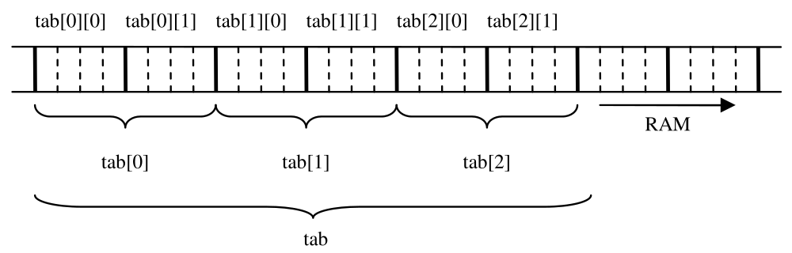
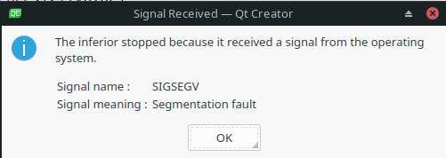

# Tablice

Współczesne programy mogą zajmować nawet kilkaset GB pamięci operacyjnej. Gdyby występowały w nich tylko zmienne podstawowych typów (`bool`, `int`, `double`, etc. ), to tych zmiennych musiałyby być miliardy. Takie zmienne miałyby zapewne nazwy w rodzaju `x0`, `x1`, ..., `x1000000000`. Samo wypełnienie miliarda zmiennych zerami wymagałoby miliarda instrukcji podobnych do `x7778976 = 0;` i gdybyśmy poświęcili tylko sekundę na napisanie każdej z nich, zapisanie kodu inicjalizującego taką tablicę zajęłoby nam ok. 10 lat. Słowem, nie byłoby dziś ani komputerów PC, ani smartfonów, ani niczego, co kojarzy się nam z informatyką.

#### Różne sposoby definiowania tablic

Typem danych, który umożliwia pracę na bardzo dużych blokach pamięci są tablice. W C++ istnieją trzy "książkowe", powszechnie spotykane w profesjonalnym kodzie sposoby deklarowania tablic:

```c++
int tab[10];              // (1) Klasyczna definicja tablicy 10 zmiennych typu int; tab jest nazwą tej tablicy 
std::array<int, 10> ar;   // (2) Nowoczesny równoważnik poprzedniej instrukcji; tu nazwą tablicy jest ar
std::vector<int> v(10);   // (3) Bardzo elastyczna i wygodna w użytkowaniu wersja "tablicy 10 int-ów"; jej nazwa to v 
```

- Tablica w stylu języka C deklarowana jest wg schematu

  ```c++
  typ_każdego_elementu_tablicy nazwa_tablicy[liczba_elementów_tablicy];
  ```

  czyli np.:

  ```c++
  int tab[10];           // tablica 10 elementów typu int
  ```

  Powyższy zapis kompilator interpretuje następująco: zarezerwuj ciągły blok pamięci, który umożliwi przechowywanie w nim dokładnie 10 różnych obiektów (zmiennych) typu `int`, i skojarz nazwę `tab` z początkiem tego obszaru, z typem każdego elementu (tu: `int`) i z ich liczbą (tu: 10). Zarezerwowana w ten sposób pamięć jest "surowa", czyli zawiera przypadkowe wartości, które akurat były zapisane w danym fragmencie pamięci. Liczba elementów tablicy jest częścią jej typu. Na przykład typem zmiennej `tab` w powyższym przykładzie jest `int[10]`. Typy zmiennych, jak wiemy, nie mogą w C++ ulegać zmianie. Dlatego liczba zapisana w nawiasach kwadratowych musi być znana kompilatorowi (mówi się, że musi być "stałą czasu kompilacji"). 

  ```c++
  const int N = 10;      // stała
  constexpr int K = 10;  // stała na pewno znana w czasie kompilacji
  int M = 10;            // zmienna
  int tab_0[10];         // OK, lietrał jest  stałą
  int tab_1[N];          // OK, N ma atrybut const
  int tab_2[K];          // OK, K ma atrybut constexpr
  int tab_3[M];          // Instrukcja niezgodna ze standardem, czyli błąd
  ```

  Ostatnia z powyższych instrukcji jest błędna, gdyż kompilator z zasady zakłada, że nie zna wartości zmiennych zadeklarowanych bez modyfikatora `const` lub `constexpr`. Niemniej, wiele kompilatorów (przy standardowych opcjach) nawet nie ostrzega o tym problemie, gdyż obsługują one rozszerzenie standardu C++ zwane "[variable-length arrays](https://stackoverflow.com/questions/1887097/why-arent-variable-length-arrays-part-of-the-c-standard)", które z kolei zostało włączone do standardu języka C.

- Nowoczesnym odpowiednikiem "tablic w stylu języka C" jest klasa `std::array`. 

  ```c++
  #include <array>
  // ...
  std::array<double, 1000> ar; // ar jest buforem na 1000 zmiennych typu double
  ```

  Jej użycie wymaga wcześniejszego włączenia do danego pliku źródłowego pliku nagłówkowego `array`. Typ ten generowany jest z szablonu, co poznajemy po nawiasach ostrokątnych `<...>`.  Zapisujemy w nich dwa parametry: typ przechowywanych w tablicy zmiennych lub obiektów oraz ich liczbę, która oczywiście musi być stałą całkowitą znaną w czasie kompilacji. 

  ```c++
  const int Size = 1000;
  std::array<double, Size> ar; // OK, Size jest stałą czasu kompilacji
  ```

  Klasa `std::array` to tzw. *wrapper* ("opakowanie") dla tablicy w stylu języka C. Wewnątrz obiektu zadeklarowanego jako `std::array<double, 1000>`znajduje się zwykła tablica typu `double[1000]`. Kompilator powinien wygenerować identyczny kod niezależnie od tego, w jaki sposób zadeklarujemy tablicę: czy w stylu języka C, czy jako `std::array`. 

- Ostatni, chyba najczęściej spotykany sposób deklarowania tablic w C++ polega na wykorzystaniu szablonu `std::vector`: 

  ```c++
  #include <vector>
  // ...
  std::vector<bool> flagi(10); // dynamiczna tablica 10 zmiennych typu bool zainicjalizowanych na false 
  ```

  Popularność `std::vector` ma kilka przyczyn. Jedną z nich jest to, że jego rozmiar nie musi być znany podczas kompilacji (dlatego nie jest umieszczany w parametrach szablonu, czyli w nawiasach ostrokątnych, lecz w tzw. konstruktorze, który jest po prostu funkcją wywoływaną podczas działania programu). Co więcej, rozmiar ten można dowolnie zmieniać podczas działania programu. Drugą jego zaletą jest to, że tylko `std::vector` obsługuje naprawdę duże tablice. W przeciwieństwie do `std::array`, wartości elementów obiektu klasy `std::vector` są zawsze inicjalizowane, tzn. `std::vector` nigdy nie operuje na surowej pamięci.  

#### Tablice wielowymiarowe

Tablice dwuwymiarowe zawsze definiuje się jako tablice tablic. W przypadku zwykłych tablic i `std::array` sprawa jest prosta:

```c++
int va[4][5];                             // 4-elementowa tablica 5-elementowych tablic zmiennych typu int (w stylu języka C)
std::array<std::array<int, 5>, 4>> vb;    // 4-elementowa tablica 5-elementowych tablic zmiennych typu int (preferowany zapis w C++)
// i dwa dziwactwa, formalnie poprawne, ale rzadko spotykane w praktyce:
std::array<int, 5> mix[4];                // 4-elementowa tablica 5-elementowych tablic zmiennych typu int (kto tak pisze?)
std::array<int[5], 4> dziwactwo;          // 4-elementowa tablica 5-elementowych tablic zmiennych typu int (masakra)
```

i analogicznie dla wyższych wymiarów (np. `int tab[5][5][5][5];`. Pamiętajmy, że dane w zwyczajnych tablicach oraz w tablicach typu `std::array`, także tych wielowymiarowych, są zawsze przechowywane w ciągłym regionie pamięci operacyjnej, czyli w strukturze jednowymiarowej. Oznacza to, że tablica `tab` zdefiniowana instrukcją

```c++
int tab[3][2];
```

lub

```c++
std::array<std::array<int, 2>, 3> tab;
```

będzie posiadała następującą reprezentację w pamięci operacyjnej komputera:

 

Znając położenie dowolnego elementu tej tablicy, np. `tab[1][1]`, można więc przewidzieć położenie każdego innego. Jeżeli typ `int` zajmuje 4 bajty, to taka tablica zajmuje 4 \* 3 \* 2 = 24 bajty. 

```c++
std::cout << sizeof(int[3][2]) << "\n";                          // u mnie wyświetla liczbę 24 
std::cout << sizeof(std::array<std::array<int, 2>, 3>) << "\n";  // u mnie wyświetla liczbę 24 
```

Konstrukcja wielowymiarowych tablic w oparciu o wektory jest nieco bardziej złożona, gdyż rozmiar wektora ustalany jest tak naprawdę dopiero podczas wykonywania się programu, a jego domyślna długość to 0 elementów. Tablicę o rozmiarze 4 wierszy i 5 kolumn można zdefiniować tak:

```c++
std::vector<std::vector<int>> tab(4);     // cztery wektory pustych wektorów int-ów
for (auto & row: tab)                     // pamiętaj o ampersandzie!
    row.resize(5);                        // zmieniamy długość każdego wiersza z 0 na 5 
```

lub tak:

```c++
std::vector<std::vector<int>> tab;     // pusty wektor pustych wektorów int-ów
tab.resize(4);                         // liczba wierszy wzrasta z 0 do 4
for (auto & row: tab)                  // pamiętaj o ampersandzie!
    row.resize(5);                     // zmieniamy długość każdego wiersza z 0 do 5 kolumn 
```

Wielowymiarowe tablice zbudowane na wektorach nie zajmują ciągłego obszaru pamięci operacyjnej. Znajomość położenia elementu `tab[1][1]` pozwala określić położenie elementu `tab[1][0]`, ale nic nie mówi o położeniu elementu `tab[0][0]`.  Wynika to ze sposobu inicjalizacji takich struktur: każde `resize` rezerwuje osobny fragment pamięci.

#### Inicjalizacja tablic

Tablice inicjalizujemy za pomocą nawiasów klamrowych, np. 

```c++
int tab[3] = {1, 2, 3};
std::array<int, 3> a = {5, 6, 7};
std::vector<int> v = {3, 2, 1};
```

Jeżeli posługujemy się pełnym inicjalizatorem, w którym wszystkie elementy są tego samego typu, to typ zmiennych przechowywanych w tablicy oraz ich liczbę możemy pominąć:

```c++
int tab[] = {1, 2, 3};     // równoważne zapisowi: int tab[3] = {1, 2, 3};
std::array a = {5, 6, 7};  // równoważne zapisowi: std::array<int, 3> a = {5, 6, 7};
std::vector v = {3, 2, 1}; // równoważne zapisowi: std::vector<int> v = {3, 2, 1};
```

 Tablice wielowymiarowe ("zwykłe"):

```c++
int tab[][3] = {{1, 2, 3}, {4, 5, 6}}; // równoważne zapisowi: int tab[2][3] = {{1, 2, 3}, {4, 5, 6}};
```

Jeżeli w deklaracji tablicy "zwykłej" lub `std::array` podamy mniejszą liczbę inicjalizatorów niż rozmiar tablicy, to kompilator brakujące wartości uzupełni wartościami domyślnymi dla danego typu. Dla typów arytmetycznych domyślną wartością jest 0:

```c++
int tab[10] = {7, 9};                // równoważne: int tab[10] = {7, 9, 0, 0, 0, 0, 0, 0, 0, 0};
std::array<char, 5> a = {'1', '2'};  // równoważne: std::array<char, 5> a = {'1', '2', '\0', '\0', '\0'};
```

 Znak `=` można przy inicjalizacji pomiąć:

```c++
std::array<int, 5> a{1, 2};   // ten rodzaj zapisu się spotyka 
int tab[10]{7};               // koszmar - łatwo przeoczyć klamry i pomyśleć, że to deklaracja tablicy dwuwymiarowej
```

#### Dostęp do elementów tablic

Do elementów tablic dostęp uzyskujemy za pomocą operatora indeksowania, czyli nawiasów kwadratowych:

```c++
int tab[10] = {0}; // tab = {0, 0, 0, 0, 0, 0, 0, 0, 0, 0}
tab[1] = 9;        // tab = {0, 9, 0, 0, 0, 0, 0, 0, 0, 0} 
std::array<int, 10> a = {1, 2, 3, 4, 5};
std::cout << a[0];                     // wyświetli 1
std::vector<double> v = {1, 2, 4};     // v = {1.0, 2.0, 4.0}
v[1] = 0.0;                            // v = {1.0, 0.0, 4.0}
```

Pamiętajmy, że pierwszemu elementowi tablicy odpowiada indeks 0!

Dostęp do elementów tablic wielowymiarowych:

```c++
std::array<std::array<5, int>> a2; 
a2[0][0] = 1.0; 
```

Oznacza to, że jeżeli zdefiniujesz tablicę w dowolny (standardowy) sposób: jako tablicę "w stylu C", jako `std::array` lub jako `std::vector`, to zawsze używasz jej dokładnie tak samo. 

#### Stos, sterta i operator sizeof, czyli gdzie są moje dane?

Programy (jednowątkowe) dzielą dostępną im pamięć na kilka segmentów, por. [rysunek](https://www.geeksforgeeks.org/memory-layout-of-c-program/):

 

Dla programisty C++ najważniejsze są 3 segmenty: 

- **stos** (ang. *stack*): obszar danych lokalnych w funkcjach. Trafiają tu wszystkie dane nazwane, które zdefiniowano wewnątrz funkcji (jako zmienne lokalne funkcji lub ich argumenty). Czas ich życia jest dobrze określony i zarządzany w pełni automatycznie przez kompilator. Stos zwykle ma z góry ograniczoną pojemność, która nie zmienia się w trakcie działania programu. W systemach operacyjnych rodziny Linux jest to zwykle 8 MB (8192 KB). 

  ```bash
  > ulimit -s
  8192
  ```

- **sterta** (ang. *heap*): obszar dla danych "na życzenie". Dane tu przechowywane nie są identyfikowane przez nazwę, której nie posiadają, a czas ich życia kontrolowany jest przez programistę. Jego rozmiar jest ograniczony tylko ilością dostępnej pamięci operacyjnej. 

- **obszar danych statycznych** (na rysunku: "bss" i "initialized data"). Dane te widoczne są w całym programie przez cały czas jego funkcjonowania. W tym segmencie przechowywany jest m.in. `std::cout`. Może być dowolnie duży, ale staramy się tej jego własności nie nadużywać: im mniej danych "statycznych", tym lepiej. 

Nazwane tablice w stylu języka C (np. `int tab[10]`) oraz zdeklarowane poprzez `std::array` są w całości umieszczane na stosie (lub w segmencie danych statycznych). Jest to możliwe, bo ich rozmiar jest znany kompilatorowi i nie może ulec zmianie, kompilator może więc automatycznie zarządzać przydzieloną im pamięcią. Natomiast nazwany wektor składa się z części przechowywanej na stosie i części przechowywanej na stercie. Część przechowywana na stosie jest niewielka i służy do zarządzania danymi, które w całości przechowywane są na stercie.

Operator `sizeof` zwraca liczbę bajtów zajmowanych przez zmienną lub obiekt, ale tylko w części zarządzanej przez kompilator, czyli umieszczonej na stosie (lub w segmencie danych statycznych). Z kolei liczbę danych przechowywanych w `std::array` lub `std::vector` można otrzymać, poprzez wywoiłąnie składowej `size` tych obiektów:

```c++
// vector:
std::vector<int> v(1000);
std::cout << sizeof(v) << "\n"; // u mnie wyświetla 24. Te 24 bajty zawierają informacje niezbędne do zarządzania danymi 
std::cout << v.size() << "\n";  // wyświetla 1000, czyli liczbę elementów wektora (= rozmiar danych)

// array:
std::array<int, 1000> a;
std::cout << sizeof(a) << "\n"; // u mnie wyświetla 4000, bo `int`zamuje u mnie 4 bajty 
std::cout << v.size() << "\n";  // wyświetla 1000, czyli liczbę elementów tablicy

// tablica w stylu C
int tab [1000];
std::cout << sizeof(tab) << "\n";                 // u mnie wyświetla 4000, bo `int`zamuje u mnie 4 bajty 
std::cout << sizeof(tab)/sizeof(tab[0]) << "\n";  // wyświetla 1000, czyli liczbę elementów tablicy
```

Do czego potrzebna jest nam ta cała wiedza o stosie i stercie? Otóż skoro stos to segment danych o stałej pojemności ok. 8MB pamięci, która ma wystarczyć na cały nasz program, to nie możemy w nim zmieścić naprawdę dużych tablic. Dlatego duże tablice umieszcza się w `std::vector`.  Poniższy program jest całkowicie poprawny, kompilator nie wyświetli nawet ostrzeżenia, niemniej, program "padnie" podczas działania:

```c++
int main()
{
   std::vector<int> v(10'000'000); // OK
   int tab[10'000'000] = {0};      // na tej instrukcji program "padnie"
}
```



Ten rodzaj błędu to tzw. *[stack overflow](https://en.wikipedia.org/wiki/Stack_overflow)*. Teraz rozumiesz już, co oznacza nazwa popularnego serwisu [stackoverflow.com](https://stackoverflow.com/). 

#### Przepełnienie bufora, czyli *buffer overflow*

Podczas odwoływania się do elementów tablicy, program nie sprawdza, czy indeks mieści się w prawidłowym zakresie. Dlatego

```c++
int n = 7;
std::array<int, 5> tab;
tab[n] = n;
```

to poprawny składniowo fragment programu. Kompilator nie musi nawet nas ostrzegać, że usiłujemy zapisać informacje poza obszarem pamięci przydzielonej tablicy `tab`. Sytuację tę nazywamy przepełnieniem bufora, czyli *[buffer overflow](https://pl.wikipedia.org/wiki/Przepe%C5%82nienie_bufora)*. Każde "przestrzelenie" indeksu to błąd, czyli *undefined behavior*, ale zwykle tylko "duże" przestrzelenie jest diagnozowane podczas działania programu - w tym przypadku program "padnie" na skutek zgłoszenia sygnały "segmentation fault". 

#### Który rodzaj tablic jest "najlepszy"?

Gdyby jeden rodzaj tablic najlepiej pasował do każdej sytuacji, to nie mielibyśmy wyboru. Czyli: każdy rodzaj tablic ma swoje wady i zalety. 

- Jeżeli zależy ci tylko na tym, by program po prostu działał, używaj `std::vector`.
- Jeżeli nie znasz rozmiaru tablicy zanim rozpocznie się program, lub chcesz, by jego rozmiar mógł być zmieniany podczas wykonywania się programu, używaj `std::vector`. 
- Jeżeli zależy ci na tym, by program działał możliwie szybko i optymalnie wykorzystywał pamięć komputera, używaj `std::array` lub notację z języka C:
  - Gdy tablica nie będzie zbyt duża i znasz jej rozmiar już w chwili pisania programu 

Kolejne pytanie: notacja "w stylu języka C" (czyli np. `int tab[10];`) czy `std::array`. Generalnie preferuje się `std::array`, gdyż `std::array`

- "zna" swój rozmiar (składowa `size`)
- jest dostosowany do typowych interfejsów C++ (np. do iteratorów)
- nie może przypadkiem być zinterpretowany jak wskaźnik
- posiada zdefiniowany operator przypisania
- ułatwia diagnostykę przepełnienia bufora

Czy to znaczy, że sam nie używam tablic w stylu C? Nie, czasami używam. Jenak nie zalecam. 

#### Zamiast podsumowania

Programiści takich języków jak Python czy JavaScript mogą się dziwić, że w C++ tablice można definiować na co najmniej 3 sposoby, z czego niektóre są równoważne, a inne nie, że istnieje kilka składni dla inicjalizacji obiektów, w tym tablic, że istnieje coś takiego jak stos i sterta i że to ma znaczenie dla działania programu. Cóż, w jądrze Pythona nie ma tablic, a żeby pracować w nim na (prawdziwych) tablicach potrzebujemy zaimportować jakąś bibliotekę, np. NumPy.  Można o niej [przeczytać](https://www.w3schools.com/python/numpy/numpy_intro.asp), że *NumPy is a Python library and is written partially in Python, but most of the parts that require fast computation are written in C or C++*. C++ jest tym językiem, którego projekt za najważniejszą cechę języka uznaje możliwość kompilacji do bardzo efektywnego kodu maszynowego. Jest też językiem wielokrotnie modernizowanym. Stąd tyle tych "dziwnych" niuansów.

Różne języki w odmienny sposób definiują podstawowe operacje na tablicach. Pouczające ćwiczenie: odwiedź stronę https://www.w3schools.com/ i sprawdź, jak w językach Python [(NumPy](https://www.w3schools.com/python/numpy/)), JavaScript i R definiuje się tablice, jak napisany w tych językach program reaguje na przepełnienie bufora (w tym na podanie ujemnych indeksów lub indeksu 0 dla języka R), czy indeksowanie tablicy rozpoczyna się w nich od 0 czy 1, czy można zmieniać rozmiar tych tablic i czy mogą przechowywać wartości różnych typów.
