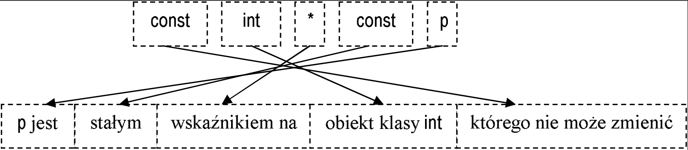

# Wskaźniki

Gdy kupujemy chleb, to dostajemy ten chleb i możemy przynieść go ze sobą do domu. Gdy kupujemy mieszkanie, to nikt nie przenosi go z jednego budynku do drugiego; w tym przypadku dostajemy "tylko" akt notarialny i klucze. Wskaźniki to właśnie takie klucze, które pasują tylko do jednego mieszkania i - w pewnym sensie - identyfikują je. Ich podstawowym zastosowanie jest przekazywanie informacji o tym, gdzie są dane, bez konieczności przekazywania (powielania) tych danych. W gruncie rzeczy to jedyne ich zastosowanie. Niemniej, świat, w którym programowanie obywałoby się bez wskaźników (choćby ukrytych przed programistą) byłby równie dziwny, jak świat, w którym kupiec domu musi sobie ten dom wykopać z ziemi i przetransportować na własną działkę.

### Operator pobrania adresu

Każda zmienna i każdy obiekt ma swoje miejsce w pamięci operacyjnej. W C++ możemy uzyskać informację o tej lokalizacji za pomocą operatora pobrania adresu: &.

```c++
int n = 10;
auto p = &n;   // p jest zmienną wskaźnikową przechowującą adres zmiennej n
```

W powyższym przykładzie `p` jest wskaźnikiem (ang. *pointer*) do zmiennej `n`. Można też ją nazwać adresem lub zmienną wskaźnikową.

Tak jak możne istnieć wiele egzemplarzy kluczy do jednego mieszkania, tak można mieć wiele wskaźników do tej samej zmiennej:

``` c++
int m = 10;
auto p1 = &k;  // p1 wskazuje na k
auto p2 = &k;  // p2 także wskazuje na k
```

 Można też tworzyć klucz do klucza, czyli wskaźnik na wskaźnik:

```  c++
double x = 1.0;
auto p = &x;
auto pp = &p;    // pp wskazuje na p (który w tej chwili wskazuje na x)
auto ppp = &pp;  // ppp wskazuje na pp (którry w tej chwili wskazuje na p, który w tej chwili wskazuje na x)
```

### Jawna deklaracja typu wskaźnika

W języku C++ każda zmienna, każdy obiekt musi mieć dobrze zdefiniowany typ. W powyższych przykładach ominąłem kwestię deklaracji typu wskaźników `p` i `pp`, przerzucając tę pracę na kompilator poprzez zadeklarowanie ich typów jako `auto`. W praktyce jednak nie uniknie się jawnych deklaracji typów wskaźnikowych. Składnia jest dość prosta i opiera się na umieszczania gwiazdki (`*`) między nazwą wskazywanego typu a nazwą zmiennej wskaźnikowej. Powyższy przykład można więc przepisać następująco:

```c++
double x = 1.0;
double* p = &x;       // p wskazuje na x 
double** pp = &p;     // pp wskazuje na p (który w tej chwili wskazuje na x)
double*** ppp = &pp;  // ppp wskazuje na pp (którry w tej chwili wskazuje na p, który w tej chwili wskazuje na x)
```

Typem wskaźnika na `double` jest więc `double*`, podobnie typ wskaźnika na `char` oznaczamy jako `char*`. Typem wskaźnika na wskaźnik na `double` jest więc wskaźnik na `double*`, czyli coś w rodzaju `(double*)*`, jednak nawiasów tu nie używamy, stąd typ ten to po prostu `double**`. Skoro w deklaracji `double** pp = &p;` zapisano dwie gwiazdki, to znaczy, że mamy podwójne adresowanie pośrednie: w filmie sensacyjnym `pp` odpowiadałoby kluczykowi do skrytki na stacji kolejowej, w której znajduje się kolejny kluczyk (tu: `p`), i dopiero on otwiera drzwi do tajnej kryjówki (tu: `x`).

### Operator wyłuskania wartości, `*`

Wiemy, że po instrukcji `double* p = &x;` w zmiennej `p` zostanie zapisany adres zmiennej `x`. W jaki sposób można za pomocą można odnieść się do danych wskazywanych przez wskaźnik? Służy do tego ta sama gwiazdka, której używa się do deklaracji typu wskaźnika. W tym kontekście ta gwiazdka zwana jest operatorem wyłuskania:

```c++
int a = 10;
int* p = &a;
std::cout << *p << "\n";  // wyświetli liczbę 10, bo p wskazuje na a, więc *p równoważne jest a 
*p = 2;                   // zapisze wartość 2 w zmiennej a, bo p wskazuje na a, więc *p równoważne jest a 
std::cout << a << "\n";   // wyświetli 2
```

### Operator wyłuskania składowej, `->`

Jeżeli mamy do czynienia ze strukturą danych, do której mamy dostęp poprzez wskaźnik, to odwołujemy się do niej poprzez operator wyłuskania składowej `->` ("strzałka"):

```c++
struct Osoba
{
    std::string imie;
    int rok_urodzenia;
};
Osoba bolek;
Osoba* p = &bolek;
p->imie = "Bolek";  
p->rok_urodzenia = 2000;
```

Zapis ten pozwala uprościć nawiasy, które byłyby niezbędne bez niego: zapis `p->imie` jest bowiem równoważny zapisowi `(*p).imie`. W tej postaci nie jest to może jeszcze duże uproszczenie, ale adresowanie pośrednie czasem występuje w całych ciągach i jeżeli możemy coś zapisać w postaci
`ui->main_widget->get_slider(1)->setRGB(RGBColor(127, 64, 197)); `, to cieszymy się, że nie musimy tego zapisywać jako 
`(*(*(*ui).main_widget).get_slider(1)).setRGB(RGBColor(127, 64, 197));`  (mam nadzieję, że się nie pomyliłem w przekształcaniu wyrażeń);

Warto porównać to, jak `std::cout` traktuje wskaźnik, a jak wyłuskiwaną z niego wartość:

```c++
int n = 10;
int* p = &n;
std::cout << "p = " << p << ", *p = " << *p << "\n";
```

 U mnie program ten wyświetla

```txt
p = 0x7ffcd57fe7e4, *p = 10
```

 `0x7ffcd57fe7e4` to zapisany w formacie szesnastkowym adres zmiennej `n`, a `10` to jej wartość wyłuskana za pomocą wyrażenia `*p`.

### Kopiowanie wskaźników

Wskaźnik nie musi zawsze wskazywać tej samej zmiennej.

```c++
int n = 10;
int m = 100;
int* p = &n;
int* q = &m;
std::cout << *p << "\n"; // wyświetli 10
p = q;
std::cout << *p << "\n"; // wyświetli 100
```

Przy kopiowaniu wskaźników obowiązuje jednak zasada, że ich typy muszą być zgodne. W szczególności, nie można kopiować wskaźnika typu `int*` na wskaźnik typu `double*`:

```bł
int n = 9;
double x = 1.0;
int* p = &n;
double* q = &x;
p = q;   // błąd: typy p i q są różne
p = &x;  // błąd: typt p i &x są różne
```

### Wskaźnik typu `void*`

Istnieje specjalny, "niepełny" typ wskaźnikowy `void*`, dosłownie "wskaźnik na pustkę", w rzeczywistości "wskaźnik na nie wiadomo co". Typu tego używamy, gdy chcemy "oszukać" (czy raczej na chwilę wyłączyć) system kontroli typów języka C++. Jeżeli zadeklarujemy `p` jako `void* p;`, to kompilator zezwoli na przypisanie mu wartości dowolnego wskaźnika, niezależnie od tego, na co by on naprawdę nie wskazywał. Ponieważ jednak kompilator nie ma informacji o tym, na co wskaźnik typu `void*` wskazuje, to nie zezwala na wyłuskiwanie z niego wartości (operatorem `*` lub `->`)

```c++
int n;
int* q = &n;
void* p = q;    // OK, każdy wskaźnik można skopiować na void*
q = p;          // Błąd: nie można przypisać wskaźnikowi na int jakiegoś "śmiecia" ze zmiennej typu void*
q = (int*)p;    // OK: jawnie powiedzieliśmy kompilatorowi, że p przechowuje teraz wskaźnik na int
std::cout << *p << "\n";                    // Błąd: nie można wyłuskiwać wartości z void*
std::cout << (int*)p << "\n";               // Ok: kompilator założy, że w p zapisano wskaźnik na int. Składnia odziedziczona z języka C
std::cout << static_cast<int*>(p) << "\n";  // To samo, co powyżej, ale zapisane "porządnie", nowoczesnym C++
```

Wskaźniki `void*` bardzo rzadko pojawiają się w "czystym" C++, natomiast bardzo często pojawiają się w deklaracjach argumentów funkcji w bibliotekach napisanych w języku C. Na przykład tak wygląda deklaracja funkcji `qsort` z biblioteki standardowej języka C oraz C++: 

```c++
void qsort(void *ptr, std::size_t count, std::size_t size, int(const void*, const void*) *comp);
```

a tak - deklaracja funkcji wykonującej losową permutację elementów tablicy w bibliotece [GSL](https://www.gnu.org/software/gsl/):

```c++
void gsl_ran_shuffle(const gsl_rng *r, void *base, size_t n, size_t size);
```

Język C++ jest w znacznym stopniu nadzbiorem języka C i kompilator języka C++ kompiluje programy napisane w C tak, jak by były to programy napisane w C++. Istnieje bardzo dużo bibliotek napisanych jednocześnie (jeden kod) dla języka C i C++. Takie biblioteki muszą używać `void*` wszędzie tam, gdzie chcą umożliwić użytkownikom operacje na dowolnych typach danych. Na przykład chcielibyśmy, aby `qsort` mógł sortować dane dowolnego typu - dlatego adres bufora zawierającego dane zadeklarowany jest jako `void *ptr`.

### Wskaźnik zerowy, czyli `nullptr`

Istnieje specjalna wartość, którą można zapisać we wskaźniku dowolnego typu. Oznacza się ją słowem `nullptr`. Standard nie mówi, jaka jest jego reprezentacja bitowa, ale przez dziesięciolecia wiadomo było, że składała się ona z samych zer. Stąd jego zwyczajowa nazwa: wskaźnik zerowy.

```c++
int* p = nullptr; // OK
int* q = 0;       // Zwykle to samo, można to spotkać w starym kodzie, ale odradzam stosowania takiego zapisu
```

Wskaźnik zerowy niesie ważną informację: "nie wskazuję na nic użytecznego". To jak kluczyk, który nie pasuje do żadnych drzwi. Można go użyć do zasygnalizowania, że nie ma już żadnych nowych drzwi do otwarcia.

### Wskaźniki stałe, wskaźniki na stałe i stałe wskaźniki na stałe

Praktyka dowodzi, że programy, w których operuje się na wskaźnikach, są podatne na błędy. Żeby ograniczyć ich liczbę, wprowadzono wskaźniki stałe (takie, które zawsze wskazują na ten sam obiekt) i wskaźniki na stałe (takie, za pomocą których można odczytywać informacje, ale nie można ich użyć do modyfikowania pamięci wskazywanej przez wskaźnik).

```c++
int n = 1;
int m = 2;
int* const pc = &n;         // pc zawsze wskazuje na n;
const int* cp = &n;         // cp jedst wskaźnikiem "tylko do odczytu" wskazywanej przez siebie wartości
const int* const cpc  = &n; // cpc zawsze wskazuje na n i nie może zostać użyte do modyfikowania n
std::cout << *pc << "\n";   // OK, pc służy do odczytu *pc
*pc = 11;                   // OK

*cp = 10;   // Błąd, *cp jest typu const int, nie może więc ulec zmianie
*cpc = 12;  // Błąd, jak wyżej
cpc = &m    // Błąd, typ cpc posiada modyfikator const
```

Złożone deklaracje wskaźników najwygodniej czyta się od prawej do lewej:




### Wskaźniki a tablice

Jak już wiemy, tablica to fragment pamięci operacyjnej identyfikowany przez nazwę. Zupełnie jak wskaźnik. Dlatego nie powinno nas bardzo dziwić, że nazwa tablicy może być używana jak wskaźnik, a wskaźnik jak nazwa tablicy.

```c++
int tab[10] = {0, 1, 2, 3, 4, 5, 6, 7, 8, 9};
int* p = &tab[0];
std::cout << p[3] << " " << *tab << "\n"
```

Powyższy program wyświetla

```txt
3 0
```

czyli to samo, co instrukcja

```c++
std::cout << tab[3] << " " << *p << "\n";
```

### Tablice wskaźników i wskaźniki na tablice

Spójrzmy na poniższe dwie deklaracje:

```c++
int* tab1[10];    // tablica 10 wskaźników na int
int (*tab2)[10];  // wskaźnik na tablicę 10 zmiennych typu int
```

Zasada interpretowania takich deklaracji jest następująca: zaczynamy od nazwy zmiennej i posuwamy się w prawo aż do prawego nawiasu, po czym zmieniamy kierunek na "w lewo", aż do nawiasu lewego, który tworzy parę z nawiasem prawym, na którym zmieniliśmy kierunek czytania deklaracji. Następnie znowu w prawo. Jeżeli okrągły nawias lewy napotkamy przed prawym, to mamy do czynienia z funkcją. Nawias kwadratowy wprowadza rozmiar tablicy. Dlatego w deklaracji `int* tab1[10];` zmienna `tab1` to "tablica 10 wskaźników na int", deklaracja `int (*tab2)[10];` deklaruje, że `tab2` to "wskaźnik na tablicę 10 zmiennych typu int".  W tym drugim przypadku zaczynamy od `tab2`, idziemy w prawo, zawracamy na prawym nawiasie okrągłym, odczytujemy `*` jako "wskaźnik" ("`tab2` to wskaźnik..."), zawracamy na lewym nawiasie okrągłym, dochodzimy do `[`, co odczytujemy jako "tablica" ("`tab2` to wskaźnik na tablicę...)", odczytujemy `10]` jako rozmiar tablicy ("`tab2` to wskaźnik na tablicę dziesięciu..."), dochodzimy do końca deklaracji, zawracamy w lewo, odczytujemy `int` i mamy pełną definicję: "`tab2` to wskaźnik na tablicę dziesięciu zmiennych typu `int`".

### Wskaźniki a napisy

Jak wiemy, każde wyrażenie w C++ ma swój typ. Dlatego napisy, np `"Ala"`, też mają swój typ. Tylko - jaki? I jak te napisy zapisać w zmiennych? Otóż literały napisowe, np. `"Ala"`, interpretowane są jako tablice znaków, przy czym kompilator sam dodaje na końcu takiej tablicy specjalny znak `'\0'` o wartości 0 (tzw. bajt zerowy) . Jednak w instrukcji `auto s = "Ala"` kompilator jako typ `s` przyjmie typ wskaźnikowy `const char*`.

```c++
char tab[] = "Ala";                   // tab jest tablicą 4 znaków
char tab2[] = {'A', 'l', 'a', '\0'};  // tab2 jest idntyczną tablicą 4 znaków
auto napis = "Ala";                   // napis ma typ const char* i wskazuje na początek napisu "Ala"
```

Jeżeli w literale napisowym zastosujemy litery spoza zestawu ASCII, to trudno przewidzieć, z ilu będzie się składał znaków. W popularnym standardzie [UTF-8](https://pl.wikipedia.org/wiki/UTF-8) (Linux, niektóre programy w Windows) polskie litery kodowane są na 2 bajtach, ale zapis niektórych symboli wymaga 3 lub nawet 4 bajtów.

```c++
std::cout << sizeof("Ala") << "\n";  // wyświetla 4: 3 litery ASCII + bajt zerowy
std::cout << sizeof("Żółć") << "\n"; // u mnie wyświetla 9: 4 polskie litery, każda zakodowana na 2 bajtach, + bajt zerowy
```

Bardzo rzadko pracuje się z napisami za pomocą tablic, gdyż tablice mają stałą długość, tymczasem bardzo często chcemy  napisy modyfikować, np. łączyć, a także wstawiać, podmieniać lub usuwać fragmenty tekstu. Dlatego napisy najczęściej są w programach definiowane tak:

```c++
const char* s = "napisz coś"; // wersja tradycyjna
auto s2 = "kot w butach";     // jak wyżej
std::string s3 = "bajki";     // wersja zalecana, ale nie omawialiśmy jeszcze std::string
```

### Arytmetyka na wskaźnikach

Jak już wiemy, wskaźników można używać jak nazw tablic, a nazw tablic - jak wskaźników. W pewnych sytuacjach ułatwia to pracę z tablicami. Spójrzmy na poniższy przykład: na co wskazuje `p` po operacji `p++`?

```c++
int tab[5] = {0, 1, 2, 3, 4};
int* p = &tab[0];
p++;
```

Ponieważ język programowania nie powinien ułatwiać pisania jawnie błędnego kodu, taka instrukcja na pewno nie przesuwa wskaźnika `p` na kolejny bajt, gdyż pod tym adresem na pewno nie ma liczby typu `int`, tymczasem wskaźnik ten gwarantuje, że przy poprawnym używaniu, zawsze będzie wskazywał na jakąś liczbę tego typu. Z tego powodu `p++` przesuwa wartość `p` do kolejnej popranej wartości, czyli do `&tab[1]`. W praktyce więc `p++` zwiększy wartość zmiennej `p` o rozmiar zmiennej typu `int`, czyli zapewne o 4 bajty:

```c++
int tab[5] = {0, 1, 2, 3, 4};
int* p = &tab[0];
std::cout << p << "\n";
p++;   
std::cout << p << "\n";
while (p != &tab[4])
{
    std::cout << *p << "\n";
    p++;
}
```

 Ten fragment programu wyświetla na moim komputerze

```txt
0x7ffe42c0b0d0
0x7ffe42c0b0d4
1
2
3
```

Jak widzimy, wartości adresów zmiennej `p` przed i po wykonaniu operacji `p++` różnią się o 4 bajty. Pętla zaczyna się w sytuacji, gdy `p` wskazuje na element o wartości 1, dlatego nie jest wyświetlany pierwszy element tablicy (tu: `0`).

Dokładnie na tej samej zasadzie działają operacje w rodzaju `--p`, `p + 7`, `p += 1` czy `p -= 2`. Należy pamiętać, że one są dobrze określone tylko wówczas, gdy wartość danego wyrażenia nie wychodzi poza tablicę, na którą wskazuje `p`.

Kolejny przykład. Załóżmy, że mamy tablicę zadeklarowaną jako `double tab[100]` i że chcemy ja uporządkować od najmniejszej do największej. Można to w C++ robić instrukcją

```c++
std::sort(&tab[0], &tab[100]);  // tak, tab[100] leży dokłądnie zaraz za tablicą i właśnie tak ma tu być
```

można też skorzystać z arytmetyki na wskaźnikach i nieco skrócić zapis,

```c++
std::sort(tab, tab + 100);
```

W podobny  sposób możemy posortować tylko część tablicy, np.:

```c++
std::sort(tab + 10, tab + 20); // sortuje elementy {tab[10], tab[11], ..., tab[19]}
```

Na koniec ciekawostka. Kompilatory niemal na pewno wyrażenie `tab[10]` zamieniają na `*(tab + 10)`. Jest ono jednak równoważne wyrażeniu `*(10 + tab)`,  które z kolei można zapisać w postaci `10[tab]`. Proszę nigdy nie używać tej notacji. Niemniej, jeżeli rozumiesz, o co tu chodzi, to chyba rozumiesz też arytmetykę na wskaźnikach. Zapis w rodzaju `while (p != &4[tab])`, choć formalnie poprawny, nadaje się wyłącznie na [konkurs na najbardziej nieczytelny program w języku C](https://en.wikipedia.org/wiki/International_Obfuscated_C_Code_Contest).

### Wskaźniki a pamięć wolna (sterta)

Pamięć wolna (ang. *free store*), znana też jako sterta (ang. *heap*), to jeden z głównych powodów, dla których w językach C i C++ istnieją wskaźniki, i nic nie wskazuje na to, by kiedykolwiek miały z nich zniknąć.

Przypominam, że programy zwykle dostępną sobie pamięć dzielą na kilka segmentów, z których w tej chwili interesują nas dwa: stos (*stack*)  i pamięć wolna (*heap*):


Jeżeli wewnątrz dowolnej funkcji zadeklarujemy jakąś zmienną i nadamy jej nazwę

``` c++
int fun()
{
   double x = 1.0;
   // ... 
}
```

to kompilator znajdzie dla niej miejsce na stosie i zadba o to, by po zakończeniu tej funkcji pamięć ta została automatycznie zwolniona dla innych funkcji. W wielu sytuacjach zmienne alokowane (tj. umieszczane) na stosie programu zupełnie wystarczają. Metoda ma jednak jeden feler: programista musi z góry znać całkowite zapotrzebowanie na pamięć (i inne zasoby). W większości przypadków to nierealne. Czy, powiedzmy, edytor tekstu ma na sztywno zarezerwować na tekst bufor 1 MB? A jeżeli ktoś będzie chciał w nim otworzyć plik zajmujący 1GB (są edytory, które to potrafią)? A dlaczego z góry rezerwować mnóstwo pamięci, jeżeli większość przetwarzanych tekstów jest krótka? Jak w takim świecie tablic o stałej długości można by uruchamiać jednocześnie wiele programów? Jasne jest, że potrzeba pamięci "na żądanie", która nie byłaby zarządzana przez kompilator. Oto rozwiązanie w języku C++:

```c++
int* p = new int(7);
int* tab = new int[100'000];
```

W pierwszej z powyższych instrukcji operatorem `new` rezerwujemy sobie na stercie pamięć na jedną zmienną typu `int` i nadajemy jej wartość 7. Alternatywna notacja korzysta z nawiasów klamrowych:

```c++
int* p = new int{7};
```

Pamięć ta nie ma swojej nazwy. Operator `new` zwraca jej adres, który zapisujemy w zmiennej wskaźnikowej `p`.  W drugiej z powyższych instrukcji rezerwujemy na stercie miejsce na tablicę stu tysięcy zmiennych typu `int` i zapisujemy jej adres we wskaźniku `tab`. Od tej pory możemy niemal zapomnieć, że to wskaźnik i używać go jak nazwy tablicy:

```c++
for (int i = 0; i < 100'000; ++i)
    tab[i] = i;
```

Taki rodzaj rezerwacji pamięci nazywa się *dynamiczną alokacją pamięci*. Jeżeli pamięć zarezerwujemy sobie tak, jak w powyższym przykładzie, to mamy następującą sytuację: na stosie mamy 2 zmienne adresowe `p` i `tab`, a na stercie dwa bloki pamięci, jeden o długości 4 bajtów (pod adresem `p`), a drugi o długości 400000 bajtów (100000 zmiennych typu `int`). Jeżeli nic nie zrobimy, to kompilator zwolni pamięć przydzieloną zmiennym `p` i `tab`, (2 razy po 8 bajtów na stosie), ale nawet nie dotknie pamięci zarezerwowanej na stercie. Będzie to tzw. wyciek pamięci (ang. *memory leak*). Bardzo poważny i trudny w diagnostyce błąd programu. Pamięć zostanie utracona aż do końca działania programu, kiedy to "odzyska ją" dla innych programów system operacyjny.

Aby uniknąć wycieku pamięci, zarezerwowaną pamięć należy w pewnym momencie zwolnić. Służą do tego operatory `delete` i `delete []`:

```c++
delete p;
delete[] tab;   // puste nawiasy kwadratowe
```

Proszę zwrócić uwagę na to, że jeżeli na stercie zarezerwowaliśmy miejsce na pojedynczą zmienną lub obiekt (operatorem `new`), to zwalniamy ją operatorem `delete`. Jeżeli zaś rezerwowaliśmy pamięć dla całej tablicy operatorem `new[]`, to zwalniamy ją operatorem `delete[]`.

Gdyby wrócić do metafory wskaźnika jako klucza do mieszkania, to dynamiczną alokację pamięci można porównać do zaczarowanego ołówka ze znanej kreskówki. Gdy potrzebujemy trochę pamięci, to ją sobie "rysujemy" operatorem `new` lub `new[]`.  Główna różnica polega na tym, że nasze zasoby nie są nieograniczone, dlatego musimy zadbać o zwalnianie niepotrzebnej pamięć operatorem `delete` lub `delete[]`.


### Tablice i wskaźniki w argumentach funkcji

Jak za pomocą wskaźników napisać funkcję, która w miejsce jakiejś zmiennej typu `double` wpisuje jej kwadrat? Oto możliwe rozwiązanie:

```c++
void square(double* p)
{
    *p *= *p;   // pomnóż *p przez siebie i wynik zapisz w *p
}
```

Funkcja `square` ma dostęp pośredni do danych, na które wskazuje wskaźnik `p`. Gdyby zamiast `*p` użyć jakiejś zmiennej, np. `x`, to powyższa instrukcja przyjęłaby bardziej zrozumiałą postać `x *= x;`  co można zapisać też tak: `x = x * x;`.

Powyższą funkcję wywołujemy zgodnie z jej deklaracją, czyli przekazujemy do niej wskaźnik na zmienną typu `double` (tu: pobrany ze zmiennej `x` operatorem `&`):

```c++
double x = 7.0;
square(&x);               // , 
std::cout << x << "\n";   // wyświetli 49
```

Jak do funkcji przekazać tablicę w stylu języka C? Takie tablice nie mogą być kopiowane. Do funkcji przekazuje się dwa parametry, adres pierwszego elementu tablicy oraz liczbę jej elementów. Oto przykład funkcji, która zlicza, ile liczb całkowitych zapisanych w jakiejś tablicy jest podzielnych przez 3:

```c++
uint64_t num3(const int* tab, uint64_t size)      // wskaźnik na stałą typu int 
{
    uint64_t counter = 0;
    for (uint64_t i = 0; i < size; ++i)
    {
        if (*tab % 3 == 0) counter++;
    }
    return counter;
}
```

 Można jej użyć tak:

```c++
int main()
{
    int tab[] = {1, 2, 3, 4, 5, 6, 7, 8, 9, 10}; // w tej tablicy są 3 liczby podzielne przez 3 (3, 6 i 9)
    std::cout << num3(tab, 10) << "\n";          // wyświetli 3, bo num3 przetworzy całą tablicę
    std::cout << num3(tab, 2) << "\n";           // wyświetli 0, bo num3 przetworzy tylko podciąg {1, 2} 
    std::cout << num3(tab + 2, 3) << "\n";       // wyświetli 1, bo num3 przetworzy tylko podciąg {3, 4, 5} 
}
```

Jak widzimy, do funkcji przyjmującej tablicę można przekazywać całe tablice lub tylko jej części. Przydaje się do tego arytmetyka na wskaźnikach.

Zamiast czystej notacji wskaźnikowej, w deklaracjach funkcji przyjmujących argumenty tablicowe można też stosować notację pseudotablicową:

```c++
uint64_t num3(const int tab[], uint64_t size)
```

Obie konwencje są równoważne.

Spójrzmy teraz na jedną z popularnych deklaracji funkcji `main`:

```c++
int main(int argc, const char* argv[])
```

W funkcji tej `argv` jest tablicą o nieokreślonej liczbie elementów (stąd `[]`) . Każdy z tych elementów jest typu `const char*`, czyli wskaźnikiem na stały znak. Prawdopodobnie więc mamy do czynienia z tablicą napisów, np. zdefiniowaną następująco: `auto tab[] = {"Ala", "ma", "dużego", "kota"};` Funkcję tę można zdefiniować równoważnie jako `int main(int argc, const char** argv)`.

### Przykład

Rozpatrzmy dość zaawansowany przykład użycia wskaźników, skopiowany z serwisu [cppreference.com](https://en.cppreference.com/w/c/algorithm/qsort) (oryginalny przykład napisany jest w czystym C, tu  pozwoliłem sobie go nieco uprościć i dostosować do C++). Ilustruje on sposób użycia funkcji `qsort` do sortowania tablicy zmiennych typu `int` :

```c++
#include <stdio.h>
#include <stdlib.h>
 
int compare_ints(const void* a, const void* b)       // (a)
{
    int arg1 = *(const int*)a;                       // (b)
    int arg2 = *(const int*)b;                       // (c)
 
    if (arg1 < arg2) return -1;                      // (d)
    if (arg1 > arg2) return 1;                       // (e)
    return 0;                                        // (f) 
}
 
int main(void)
{
    const int size = 7;                               // (1) 
    int ints[size] = { -2, 99, 0, -743, 2, -77, 4 };  // (2) 
 
    qsort(ints, size, sizeof(int), compare_ints);     // (3)
 
    for (int i = 0; i < size; i++)                    // (4)
    {
        std::cout << ints[i] << " ";                  // (5)
    }    
    std::cout << "\n";                                // (6)
}
```

- W wierszach 1-2 definiujemy rozmiar tablicy (`size`) oraz tablicę (`ints`) wraz z jej wartościami początkowymi.

- W wierszu (3) wywołujemy funkcję `qsort`. Ma ona następujący prototyp:

  ```c++
  void qsort( void *ptr, size_t count, size_t size, int (*comp)(const void *, const void *) ); 
  ```

  - Pierwszym argumentem tej funkcji jest wskaźnik na początek sortowanej tablicy. Twórcy funkcji `qsort` nie mogli przewidzieć, jakiego typu będą dane, które chcemy sortować, dlatego użyli typu `void*`. Można więc przekazać tu adres początku dowolnej tablicy dowolnego typu i dowolnej długości. Majć to na uwadze, w wierszu 3 jako pierwszego argumentu tej funkcji użyto `ints` . Wykorzystano tu informację, że nazwa tablicy może zostać automatycznie zrzutowana na wskaźnik do jej pierwszego elementu. Można tu też  było użyć wyrażenia `&ints[0]`. 

  - Drugim argumentem `qsort` jest liczba elementów tablicy. Dlatego wstawiono tu stałą `size`. Można też było wstawić tu literał `7`.  Typ tego argumentu to `size_t` - standardowy typ dla rozmiarów tablic. Jest to typ bez znaku (`unsigned`), a więc `size` nigdy nie jest ujemne.

  - Trzecim argumentem funkcji  `qsort` jest liczba bajtów zajmowanych przez każdy element tablicy. W powyższym przykładzie wykorzystano wyrażenie `sizeof(int) `. Można też było tu użyć wyrażenia `sizeof(*ints)` lub `sizeof(ints[0])`. Ten argument jest niezbędny, gdyż `qsort` nie wie, co sortuje. 

  - Czwarty argument `qsort` ma sygnaturę

    ```c++
    int (*comp)(const void *, const void *)
    ```

    która oznacza wskaźnik na... funkcję o sygnaturze 

    ```c++
    int dowolna_nazwa_funkcji(const void* a, const void* b);
    ```

    Chodzi tu o wskaźnik na funkcję dwuargumentową zwracającą `int`, przy czym oba argumenty tej funkcji są wskaźnikami przekazywanymi jako  `void*`.  Gdyby twórcy funkcji `qsort`  wpisali tu jakiś konkretny typ, np.  `int` - por. `int dowolna_nazwa_funkcji(const int* a, const int* b);`, to `qsort` mógłby sortować wyłącznie tablice elementów typu `int`.  Dzięki zastosowaniu `void*` można funkcją `qsort` porządkować (prawie) wszystko. Skąd wziąć wskaźnik ten na funkcję? Metoda jest prosta. Trzeba gdzieś w kodzie zdefiniować funkcję, która będzie używana przez `qsort`  (w naszym przykładzie jest to funkcja `compare_ints`), a następnie w wywołaniu funkcji `qsort` użyć jej nazwy. Z funkcjami jest bowiem podobnie do tablic: ich nazwa jest w wyrażeniach interpretowana jak wskaźnik (adres) na początek kodu funkcji. W ten sposób powinno być już jasne, skąd taka a nie inna postać instrukcji

    ```c++
    qsort(ints, size, sizeof(int), compare_ints); 
    ```

  - Prototyp funkcji `compare_ints`, czyli `int compare_ints(const void* a, const void* b)`, jest zgodny z prototypem funkcji oczekiwanej przez `qsort`:  `int dowolna_nazwa_funkcji(const void* a, const void* b);`. Implementacja tej funkcji może jednak sprawić kłopot, gdyż z jej deklaracji nie wynika, jaki jest rzeczywisty typ jej argumentów. W tym momencie robimy "sztuczkę" - kompilator nie wie, jaki jest ich typ, ale my wiemy i możemy tę informację przekazać kompilatorowi. Wiemy bowiem, że  `compare_ints` ma być używana wyłącznie do porównywania wartości typu `int`. Mówimy o tym kompilatorowi w wierszach b i c. Na przykład instrukcja

    ```c++
    int arg1 = *(const int*)a;
    ```

    oznacza, że tak naprawdę pierwszy argument funkcji `compare_ints` jest niemodyfikującym wskaźnikiem na `int`, czyli jest typu `const int*`. Stąd w powyższym wyrażeniu operator rzutowania, `(const int*)`, który w tym wyrażeniu zmienia typ `a` z `const void*` na `const int*`. Kolejna gwiazdka wyłuskuje z tego wskaźnika wartość argumentu. Jeżeli ktoś tego dalej nie rozumie, to może łatwiej mu pójdzie z jej rozpiską na dwie prostsze instrukcje:

    ```c++
    const int tmp_ptr = static_cast<const int*>(a);
    int arg1 = *tmp_ptr;
    ```

    Podobnie "wyciąga się" wartość drugiego argumentu `arg2` z wskaźnika `b` zadeklarowanego jako `const void* b`. Odtąd kod wykorzystuje wyłącznie zmienne `arg1` i `arg2`. 

    Funkcja używania do porównywania elementów sortowanej tablicy musi zwracać:

    - wartość ujemną, jeżeli `arg1` ma w posortowanej tablicy poprzedzać `arg2` (czyli jeżeli `arg1 < arg2`) 
    - wartość dodatnią, jeżeli  to `arg2` ma poprzedzać `arg1` (czyli jeżeli `arg1 > arg2`)
    - zero, jeżeli nie ma znaczenia, czy `arg1` ma występować przed czy po `arg2` (czyli `arg1` jest równoważne `arg2` ) 

### Problemy związane ze wskaźnikami

Wielu specjalistów (słusznie) zauważa, że wraz ze wskaźnikami, język C++ zafundował sobie całą masę problemów. Istnieje bardzo wiele możliwości nieświadomego nadużycia wskaźników i stworzenia w ten sposób błędnie działającego kodu. Są to m.in.:

- wyłuskiwanie wartości ze wskaźnika
  - zerowego,
  - niezainicjalizowanego
  -  wskazującego obszar nienależący do programu,
- wycieki pamięci
- próba powtórnego zwolnienia tej samej pamięci
- próba zwolnienia pamięci z obszaru niezaalokowanego operatorem `new` .

Co więcej, wskaźniki są tą częścią języka C++, w której jego "silna statyczna kontrola typów" przestaje być silna, a miejscami całkowicie znika. Z drugiej jednak strony wskaźniki są jednym z powodów, dla których interpretery języków pozbawionych wskaźników i z założenia "bezpiecznych" często pisze się właśnie w C++. W pewnym wskaźniki w C++ to ten fragment języka, w którym pełni on rolę "assemblera wysokiego poziomu".

### Kiedy używać wskaźników?

Gdy  już opanujemy wskaźniki, operator `new` i operator `delete` , to staramy się tak pisać programy, by ich nie używać (sic!), chyba że nie mamy innego wyjścia. Zamiast tego w C++ używamy typów wysokopoziomowych takich jak `std::vector`, `std::string` czy `std::list`, które korzystają w swojej implementacji z "nagich wskaźników" oraz dynamicznej alokacji pamięci, jednak użytkownik nie musi być tego świadom. Po co się tego więc uczymy? Bo powinniśmy umieć stosować biblioteki wykorzystujące wskaźniki w swoich interfejsach. Wskaźników używa każda biblioteka napisana w języku C i całkiem sporo bibliotek napisanych obiektowo w C++. Powinniśmy też być świadomi, co naprawdę kryje się za typami standardowymi C++ takimi jak `std::array`, `std::vector`, `std::set` itp., tzn. jaki jest ich narzut pamięci i złożoność obliczeniowa, i dostosowywać do tego sposób pisania programów.

### Podsumowanie

Wskaźniki są przez jednych uważane za największe nieszczęście języka C++, inni je uwielbiają. Programując w C++, unikamy "nagich" wskaźników, musimy mieć jednak choćby elementarną znajomość tej problematyki. Dla przypomnienia, w tej chwili powinieneś / powinnaś kojarzyć takie tematy, jak:

- operator pobrania adresu, `&`
- operatory wyłuskania danych, `*` i `->`
- definiowanie typów wskaźników
- rolę słówka `const` w definicjach typów wskaźników
- związek wskaźników z tablicami
- sterta i stos programu i którym z tych rodzajów pamięci zawsze zarządza kompilator, a którym czasami programista
- dynamiczna alokacja pamięci, w tym
  - operatory `new`, `new[]`, `delete` i `delete[]`
- przekazywanie wskaźników i tablic do funkcji

W przyszłości trzeba będzie do tego dodać co najmniej:

- wzorzec programowania RAII,
- inteligentne wskaźniki
- zastosowania wskaźników w konstrukcji dynamicznych struktur danych, takich jak lista, dynamiczny wektor czy drzewo czerwono-czarne.

#### Test

Na zakończenie mały test ze zrozumienia treści tego wpisu. Oto [fragment opisu operatora` new` w Języku Java](https://www.javatpoint.com/new-keyword-in-java):

> The Java new keyword is used to create an instance of the class. In  other words, it instantiates a class by allocating memory for a new  object and returning a reference to that memory. We can also use the new keyword to create the array object.
>
> - It is used to create the object.
> - It allocates the memory at runtime.
> - All objects occupy memory in the heap area.

Czy bez zaglądania do definicji języka Java rozumiesz już takie zwroty, jak:

- "allocating memory for a new  object".
- "a reference to that memory",
- "array object",
- "allocates the memory at runtime",
- "heap area"?
