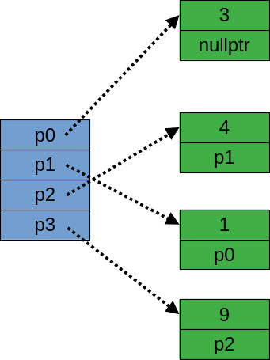
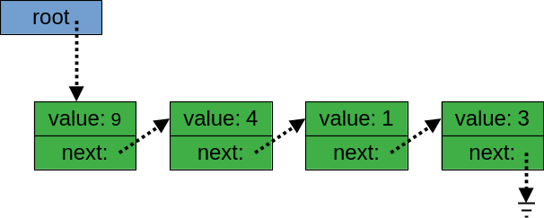

# Struktury

Poznaliśmy dotąd jeden sposób łączenia danych w duże jednostki - tablice. Wśród wielu zalet, tablice mają jedną wadę: wszystkie ich elementy muszą być dokładnie tego samego typu. Tymczasem w praktyce programistycznej bardzo często łączymy ze sobą obiekty różnych typów. Na przykład wygląd okna programu może być opisywany przez kolor tła, kolor czcionki, nazwę czcionki, rozmiar okna, jego położenie itp. oraz analogiczne właściwości różnych obiektów wyświetlanych na tym oknie. W C++ do łączenia danych różnych typów w jedną całość używa się konstrukcji `struct` (czyli tzw. struktury). Oto przykład: 

```c++
struct Okno
{
    std::string tytul;
    Point polozenie;
    Font czcionka;
    int szerokosc;
    int wysokosc;
};
```

Mamy tutaj hipotetyczną strukturę o 5 składowych: `tytul`, `polozenie`, `czcionka`, `szerokosc` i `wysokosc`. W programowaniu obiektowym składowe zwane są też właściwościami (ang. *properties*). W naszym przypadku mają one różne typy: `std::string` (czyli standardowy typ dla napisów C++), `Point` (prawdopodobnie inna struktura zdefiniowana w innym miejscu), `Font` (kolejna struktura zdefiniowana gdzie indziej) i dwie składowe całkowite typu `int`. Tak zdefiniowana struktura definiuje nowy typ danych: `Okno`. Jest to przykład typu danych, którego nie ma w standardzie języka, innymi słowy, jest to przykład *typu zdefiniowanego przez użytkownika*. 

Skoro `Okno` jest typem danych, to znamy już składnię umożliwiającą tworzenie zmiennych tego typu:

```c++
int n;      // n jest zmienną (=obiektem typu podstawowego) typu int
Okno okno;  // okno jest obiektem klasy Okno 
```

W żargonie obiektowym zmienne nazywane są obiektami (ang. *objects*), co oznacza, że powoli zbliżamy się do programowania obiektowego. 

W przypadku zmiennych (obiektów) typów podstawowych, np. `int` czy `double` wiemy, co możemy z nimi zrobić, np. dodać, pomnożyć przez 5, wyświetlić wartość w strumieniu `std::cout` itd. W przypadku obiektów typów zdefiniowanych przez użytkownika domyślny zbiór operacji na nich jest bardzo ograniczony, przy czym operacją podstawową jest uzyskiwanie dostępu do składowych. Służy do tego operator "kropka":

```c++
int szer = okno.szerokosc;
okno.czcionka = Font("Arial", 10);
okno.tytul = "Okno na podwórko";
```

Oczywiście możemy pobierać adres takiego obiektu:

```c++
Okno* p = &okno; // p jest wskaźnikiem na obiekt okno
```

W przypadku obiektów, do których dostęp mamy zapewniony przez wskaźnik, do wyłuskiwania składowych stosuje się operator "strzałka" (`->`):

```c++
p->wysokosc += 10;
```

Operator `->` wprowadzono w celu uproszczenia zapisu operacji na wskaźnikach do struktur. Np. powyższą instrukcję można bez tego operatora zapisać tak:

```c++ 
(*p).wysokosc += 10;
```

co jest dość niewygodne. W powyższym zapisie nawiasy są niezbędne, gdyż operator `.` ("kropka") ma wyższy priorytet niż `*` (czyli niż `operator *` ), więc zapis `*p.wysokosc` byłby równoważny zapisowi `*(p.wysokosc)`, który jest zapisem błędnym, jeżeli `p` jest wskaźnikiem (wskaźniki nie mają składowych, które można wyłuskiwać kropką).  Analogicznie hipotetyczny zapis

```c++
p->fun(7)->left->size();
```

bez notacji ze strzałką należałoby zapisywać w bardzo nieczytelny sposób:

```c++ 
(*(*(*p).fun(7)).left).size();
```


Struktury mogą zawierać inne struktury (w powyższym przykładzie: składową każdego obiektu typu `Okno` jest m.in. składowa typu `Font`). 

#### Inicjalizacja struktur

Do nadawania strukturom wartości początkowej (inicjalizacji) zwykle używa się notacji z nawiasami klamrowymi, np:

```c++
struct Punkt
{
    float x;
    float y; 
};
// ...
Punkt p1 = {10.0f, -3.3f};
Punkt p2 = {.x = 10.0f, .y = -3.3f};   // od C++20, tzw. designated initializer
```

Znak równości jest w powyższym zapisie opcjonalny. Istnieje też składnia z nawiasami okrągłymi (por. konstruktory klas), która jednak w odniesieniu do struktur jest chyba stosunkowo rzadko stosowana. 

#### Struktury dynamiczne

Struktury mogą także zawierać wskaźniki, w tym wskaźniki do obiektów typu, który właśnie definiujemy:

```c++
struct Lista
{
    int value;
    Lista* next;
};
```

Tego rodzaju typy danych zwane są *dynamicznymi typami danych*. Z reguły mogą one przechowywać dowolną liczbę danych. Na przykład tak można skonstruować listę czteroelementową:

```c++
Lista* p0 = new Lista {3, nullptr};
Lista* p1 = new Lista {1, p0};
Lista* p2 = new Lista {4, p1};
Lista* p3 = new Lista {9, p2};
```

Konstrukcje tę ilustruje poniższy obrazek (kolor niebieski: zmienne umieszczone na stosie programu, kolor zielony: zmienne umieszczone w pamięci wolnej)



Zmienne `p0`, `p1` i `p2` nie są tu niezbędne (co omówię szczegółowo w innym wpisie). Jeżeli zmiennej `p3` nada się zwyczajową nazwę `root` ("korzeń"), to powyższy schemat uprości się do: 



Warto zwrócić uwagę na to, że wartość `nullptr` ("zero", na schematach: znak uziemienia) sygnalizuje koniec listy. Jest to możliwe dzięki konwencji, że `nullptr` jest wartością specjalną dowolnej zmiennej wskaźnikowej sygnalizującą, że zmienna ta nie przechowuje żadnej użytecznej wartości.   

W powyższym przykładzie można utworzyć wyrażenie

```c++
root->next->next->next->value  // tu: 3
```

Takie kilkuelementowe łańcuchy wywołań operatora `->` są dość często widywane w praktyce, np. gdy z uchwytu do okna głównego aplikacji chcemy dotrzeć do jakiegoś pojedynczego elementu graficznego interfejsu użytkownika. 
