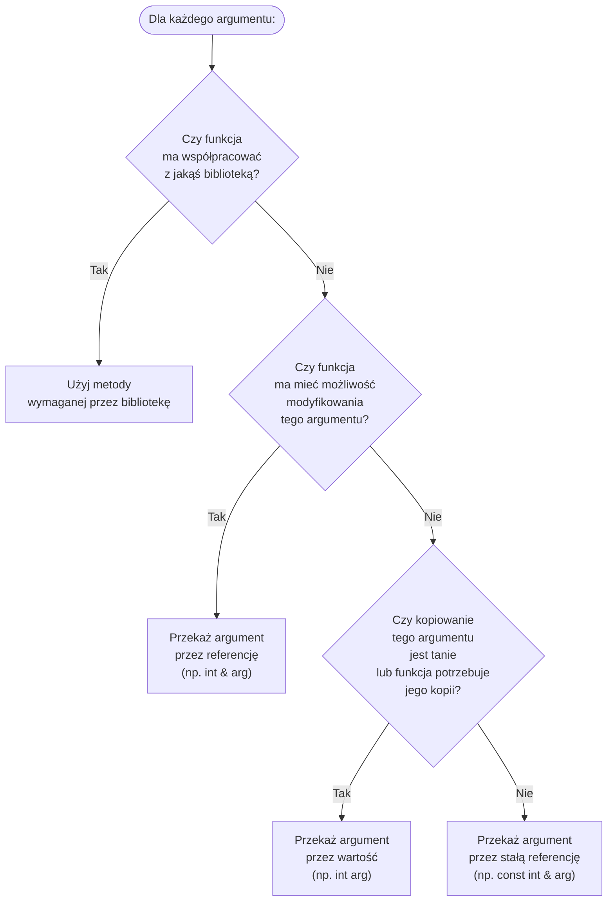

#### Przekazywanie argumentów do funkcji

Z technicznego punktu widzenia w C++ obowiązuje przekazywanie argumentów przez wartość. Oznacza to, że funkcje działają na kopiach swoich argumentów rzeczywistych. Przed wywołaniem funkcji w umówionym miejscu (na tzw. stosie wywołań funkcji, ang. *call stack*) umieszczane są kopie argumentów przekazywanych do funkcji. Po wywołaniu funkcji, jej kod swobodnie szczytuje te wartości. 

Z punktu widzenia programisty, rozróżnia się jednak aż trzy główne rodzaje przekazywania parametrów, które można dalej podzielić na aż 10 metod szczegółowych:

- Przekazanie argumentu ***przez wartość***

  ```c++
  int suma(int n, int m);
  ```

  W ramach tej podstawowej metody rozróżnia się: 

  - przekazanie argumentu *przez kopiowanie*
  - przekazanie argumentu *przez przesuwanie* (to temat zaawansowany, którego tu nie dotykam)

- Przekazanie argumentu ***przez referencję***

  W ramach tej metody rozróżnia się:

  - przekazanie argumentu przez "zwykłą referencję"

    ```c++
    void zeruj(int& n);
    ```

  - przekazanie argumentu przez "stałą referencję"

    ```c++
    void drukuj(const int& n);
    ```

  - przekazanie argumentu przez "referencję do r-wartości" (temat zaawansowany)

    ```c++
    int dziwadlo(int && n);
    ```

- Przekazanie argumentu ***przez wskaźnik***

  W ramach tej metody rozróżnia się:

  - przekazanie argumentu przez "zwykły wskaźnik"

    ```c++
    void swap(int* p0, int* p1);
    ```

  - przekazanie argumentu przez "wskaźnik na stałą"

    ```c++
    void print(const char* msg);
    ```

Istnieją też metody rzadko widywane w prawdziwych programach:

```c++
void print(const char* const msg);   // przez stały wskaźnik na stałą
void zeruj(char* const msg);         // przez stały wskaźnik
void wielkie_dziwadlo(const int&& n) // przez stałą r-referencję - tego się nie używa
```

 Skoro istnieje aż tyle metod, to, po pierwsze, one muszą mieć jakieś cechy szczególne, po drugie, programista musi wiedzieć, kiedy którą wybrać. 

- Przekazywania argumentu przez **wskaźnik** używamy tylko wtedy, gdy nie mamy innego wyjścia, czyli gdy wymaga tego jakaś część oprogramowania, które rozwijamy. W praktyce sytuacja ta występuje zawsze, gdy nasze oprogramowanie współpracuje z bibliotekami napisanymi w języku C. Istnieje jednak wiele popularnych i szeroko używanych bibliotek czysto obiektowych (C++), które również w swoich interfejsach opierają się na wskaźnikach, np. [Qt](https://contribute.qt-project.org/).

- Przekazywanie argumentu przez **zwykłą referencję** stosujemy, gdy funkcja ma mieć możliwość modyfikowania oryginału argumentu, np.:

  ```c++
  void zeruj(int & n)
  {
      n = 0;
  }
  
  int main()
  {
      int k = 123;
      zeruj(k);   // teraz k = 0
      return k;   // zwróci 0
  }
  ```

- Przekazywanie argumentu przez **stałą referencję** lub przez **wartość** stosujemy, gdy funkcja ma mieć możliwość czytania oryginału argumentu, ale nie powinna go modyfikować. To, którą z tych metod wybierzemy, nie powinno mieć wpływu na działanie programu, jednak może mieć wpływ na prędkość jego działania. Chodzi tu o to, że kopiowanie dużych obiektów może być kosztowne, a przekazywanie argumentu przez referencję (w tym stałą referencję) kosztuje tyle, ile skopiowanie jednego wskaźnika.     

  - Argument przekazujemy przez **wartość** wtedy, gdy 
    - argument zajmuje niewiele miejsca w pamięci, np. jest typu `int`, `float`, `double`, `int*` itp.
    - i tak potrzebujemy w funkcji kopii któregoś z argumentów
  - Argument przekazujemy przez **stałą referencję** wtedy, gdy uważamy, że będzie to bardziej efektywna metoda niż przekazanie go przez wartość. 


Warto porównać te dwie funkcje:

```c++
void println(int n)
{
    std::cout << n << "\n";
}
void println(const std::vector<int> & v)
{
    // kod wyświetlający zawartość wektora v
}
```

Funkcja `println` ma wyświetlać swój argument w konsoli, dlatego nie powinna przyjmować go przez zwykłą referencję. W pierwszym przypadku argument przekazywany jest więc przez wartość, gdyż `int` to typ prosty zajmujący mniej miejsca niż (ukryty za referencją) wskaźnik, natomiast w drugim przypadku argument przekazywany jest przez stałą referencję, gdyż nie potrzebujemy w funkcji kopii oryginalnego wektora, przy czym kopiowanie wektora może być bardzo kosztowne. Można to podsumować następującym diagramem:



### 