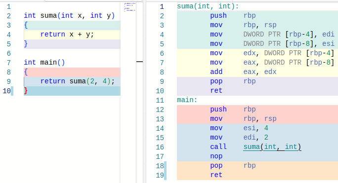
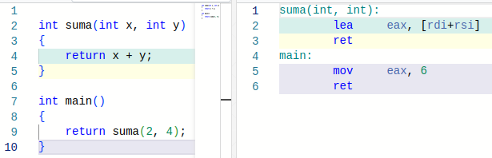

### Funkcje otwarte (`inline`)

W C++ istnieją funkcje, których definicja zawiera słowo kluczowe `inline`. Pierwotnie wprowadzono je w celu ułatwienia kompilatorowi optymalnej kompilacji krótkich funkcji (tzn. składających się z kilku instrukcji) +za pomocą techniki zwanej "inlining". W dużym uproszczeniu można to porównać do stosowania hiperlinków w tekstach. Gdybym zaczął tu używać [linków](./08fa-krotki-link.md) do bardzo krótkich tekstów lun grafik,  to czytelnicy z pewnością nie byli by szczęśliwi: link trzeba otworzyć, rzucić okiem na jego zawartość, po czym jakoś wrócić  do tekstu głównego. Zamiast tego zawartość linkowanej strony można można wstawić bezpośrednio w tekście głównym:

   

Taki tekst czyta się szybciej i wygodniej. Jednak jeżeli chciałbym napisać jakąś dłuższą uwagę o jakimś niezbyt istotnym aspekcie technicznym C++, z pewnością lepiej byłoby go umieścić w osobnym pliku, prawda? 

Współczesne kompilatory nie potrzebują słowa kluczowego `inline` do optymalizacji kodu. Zwykle potrafią bowiem optymalizować kod lepiej niż ludzie. Funkcje `inline` potrzebne są jednak do wyłączenia reguły ODR (*one definition rule*) w funkcjach, których kod powinien znaleźć się w plikach nagłówkowych (czyli tych z rozszerzeniem `*.h`, włączanych do plików źródłowych `*.cpp` makrem preprocesora `#include`). Tego rodzaju funkcje są zaś niezbędne w przypadku kodu generowanego z szablonu. Innymi słowy, w praktyce funkcje `inline` są niezbędne do tego, by w C++ można było używać szablonów - technologii, która jest jedną z wyróżniających cech tego języka. Dodatkowo, funkcje `inline` na pewno mogą być optymalizowane za pomocą metody zwanej *inlining*, ale kompilator ma tu pełną swobodę w podjęciu decyzji o zastosowaniu tej optymalizacji lub jej pominięciu, także w stosunku do funkcji pozbawiony modyfikatora `inline`.   

Przykład definicji i wykorzystania funkcji `inline`:

```c++
#include <iostream>

inline int suma(int x, int y)
{
    return x + y;
}

int main()
{
    std::cout << suma(2, 4) << "\n";
}
```

Jak widać, użycie funkcji `inline` niczym nie różni się od wykorzystania "zwyczajnych" funkcji. Funkcji tych zaczniesz używać prawdopodobnie dopiero wówczas, gdy zaczniesz pisać własne klasy, a na pewno będziesz ich potrzebować, gdy zaczniesz pisać własne szablony.

#### Przykład

Załóżmy, że chcemy zbudować bibliotekę z funkcją `suma` z powyższego przykładu. Mamy 2 możliwości. 

- Rozwiązanie standardowe: umieścić definicję tej funkcji w pliku `suma.cpp`, a je deklarację w pliku `suma.h` i włączać tę deklarację do każdego pliku źródłowego, który chce użyć tej "biblioteki"

  ```c++
  // Plik suma.h   (uproszczony, bez strażnika nagłówka)
  int suma(int x, int y);
  ```

  ```c++
  // Plik suma.cpp
  
  #include "suma.h"
  
  inline int suma(int x, int y)
  {
      return x + y;
  }
  ```

  ```c++
  // Plik main.cpp
  
  #include "suma.h"     // włączenie deklaracji funkcji suma 
  #include <iostream>
  
  int main()
  {
      std::cout << suma(1, 9) << "\n";
  }
  ```

  kompilacja:

  ```bash 
  > g++ suma.cpp main.cpp
  ```

- Drugie rozwiązanie to umieszczenie definicji tej funkcji w pliku nagłówkowym (`*.h`):

  ```c++
  // Plik suma.h   (uproszczony, bez strażnika nagłówka)
  inline int suma(int x, int y);
  ```

  Plik `suma.cpp` byłby teraz niepotrzebny, a plik `main.cpp` nie uległby zmianie. Kompilacja wyglądałaby tak:

  ```bash
  > g++ main.cpp
  ```

Program działałby tak samo, jak w pierwszej wersji. Można by nawet  pominąć `inline`, o ile nie rozbudowalibyśmy programu o kolejny plik źródłowy (*.cpp), który zawierałby instrukcję 

```c++
#include "suma.h"
```

Bez modyfikatora `inline` w deklaracji funkcji `suma` kompilacja  zakończyłaby się błędem. 

#### *Inlining*

*Inlining* to rodzaj optymalizacji polegający na zastąpieniu wywołania funkcji wklejeniem jej kodu bezpośrednio w każdym miejscu jej wywołania. To mniej więcej tak, jak by jakiś program przeglądał kod strony internetowej i każdy link zastępował treścią strony, do której ten link się odnosi. Jeżeli na linkowanej stronie byłoby bardzo mało tekstu, miałoby to sens, jeśli dużo, to raczej byłaby katastrofa. Analogicznie `inlining` jest stosowany raczej wyłącznie do "małych" funkcji, z niewielką liczbą instrukcji. 

Rozpatrzmy bardzo przykład bardzo prostego programu:

```c++
int suma(int x, int y)
{
    return x + y;
}

int main()
{
    return suma(2, 4);
}
```

Jeżeli skompilujemy go kompilatorem gcc 12.2 bez jakichkolwiek opcji optymalizacyjnych, to otrzymamy następujący kod w asemblerze x86-64 (prawa kolumna):

 

Dodanie dwóch liczb zajmuje aż 13 instrukcji asemblera: wszystkie z funkcji `suma` i zaznaczone kolorem niebieskim 4 instrukcje z funkcji `main`. Funkcja `main` najpierw kopiuje argumenty 4 i 2 do rejestrów `esi` i `edi`. Potem wywołuje funkcję `suma(int, int`). W funkcji tej dwie pierwsze instrukcje (`push` i `move`) zapisują poprzednią i ustalają aktualną wartość adresu bieżącej ramki stosu funkcji w rejestrze `rbp`.  Następnie wartości z rejestrów `esi` i `edi` kopiowane są zmiennych `x` i `y`, których adres wyliczany jest jako 4 i 8 bajtów poniżej bieżącej pozycji ramki stosu zapisanej w rejestrze `rbp`. Potem z tych zmiennych dane kopiowane są do rejestrów `edx` i `eax`. W końcu wykonywana jest instrukcja dodawania, `add`. Teraz przywracana jest poprzednia wartość adresu ramki stosu funkcji i funkcja `suma` oddaje sterowanie do funkcji `main`. Widać tu masę niepotrzebnych operacji. 

Po włączeniu dowolnej optymalizacji, np. opcji `-O3`, kod asemblera wygląda następująco (prawa kolumna):



Teraz funkcja `main` po przetłumaczeniu na asembler w ogóle nie wywołuje funkcji `suma`! Kompilator "zagląda" do jej kodu i zastępuje instrukcję `return suma(2, 4)` równoważnymi jej  instrukcjami

```c++
int x = 2;
int y = 4;
return x + y;
```

które następnie upraszcza do 

```c++
return 6;
```

Gdyby definicja funkcji `suma` umieszczona była w osobnym pliku nagłówkowym (i zapewne miała modyfikator `inline`) , efekt byłby taki sam, gdyż kompilator miałby dostęp do jej kodu źródłowego i mógłby dokonać odpowiednich transformacji. 

Gdyby definicji funkcji `suma`  umieszczona była w osobnym pliku źródłowym (*.cpp), to zoptymalizowany asembler funkcji `main` wyglądałby następująco:

```assembly
main:
	mov    $0x4,%esi
	mov    $0x2,%edi
	jmp    1130 <suma(int, int)>
```

Jak widać, mielibyśmy tu (uproszczone, poprzez wywołanie `jmp` zamiast `call`) wywołanie funkcji `suma`. Program działałby odrobinę dłużej.

Dlaczego nie umieszcza się definicji wszystkich funkcji w plikach nagłówkowych z atrybutem `inline`? Bo kompilacja takich programów trwałaby koszmarnie długo, a efekt końcowy, nawet jeśli byłby lepszy, to w sposób praktycznie niemierzalny. Co więcej, istnieją techniki optymalizacji, które pozwalają zoptymalizować nawet kod zapisany w różnych plikach źródłowych tak, jak by był umieszczony w jednym (*link-time optimization*). 

#### Ciekawostki

Jeżeli chcesz zobaczyć kod asemblerowy programu napisanego w C++, to w Linuksie możesz posłużyć się  programem `objdump`. np.:

```bash
> g++ suma.cpp main.cpp -flto -O3
> objdump a.out -dC
```

- Pierwsza komenda kompiluje program z opcjami `-O3` (pełna optymalizacja)  i `-flto` (zastosuj optymalizację na poziomie konsolidacji programu) i umieszcza wynik kompilacji w pliku `a.out` (domyślna nazwa pliku wykonywalnego w systemach UNIX i pochodnych)
- Druga komenda wyświetla kod maszynowy, kod asemblerowy oraz odpowiadający im kod źródłowy (opcja `-d`) w sposób czytelny dla człowieka (opcja `-C`).

Inna metoda to wklejenie fragmentu programu (np. pojedynczej funkcji) w serwisie Compiler Explorer, https://godbolt.org/. 