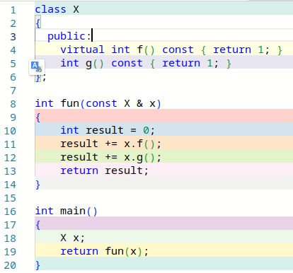
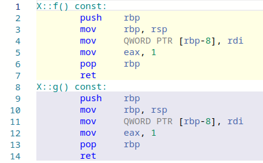
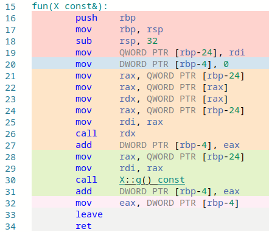
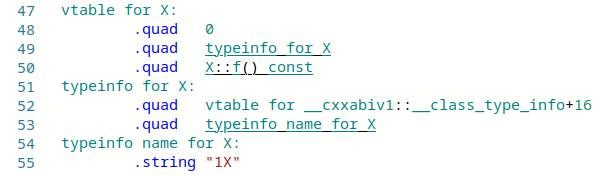

# Funkcje wirtualne

## 1. Co to są funkcje wirtualne?

Najprostsza definicja obiektu brzmi: "obiekt jest to fragment pamięci operacyjnej". Nie jest to oczywiście definicja wyczerpująca. W szczególności, język C++ to język z silną statyczną kontrolą typów, dlatego z każdym obiektem związany jest jego typ. Na najbardziej podstawowym poziomie typ określony jest przez strukturę pamięci przypisanej obiektowi - obiekt z tej perspektywy jawi się jako zestaw składowych ("właściwości", ang. *properties*) o określonym, bardziej prostym typie, który z kolei informuje kompilator, jakie operacje na danej składowej są dopuszczalne. Na tym poziomie , obiekt jawi się jako struktura, np.:

```      C++
struct Pracownik
{
  std::string imie;
  std::string nazwisko;
  int rok_urodzenia;
  Stanowisko stanowisko;
};
```

Powyższy schemat jest charakterystycznym dla języka C. Język C++ idzie o krok dalej, wprowadzając hermetyzację danych (sekcje `public`, `protected` i `private`) oraz możliwość definiowania kompletnego zbioru dopuszczalnych operacji na danym obiekcie poprzez wprowadzenie do języka funkcji składowych (i zaprzyjaźnionych). W dalszym jednak ciągu obiekt to konstrukt skoncentrowany na danych. Pojawia się jednak pytanie, czy z obiektem, oprócz danych, można także związać funkcje na nim działające? Innymi słowy, czy można sprawić, by w efektywny sposób można było z obiektami skojarzyć nie tylko dane, ale i działające na nich funkcje? Mogłoby się wydawać, że nic prostszego - przecież każdy obiekt ma swój typ, a z każdym typem danych związany jest kompletny zestaw funkcji, jakie można na tym obiekcie wywołać. Nie o to jednak chodzi. Nie pytamy o związanie funkcji z typem obiektu, to jest proste, tylko z samym obiektem. Skoro każdy obiekt przechowuje unikatowe dla siebie dane, to czy - nie rezygnując ze ścisłej statycznej kontroli typów, możemy związać z obiektami także specyficzne dla nich funkcje?

Jasne jest, że tego rodzaju możliwość wymaga pewnego rozluźnienia ścisłej statycznej kontroli typów. Istnieje mechanizm, który daje pewną elastyczność bez rezygnowania z bezpieczeństwa, jakie zapewnia ścisłą statyczna kontrola typów. Jest nim dziedziczenie. Rozpatrzmy *bardzo* uproszczony przykład zainspirowany kosmicznymi okrętami wojennymi z Gwiezdnych Wojen:

```C++  
#include <iostream>

struct Spaceship
{
    double mass = 1.0;
};

struct Dreadnought : public Spaceship  // krążownik
{
    int heavy_cannons = 10000;
};

struct Sloop : public Spaceship        // korweta
{
    int light_sails = 2;
};

void print_spaceship_address(Spaceship &ship)     { std::cout << "spaceship at   " << (void *) &ship << "\n"; }
void print_dreadnought_address(Dreadnought &ship) { std::cout << "dreadnought at " << (void *) &ship << "\n"; }
void print_sloop_address(Sloop &ship)             { std::cout << "sloop at       " << (void *) &ship << "\n"; }

int main()
{
    Dreadnought starship;
    Sloop sloop;
    
    // próbujemy coś zrobić z obiektem starship
    print_spaceship_address(starship);
    print_dreadnought_address(starship);
    // print_sloop_address(starship);  /// to byłby błąd: krążownik nie jest korwetą
    
    // próbujemy użyc obiektu sloop:
    print_spaceship_address(sloop);
    print_sloop_address(sloop);
    // print_dreadnought_address(sloop);  /// to byłby błąd: korweta nie jest krążownikiem
}
```

Mamy tu klasę bazową (`Spaceship`) i wyprowadzone z niej dwie niezwiązane ze sobą klasy pochodne: `Dreadnought` i `Sloop`. Pod definicją klas dodałem definicje 3 prostych funkcji przyjmujących swoje argumenty przez referencję do obiektu, kolejno, klasy `Spaceship`, `Dreadnought` i `Sloop`  i wyświetlających informację o typie oraz adres tego argumentu w pamięci operacyjnej. W funkcji `main` tworzą jeden krążownik i jedną korwetę i sprawdzam, co się stanie, gdy użyję ich jako argumentów wspomnianych trzech funkcji. Przykładowy wynik działania tego programu:

```bash
> ./a.out 
spaceship at   0x7fbf91300020
dreadnought at 0x7fbf91300020
spaceship at   0x7fbf91300040
sloop at       0x7fbf91300040
```

Jak widzimy, obiekt klasy pochodnej, np. `Dreadnought`, można użyć w funkcji oczekującej obiektu tejże klasy (co nas nie dziwi), ale tez klasy podstawowej (co powinniśmy już wiedzieć) i za każdym razem program "widzi" go pod tym samym adresem. Innymi słowy, pod adresem `0x7fbf91300020` równie dobrze znajduje się obiekt klasy `Spaceship` i obiekt klasy `Dreadnought`. Podobnie pod tym samym adresem (tu: `0x7fbf91300040`) znajduje się obiekt klasy `Spaceship` i obiekt klasy `Sloop`. Oczywiście za każdym razem jest to ten sam obiekt, ale widzimy tu pewne poluzowanie mechanizmu ścisłej statycznej kontroli typów. 

Można by to wykorzystać następująco. Do klasy bazowej można dodać jakieś pole z identyfikatorem klasy obiektu. Mógłby być to np. napis z nazwą klasy lub unikatowa liczba, lub unikatowy adres. Następnie można w klasie bazowej dodać funkcję składową, np. `shoot`, czyli "strzelaj", która w tej dodatkowej składowej sprawdzałaby "prawdziwy" typ bieżącego obiektu (wskazywanego przez `this`) i w zależności od wyniku, wykonywałaby inne strzelanie dla krążowników, inne dla korwet, a inne dla pozostałych statków kosmicznych. To się da zrobić, ale nie pójdziemy ta drogą, gdyż funkcjonalność tego typu istnieje w języku C++ jako jedna z jego podstawowych właściwości, przy czym jej implementacja przerasta wszystko, co sami moglibyśmy stworzyć. Funkcjonalność tę realizują w C++ **funkcje wirtualne**. Powyższy przykład można z ich pomocą zaimplementować np. tak:

```C++ 
#include <iostream>
#include <vector>

struct Spaceship
{
    double mass = 1.0;
    virtual void shoot(std::ostream& out) { out << ". . . . .\n"; } /// <--- składowa wirtualna
};

struct Dreadnought : public Spaceship // krążownik
{
    int heavy_cannons = 10000;
    void shoot(std::ostream& out) override { out << "⬤⬤⬤⬤⬤⬤⬤⬤⬤⬤\n"; } /// <--- override
};

struct Sloop : public Spaceship // korweta
{
    int light_sails = 2;
    void shoot(std::ostream& out) override { out << "- - -\n"; } /// <--- override
};

void shoot_all(const std::vector<Spaceship *> p_ships)
{
    for (const auto &s : p_ships)
    {
        s->shoot(std::cout);
    }
}

int main()
{
    Spaceship millenium_falcon;
    Dreadnought dread;
    Sloop sloop[3];
    std::vector<Spaceship *> ships = {&millenium_falcon, &sloop[0], &sloop[2], &dread, &sloop[1]};
    shoot_all(ships);
}
```

Widzimy tutaj te same klasy po lekkiej modyfikacji. W klasie podstawowej pojawiła się funkcja składowa `shoot`, której nadano atrybut **`virtual`**. Funkcje o identycznych sygnaturach (`void shoot(std::ostream& out)`) zdefiniowano też w obu klasach pochodnych, jednak każdej inaczej. W funkcji `main` utworzono 5 obiektów różnych klas (z czego 3 w tablicy `sloop`) a także wektor wskaźników do klasy podstawowej, czyli do `Spaceship`. Wektor ten zainicjalizowano adresami tych obiektów, a następnie wywołano na nim funkcję `shoot_all`, która na każdym obiekcie wskazywanym przez zmienne wskaźnikowe umieszczone w wektorze wywołuje ich składową `shoot`. Jest to bardzo uproszczony schemat tego, jak można by zorganizować "strzelanie" w grze komputerowej z różnymi rodzajami statków kosmicznych (postaci, pojazdów itp.). 

W powyższym kodzie wykorzystujemy to, że dziedziczenie realizuje relację A jest B. W szczególności, każdy obiekt klasy `Dreadnought` jest jednocześnie obiektem klasy `Sopaceship`. Podobnie każdy obiekt klasy `Sloop` także jest jednocześnie obiektem klasy `Spaceship`. Dlatego w wektorze wskaźników do `Spaceship` można umieścić wskaźniki na każdą z tych klas - bez łamania zasady silnej statycznej kontroli typów. Kompilator podczas kompilacji funkcji `shoot_all` zakłada jednak, że nie zna całości programu - kompilując jakąś funkcję, nie zagląda do treści innych funkcji (z wyjątkiem funkcji `inline`). Dlatego skompilowany kod pętli 

```c++  
	for (const auto &s : p_ships)
    {
        s->shoot(std::cout);
    }
```

będzie musi identyczny sposób traktował każdy ze wskaźników umieszczonych w obiekcie `p_ships`. Kompilator jednak posiada informację, że są to wskaźniki do klasy bazowej pewnej hierarchii klas i być może w rzeczywistości wskazują one na obiekty klas pochodnych, czyli `Dreadnought` lub `Sloop`. Kompilator ma też informację, że wywoływana funkcja posiada atrybut `virtual`. Wygeneruje więc specjalny kod, który sprawdzi, jaki jest "**prawdziwy**" (czyli: oryginalny) typ każdego obiektu wskazywanego przez kolejne wskaźniki z `p_ships` i wywoła tę funkcję `shoot(std::ostream& out)`, która odpowiada tej prawdziwej klasie wskazywanego obiektu. Dlatego wynik działania powyższego programu wyglądać musi następująco:

```bash
. . . . .
- - -
- - -
⬤⬤⬤⬤⬤⬤⬤⬤⬤⬤
- - -
```

Zauważmy, że w funkcji `main` umieściliśmy w wektorze `ships` adresy 5 obiektów klasy `Spaceship` lub klas pochodnych wyprowadzonych z niej przez dziedziczenie. Czytelnik funkcji `main` doskonale wie, że wektor ten zawiera adresy obiektów o następujących typach (kolejno): `Spaceshift`, `Sloop`, `Sloop`, `Dreadnought` i `Sloop`. Czytelnik funkcji `shoot_all` nie posiada tej informacji: w zasadzie funkcja ta musi w przewidywalny sposób obsługiwać dowolny wektor wskaźników na `Spaceship`. Mimo tego, funkcja w jakiś tajemniczy sposób odczytuje z kolejnych wskaźników ich "prawdziwy" typ i stosownie do niego uruchamia na kolejnych obiektach:

- funkcję `Spaceship::shoot(std::ostream&)`  jeżeli obiekt, na którym jest wywoływana, został utworzony jako `Spaceship`;
- funkcję `Dreadnought::shoot(std::ostream&)`  jeżeli obiekt, na którym jest wywoływana, został utworzony jako `Dreadnought`;
- funkcję `Sloop::shoot(std::ostream&)`  jeżeli obiekt, na którym jest wywoływana, został utworzony jako `Sloop`;

Oznacza to, że każdy **obiekt**, na który wskazuje `p_ships`, **posiada nie tylko dane, ale i pełną informację o funkcjach, które na tym obiekcie należy wywoływać.** To jest istota obiektowości: w programowaniu obiektowym obiekt to nie tylko "fragment pamięci operacyjnej", lecz przede wszystkim swoista paczka zawierająca nie tylko dane, ale i informacje o funkcjach, które na nich należy wykonywać. Ta właściwość powoduje, że programowanie obiektowe to zupełnie osobny paradygmat programowania.

Podkreślę raz jeszcze: istotą obiektowości jest możliwość konstruowania obiektów zawierających dane wraz z kompletem operacji, które na nich można wykonywać, przy czym użytkownik takich obiektów może nie mieć (i zwykle nie ma) wglądu w ich wewnętrzną strukturą (hermetyzacja danych) ani w to, co te operacje tak naprawdę robią. Co więcej, w momencie kompilowania kodu wykorzystującego obiekty, kod tworzący te obiekty może jeszcze nie istnieć. Powtórzę, bo to niezwykle ważna sprawa: w momencie, w którym, kompilator kompiluje kod funkcji `shoot_all`, klasy `Dreadnought` i `Sloop` mogą nie istnieć. Co więcej, w trakcie dalszego rozwoju programu można zmieniać, w tym poszerzać hierarchię dziedziczenia opartą na klasie `Spaceship`. Funkcje `shoot_all` **bez rekompilacji** poprawnie obsłuży każdy z obiektów takich klas. 

Powyższa własność daje fantastyczną elastyczność twórcom bibliotek obiektowych. Biblioteka może np. zdefiniować jakąś klasę, powiedzmy `X`, a w niej szereg funkcji składowych oznaczonych jako funkcje wirtualne. Biblioteka może też zaimplementować szereg funkcji działających na obiektach tej klasy. Jak dotąd nie ma w tym nic nadzwyczajnego. Ciekawie robi się w momencie, gdy uświadomimy sobie, że jeżeli we własnym kodzie utworzymy własną klasę dziedziczącą z `X` oraz przedefiniujemy w niej jedną, kilka lub wszystkie funkcje wirtualne z klasy bazowej, po czym obiekt tego typu przekażemy prze zreferencję lub wskaźnik z powrotem do tej biblioteki, to zacznie ona wywoływać ***nasze*** implementacje tych przedefiniowanych funkcji składowych. Jest to bardzo prosty i bardzo bezpieczny sposób posługiwania się tzw. *callbackami*, czyli funkcjami, które wstrzykujemy do cudzego kodu po to, by wykonał jakieś operacje na naszych danych. Tak działa m.in. biblioteka Qt. Pozwala ona nam tworzyć własne *widgety*, czyli elementy graficznego interfejsu użytkownika zapewniające komunikację między programem i użytkownikiem. Dzięki mechanizmowi hierarchii klas (każdy widget musi dziedziczyć z klasy `QWidget`) i funkcjom wirtualnym, użytkownik definiuje interakcję swojego widgetu z systemem operacyjnym (a konkretnie - jego rekcję np. na ruch myszki, zmianę rozmiaru okna itp.) poprzez przedefiniowanie wybranych funkcji wirtualnych z klasy `QWidget`. 

## 2. Nomenklatura

W kontekście funkcji wirtualnych w C++ stosuje się specjalne słownictwo.

-  Jeżeli jakąś zwykłą (=niewirtualną) funkcję składową zdefiniujemy zarówno w klasie podstawowej, jak i pochodnej, to proces ten nazywamy ***przeciążaniem funkcji*** (ang. f*unction overloading*). Tego samego pojęcia używa się do określenia sytuacji, kiedy definiuje się zwyczajne funkcje (=niebędące skąłdowymi klas, czyli tzw. funkcje swobodne) o tej samej nazwie, ale innej liczbie lub typach argumentów. Przeciążanie funkcji jest więc tak naprawdę przeciążaniem jakiejś nazwy funkcji i rozstrzygane jest przez kompilator przed uruchomieniem programu. Jest więc to zjawisko *statyczne* (= *compile time*).
- Jeżeli jednak w klasie pochodnej przeciążymy funkcję wirtualną z klasy bazowej, to mówimy nie o przeciążaniu, a o ***zastępowaniu*** (ang. *overriding*) tej funkcji składowej. Używa sie tu też terminu ***nadpisywanie funkcji***. Zastępowanie funkcji ma zawsze charakter dynamiczny, czyli wykonywane jest podczas działania programu (ang. *at runtime*).
- Składowe funkcje wirtualne często zwie się ***metodami*** (ang. *methods*). Termin ten często uogólnia się na wszystkie funkcje składowe klas. Osobiście preferuję jednak słowo "funkcja" (być może z modyfikatorem "składowa", "wirtualna" itp.). Termin ten jest jednak powszechnie używany w kontekście innych języków obiektowych oraz ogólnej teorii programowania obiektowego. 

## 3. Pouczające modyfikacje kodu 

Jedną z najbardziej efektywnych metod uczenia się rozumienia programów jest obserwowanie reakcji na drobne modyfikacje kodu. Sprawdźmy kilka takich modyfikacji powyższego programu. 

- Rezygnacja z funkcji wirtualnych. Jeżeli w deklaracji funkcji składowej `shoot` klasy bazowej (`Spaceship`) usuniemy słowo kluczowe `virtual`, to kompilator zasygnalizuje błędy w definicji tej funkcji w klasach pochodnych. Chodzi o to, że słowa kluczowego `override` można użyć wyłącznie jako modyfikatora funkcji wirtualnych zastępujących funkcje wirtualną zdefiniowaną w klasie bazowej. Nie ma obowiązku używania tego słowa kluczowego w definicji funkcji składowych w klasach pochodnych, jednak jego zastosowanie pozwala wyeliminować pewien trudny w diagnostyce błąd, który mógłby się pojawić, gdybyśmy zamiast zastępowania funkcji, mieli do czynienia z jej przeciążeniem. Czyli gdyby funkcja w klasie pochodnej nie miała identycznej sygnatury, jak zastępowana funkcja w klasie bazowej. Po usunięciu słowa `virtual` żadna z klas nie posiada funkcji wirtualnych. Kompilator skompiluje funkcję `shoot_all` w sposób tradycyjny, posługując się ścisłą statyczną kontrolą typów, czyli dla każdego obiektu wywoła funkcję `shoot` z jego klasy bazowej. Wynik programu przedstawiać się będzie następująco:

  ```c++ 
  . . . . .
  . . . . .
  . . . . .
  . . . . .
  . . . . .
  ```

- Brak zdefiniowania funkcji zastępującej funkcję wirtualną w klasie bazowej. Powiedzmy, że w powyższym programie nie definiujemy funkcji składowej `shoot` w klasie `Sloop`. Program się skompiluje bez problemu. Wszystkie obiekty klasy `Sloop` odziedziczą te składową z klasy bazowej, `Spaceship`. Stąd program wyświetli nasteupjący tekst: 

  ```c++ 
  . . . . .
  . . . . .
  . . . . .
  ⬤⬤⬤⬤⬤⬤⬤⬤⬤⬤
  . . . . .
  ```

  To jest bardzo ważny przykład, gdyż ilustruje on bardzo ważną cechę programów wykorzystujących funkcje wirtualne. Ich zachowanie zależy od tego, czy jakąś funkcję z klasy podstawowej zastąpimy w klasie pochodnej, czy nie. Nie musimy nawet nigdzie tej funkcji składowej wywoływać. Liczy się sam fakt istnienia bądź nieistnienia w klasie pochodnej odpowiedniej funkcji składowej.

## 4. Typowa implementacja

Standard języka C++ nie przesądza tego, w jaki sposób funkcje wirtualne są implementowane. Wydaje się jednak, że przeważa implementacja oparta na tablicy adresów funkcji wirtualnych, tzw. `vtable`. Otóż kompilator dla każdej klasy, w której istnieje choć jedna funkcja wirtualna, wygeneruje tablicę adresów tych funkcji. Następnie, gdy podczas wykonywania się programu będą tworzone obiekty tych klas, kompilator do każdego z nich doda ukryty wskaźnik na tablicę funkcji (`vptr`). Wskaźnik ten jest incjalizowany prze konstruktor danego obiektu i wskazuje na tablicę `vtable` adresów funkcji z danej klasy. Wskaźnik ten ma tę samą wartość przez cały czas życia obiektu (m.in. w tym celu jest ukryty przed programistą). Dlatego na danym obiekcie zawsze wywoływany będzie ten sam zestaw funkcji wirtualnych. 

Konkretnie, wywołanie funkcji jako wirtualnej przebiega następująco

- program odczytuje z obiektu adres odpowiadającej mu tablicy `vtable`
- program odczytuje z niej adres funkcji, która ma być wywołana. Funkcje o tej samej sygnaturze (np. `void shoot(std::ostream&)`) zawsze umieszczane są w niej pod tymi samymi indeksami, dlatego kompilator "wie", gdzie adresu danej funkcji szukać.

Z powyższego wynika kilka wniosków dotyczących funkcji wirtualnych

- Wywołanie funkcji jako wirtualnych zajmuje nieco więcej czasu niż jako zwykłych funkcji. Wiąże się to z tym, że program musi odczytać dodatkowo dwa adresy (początku tablicy `vtable` i adresu wywoływanej funkcji). W praktyce ten narzut nie jest jednak duży i tylko wyjątkowo warto się nim przejmować.
- Wywołanie funkcji wirtualnych nie może być optymalizowane poprzez *inlining*.
- Funkcji wirtualnych nie można wywołać bez obiektu, na którym działają, i z którego odczytują adres `vtable`.
- Stosowanie funkcji wirtualnych wymaga, by każdy obiekt, na którym są wywoływane, zawierał dodatkową składową ze wskaźnikiem (tzw. `vptr`). W praktyce rzadko kiedy ma to istotne znaczenie.
- Tak naprawdę nie ma czegoś takiego, jak funkcja wirtualna. Każda funkcja kompilowana jest tak samo. To, co wyróżnia funkcje składowe opatrzone modyfikatorem `virtual`, to sposób ich wywoływania, który zawsze wiąże się z łączeniem dynamicznym wykonywanym w czasie działania programu (*runtime binding*, *dynamic binding*, *dynamic dispatch*). Jak pamiętamy, pozostałe (=niewirtualne) funkcje wywoływane są z zastosowaniem łączenia statycznego lub dynamicznego przeprowadzanego przed uruchomieniem programu.

Przypomnijmy funkcje `main` z poprzedniego przykładu:

```C++  
int main()
{
    Spaceship millenium_falcon;
    Dreadnought dread;
    Sloop sloop[3];
    std::vector<Spaceship *> ships = {&millenium_falcon, &sloop[0], &sloop[2], &dread, &sloop[1]};
    shoot_all(ships);
}
```

Graficznie sytuację z tego programu przedstawia poniższy schemat. Obiekt `ships` zawiera 5 wskaźników do obiektów klasy `SpaceShip`. W rzeczywistości zainicjalizowaliśmy go nie tylko wskaźnikiem do `SpaceShip`, ale i wskaźnikami do obiektów klas wyprowadzonych z tej klasy przez dziedziczenie: `Dreadnought` i `Sloop`. Obiekt klasy podstawowej, `millenium_falcon`, zawiera składową `mass` oraz dodana przez kompilator ukrytą składową umownie oznaczaną jako `vptr`. Obiekty klas pochodnych, `dread` i tablicy `sloop`, zawierają w sobie obiekt klasy bazowej, a więc mają składowe `vptr` oraz `mass`. Dodatkowo mają i inne składowe: `heavy_cannons` lub `light_sails`.    Funkcja `shootall` przegląda po kolei każdy element tablicy `ships` i wykonuje dla niego następujące operacje:

- Przejdź do lokalizacji i odczytaj z niej wskaźnik `vptr` (pierwsza strzałka na schemacie)
- Przejdź do lokalizacji wskazywanej przez `vptr` i odczytaj z niej adres pierwszej funkcji w tablicy adresów funkcji (w przykładzie poniższym w każdej klasie istnieje tylko jedna funkcja wirtualna, stąd może nie być dobrze widać, że te szare prostokąciki to tablice a nie pojedyncze zmienne)
- Wywołaj funkcję spod wskazanego adresu z argumentem typu `std::ostream&)`.  


# 5. Jak funkcje wirtualne są obsługiwane przez kompilator gcc?

Rozpatrzmy bardzo prosty program, w którym pewna klasa `X` posiada dość trywialną funkcję wirtualną `f` i wykonującą identyczne zadanie niewirtualną funkcję `g`:

  

Korzystając z serwisu [Compiler explorer](https://godbolt.org/) sprawdźmy, co z powyższym kodem robi kompilator gcc (tu: w wersji 13.1, z opcją `-g`, czyli z wyłączoną optymalizacją i z włączonymi informacjami o kodzie źródłowym). Zacznijmy od obu funkcji, pamiętając, że Compiler Explorer tymi samymi kolorami zaznacza odpowiadające sobie wiersze w kodzie źródłowym i asemblerowym: 

 

To, co powinno od razu rzucić się w oczy, to fakt, że po skompilowaniu, funkcja wirtualna niczym nie różni się od funkcji niewirtualnej. W tym sensie termin "funkcja wirtualna" to pewne nadużycie językowe: poprawnie byłoby mówić o wywoływaniu funkcji "w sposób wirtualny". W tym miejscu warto też przypomnieć nieco składnię: zapis `X::f() const` oznacza, że mamy do czynienia z funkcją składową zdefiniowaną w przestrzeni nazw `X` i że ta funkcja nie modyfikuje obiektu, na którym jest wywoływana. 

Przejdźmy do funkcji `fun`:

​    

Nie musimy znać assemblera x86, by zauważyć że wywołania funkcji wirtualnych i niewirtualnych realizowane są inaczej. Wywołanie funkcji niewirtualnej (tu: `X::g() const`) realizowane jest instrukcją `call` z jawnie podanym argumentem, będącym adresem wywoływanej funkcji:

```asm   
  		call    X::g() const
```

Dodajmy, że poprzedzają ją dwie instrukcje, w których do rejestrów `rax` i `rdi` wpisywana jest wartość adresu obiektu, na którym ta funkcja jest wywoływana, czyli adres obiektu `x`.  Najwyraźniej w tej implementacji obiekt `x` znajduje się 24 bajty poniżej tzw. *frame pointer* przechowywanego w rejestrze `rbp` (por:  [call stack](https://en.wikipedia.org/wiki/Call_stack#Stack_and_frame_pointers)).   

```asm
        mov     rax, QWORD PTR [rbp-24]
        mov     rdi, rax
```

Wywołanie funkcji wirtualnej (tu: `X::f() const`) wygląda podobnie, jednak nie tak samo. Samo wywołanie ma postać

```asm
        call    rdx
```

czyli adres wywoływanej funkcji odczytywany jest z rejestru `rdx`. To jest ta fundamentalna cecha wirtualnego wywołania funkcji: jej adres jest wyliczany podczas wykonywania się programu. Samo przygotowanie wywołania tej funkcji wygląda podobnie do przygotowania zwyczajnego wywołania funkcji, tzn. kompilator w rejestrach `rdx` i `rdi` umieszcza adres obiektu `x`, na którym zostanie wywołana funkcja (por. kod źródłowy: `x.f()`, czyli `f()` jest wywoływana na `x`, czyli potrzebuje jego adresu).

```asm
        mov     rax, QWORD PTR [rbp-24]
        mov     rdi, rax
```

Jednak przed tymi instrukcjami dostrzegamy jeszcze trzy, które służą umieszczeniu adresu wywoływaniej funkcji w rejestrze `rdx`: 

```asm      
; umieść adres obiektu x w rejestrze rax. 
; QWORD oznacza "64 bity"
; nawiasy kadratowe oznaczają adresowanie pośrednie (jak operator* dla wskaźników w C/C++)        
        mov     rax, QWORD PTR [rbp-24]   
; na początku obiektu x, czyli teraz w rejestrze rax, znajduje się wskaźnik (vptr) do tablicy (vtable) funkcji wirtualnych
; zapisz w rejestrze rax wartość wskazywaną prze vptr, czyli adres vtable 
        mov     rax, QWORD PTR [rax]         
; zapisz w rejestrze rdx pierwszy z adresów wskazywanych przez vtable, czyli teraz przez rejestr rdx        
        mov     rdx, QWORD PTR [rax]
```

Jeśli powyższego nie rozumiesz, to trudno. Na pewno jednak widzisz, że wywołanie funkcji jako funkcji wirtualnej jest nieco bardziej kosztowne od zwykłego wywołania funkcji i że adres wywoływanej funkcji jest *wyliczany* podczas wykonywania się programu. Jest to więc przykład łączenia dynamicznego realizowanego podczas działania programu (ang. *runtime dynamic binding*).  

Jako ciekawostkę dodam, że jeżeli jakaś klasa zawiera choć jedną funkcję wirtualną, tak jak w naszym przykładzie  `X`, to kompilator wygeneruje dodatkowe dane niezbędne do wywoływania funkcji w sposób wirtualny i do implementacji tzw. [runtime type information](https://en.wikipedia.org/wiki/Call_stack#Stack_and_frame_pointers):

  

Jedyne, co warto z tego zapamiętać, to to, że te dane generowane są w jednym egzemplarzu na całą klasę i obejmują `vtable`, czyli tablicę adresów funkcji wirtualnych. 

I jeszcze jedna ciekawostka. Oto jak wygląda cały kod w asemblerze po skompilowaniu programu z opcją `-O3`, co z grubsza odpowiada kompilacji w trybie Release:

  

Jak widać, wynik kompilacji w trybie "Release" drastycznie różni się od tego, co kompilator produkował w trybie "Debug":

- Kod jest niezwykle zwarty, krótki

- W ogóle nie ma kodu funkcji `X::g() const` - kompilator "zauważył", że ona zawsze zwraca wartość 1, więc zapewne każde jej użycie zastąpił wartością `1`.    Jest to przykład ilustrujący zasadę, ze kompilator C++ może przekształcić kod w dowolny sposób niezmieniający jego znaczenia.  Por. inlining. 

- W funkcji `fun` zaimplementowano wyznaczenie adresu wywoływanej funkcji i umieszczenie jej w rejestrze `rdx`, po czym sprawdza się, czy ten adres to adres funkcji `X::f() const`. Jeśli tak, to się jej nie wywołuje, gdyż kompilator "wie", że jej wartość to 1, więc wartość funkcji `fun` to 2 i wartość tę zwraca się w wierszach 9 i 10. 

- Kompilator "dostrzegł", że w powyższym programie w funkcji `main` instrukcja

  ```C++ 
  return fun(x);
  ```

  musi zwrócić wartość 2, dlatego nawet nie fatygował się wywoływać `x.f()` i `x.g())`. Cały program zredukował do 

  ```C++ 
  int main()
  {
      return 2;
  }
  ```

- W szczególności oznacza to, że jeśli ze źródłowego kodu programu wynika, że jakaś funkcja jest wywoływana jako wirtualna, to optymalizator C++ może 

  - wywołać tę funkcję w sposób wirtualny (tak jak powyżej w trybie Debug  - łatwo to sprawdzić na nieco bardziej złożonym kodzie; jest to domyślne zachowanie kompilatora)
  - wywołać ją jak zwykłą funkcję (o ile już w czasie kompilacji posiada informację o rzeczywistym typie obiektu - można dość łatwo sprawdzić to na nieco bardziej złożonym programie)  
  - zoptymalizować to wywołanie metodą *inlining*, czyli w ogóle pominąć wywołanie funkcji i zastąpić je jej wartością (co ilustruje powyższy przykład).  op
