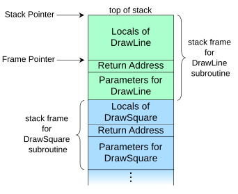

### Dynamiczne struktury danych a model pamięci w językach C/C++

Zanim przejdziemy do implementacji własnych dynamicznych struktur danych, dobrze jest zapoznać się (lub przypomnieć sobie), jak wygląda typowy model pamięci w języku C++ (i C). Omówienie rozpocznę od rysunku zaczerpniętego z portalu [GeegsForGeegs](https://www.geeksforgeeks.org/memory-layout-of-c-program/):


Warto przeczytać cały opis umieszczony pod powyższym linkiem, tu dodam kilka istotnych szczegółów. 

Po pierwsze, współczesne komputery posługują się pamięcią wirtualną. Oznacza to, że nawet jeżeli w maszynie mamy fizycznie np. 16 GB pamięci, to nasze programy mogą "myśleć", że jest jej $2^{64}$ bajtów, czyli  ok. 17,179,869,184 GB. Co więcej, jeżeli jednocześnie działa 100 programów (z czego większość w uśpieniu), to każdy może uważać, że cała pamięć wirtualna, całe $2^{64}$ bajtów, należy tylko do niego. Adresy wirtualne, jedyne, jakie widzimy jako programiści, są tłumaczone praktycznie dopiero na procesorze na adresy pamięci fizycznej i wtedy może się okazać, że tej pamięci fizycznej już nie ma, ale to już temat na inną opowieść. 

Pamięć, jak przedstawiono to na powyższym rysunku, z punktu widzenia programu podzielona jest na co najmniej 5 bloków. Jednym z nich jest **TEXT**: tu komputer przechowuje po prostu kod maszynowy naszego programu (czyli instrukcje). Za tym blokiem mamy blok zainicjalizowanych danych globalnych (statycznych): jeżeli kompilator może przewidzieć wartość, jaką powinien zainicjalizować zmienną globalną (lub statyczną w funkcji), to tę wartość może zapisać na dysku w kodzie programu, a potem po prostu ją wczytać wraz z ładowaniem programu do pamięci operacyjnej. Dalej znajduje się blok zmiennych globalnych (i statycznych w funkcjach) niezainicjalizowanych, tzw. **BSS**. Z zasady cała pamięć w tym bloku przed uruchomieniem programu jest zerowana, dlatego niezainicjowane zmienne globalne i statyczne mają w C++ wartość zero. Z kolei pod adresami o najwyższych wartościach  mamy blok, w którym program ma zapisane wartości zmiennych środowiskowych (np. `PATH`) oraz ewentualnych argumentów wiersza poleceń. To jest już ciekawa informacja, bo wynika z niej, że stan środowiska programu ustalany jest w momencie jego ładowania do pamięci operacyjnej. Zmiana środowiska poza programem po jego uruchomieniu jest już dla programu niewidoczna. Jak dla mnie, ten blok pamięci jest częścią omówionego poniżej stosu. 

Dochodzimy do dwóch najciekawszych bloków: **STACK** (stos) i **HEAP** (sterta). Stos służy do obsługi funkcji, stąd też bywa nazywany stosem funkcji (ang. [*call stack*](https://en.wikipedia.org/wiki/Call_stack)). W tym miejscu znajdują się wszystkie zmienne deklarowane wewnątrz funkcji, a także jej argumenty i wartość. Z tym, że nie można z góry przewidzieć adresu tych zmiennych. Najważniejszym parametrem stosu jest bowiem informacja o położeniu jego końca - jest to tzw. *stack pointer* oraz o położeniu końca stosu zanim daną funkcję wywołano - tzw. *frame pointer*. Położenie zmiennych lokalnych, argumentów funkcji i ich wartość definiowane są zawsze jako wartości względne względem jednego z tych adresów. Dzięki temu podczas rekurencyjnego wywoływania funkcji, za każdym razem jej parametry, wartości i zmienne lokalne alokowane są w osobnym obszarze pamięci. 

Zróbmy małą dygresję i spójrzmy na poniższy rysunek (https://en.wikipedia.org/wiki/Call_stack) przedstawiający ramkę stosu (rosnącego do góry) dla dwóch funkcji, z których pierwsza, `DrawSquare`, wywołuje drugą, `Drawine` :



W momencie, gdy funkcja `DrawSquare` chce wywołać funkcję `DrawLine` (zapewne cztery razy, skoro kwadrat ma cztery boki), to powiększa swój stos o miejsce (co wiąże się z przesunięciem wartości *Stack pointer*), w którym zapisuje argumenty, z jakimi wywołuje  `DrawLine`, a także adres instrukcji, która ma być wykonana po zakończeniu `DrawLine`. Ta instrukcja oczywiście należeć będzie do `DrawSquare`, a sam adres nazywa się adresem powrotu (*return address*). Następnie bieżąca wartość *Stack Pointer* zapamiętywana jest we *Frame Pointer*, a  sterowanie przekazywane jest do `DrawLine`. Ta z kolei funkcja przesuwa StackPointer o tyle bajtów, ile potrzeba do jej działania. Przez chwilę przed i po wywołaniu funkcji obie funkcje, wywołująca i wywoływana, współdzielą miejsce, w którym funkcja wywoływana zapisuje swój wynik. Powyższe pozwala rozumieć, jak działają funkcje w C/C++ a także takie zaawansowane aspekty standardu C++, jak RVO (*Return Value Optimization*). Stos funkcji ma jeszcze jedną bardzo ważną cechę: zwykle jego rozmiar jest z góry ograniczony. W moim systemie (Maniaro Linux) jest to obecnie 8 MiB. Jeżeli nasze zmienne lokalne w funkcjach zajęłyby więcej pamięci, to program padnie, a my prawdopodobnie zobaczymy komunikat "stack overflow". Z powyższego wywodu należy zapamiętać, że wszelkie nazwane zmienne lokalne (w tym argumenty i wartość funkcji - ta akurat wyjątkowo jest obiektem nienazwanym) umieszczane są na stosie funkcji, przy czym zarządzanie stosem przejmuje na siebie kompilator, a jego rozmiar ustalany jest w chwili uruchamiania programu. Prawdopodobnie ułatwia to organizacje pracy ostatniego segmentu pamięci programu: sterty. 

**Sterta** (ang. *heap*), zwana też pamięcią wolną (ang. *free store*) to pamięć przydzielana "na żądanie". Żadna zmienna nazwana nie jest przechowywana na stercie programu. Do alokowania obiektu na stercie służą operatory `operator new` oraz `operator new[]`, a do zwalniania tej pamięci - operatory `operator delete` oraz `operator delete[]`.  Oznacza to, że zarządzanie stertą należy do wyłącznych kompetencji programisty. 

Rozważmy następujący program:

```c++ 
int g;                     // g: w obszarze niezainicjowanych zmiennych statycznych (BSS)
int main(int argc, const char* argv[])  // argc i argv: na stosie
{
    static int a = 1;      // a: w obszarze statycznych zmienych zainicjalizowanych  
    int b = 3;             // b: na stosie
    int* p = new int(8);   // p: na stosie; new int: na stercie
    delete p;              // zwolnienie pamięci (na stercie) pod adresem p
    return 0;              // wynik: na stosie
}
```

W programie tym:

- zmienna `g`, jako niezainicjowany obiekt globalny, zostanie przydzielona do segmentu BSS. 
- zmienna `a`, jako zainicjalizowany obiekt statyczny, zostanie przydzielona do segmentu "initialized data" 
- zmienne `argc`, `argv`, `b` i `p`, jako niestatyczne zmienne lokalne w funkcji, zostaną zaalokowane w segmencie STACK, czyli na stosie funkcji. Tam też znajdzie się miejsce na wartość zwracaną z `main` (tu: zero). 
- dodatkowo jedna nienazwana zmienna typu `int` i wartości 8 zostanie zaalokowana na stercie (HEAP) operatorem `new`. Jest ona dostępna poprzez wskaźnik `p`.    

Można zadać pytanie, dlaczego pisząc w większości innych języków programowania niż C/C++ nie musimy rozróżniać obiektów globalnych, lokalnych i alokowanych na stercie programu. W większości przypadków odpowiedź jest prosta: tamte języki preferują bezpieczeństwo i łatwość użycia ponad efektywność kodu wynikowego. I mogą polegać na C/C++ jako narzędziach do tworzenia interpreterów lub kompilatorów tych języków i/lub ich maszyn wirtualnych.     

Jakie stąd wnioski?

- Miej świadomość, że w każdym programie napisanym w C/C++ 

  - część zmiennych i obiektów (np. `std::cout`) zajmuje miejsce w obszarze zmiennych (zainicjalizowanych lub nie)  globalnych i statycznych. To pozwala lepiej zrozumieć specyfikę obiektów globalnych i statycznych w funkcjach. 
  - część zmiennych i obiektów zajmuje miejsce na stosie funkcji. W szczególności przechowywane są tam wszystkie niestatyczne zmienne lokalne w funkcjach, ich argumenty i wartość. 
  - część zmiennych i obiektów zajmuje miejsce na stercie (pamięci wolnej). Te obiekty nie mają swojej nazwy i zarządzane są wyłącznie poprzez wskaźniki.

- Stosem i zmiennymi globalnymi zarządza kompilator, a stertą - programista. 

  - interfejsem programistycznym sterty są dwa operatory `new` i odpowiadające im dwa operatory `delete`. 

- Dynamiczne struktury danych muszą posługiwać się stertą, jedynym blokiem pamięci programu, w którym pamięć na indywidualne obiekty bądź ich tablice przydzielana jest na żądanie, natomiast uchwyt do tych danych zwykle (ale nie na pewno) będzie umieszczony na stosie.
