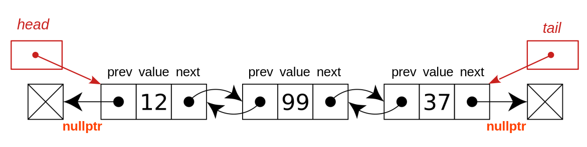
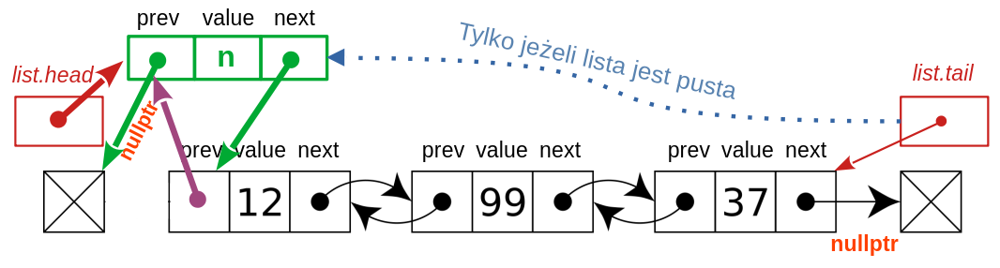

### Lista podwójnie wiązana

Lista podwójnie wiązana jet podobna do listy wiązanej pojedynczo, z tym że teraz każdy element ma wskaźnik nie tylko do elementu następnego ale i poprzedniego, przy czym jeżeli element następny lub poprzedni nie istnieje, to odpowiadający mu wskaźnik ma wartość `nullptr`. 

Rekurencyjna struktura danych reprezentująca element listy podwójnie wiązanej wygląda następująco:

```c++    
struct Element
{
    int value;      // dane przechowywane w danym elemencie listy
    Element* prev;  // adres porzedniego elementu lub nullptr, jeśli taki nie istnieje 
    Element* next;  // adres następnego elementu lub nullptr, jeśli taki nie istnieje
};
```

Graficznie listę podwójnie wiązaną można przedstawić [następująco](https://en.wikipedia.org/wiki/Doubly_linked_list):



Jak widać, mamy teraz nie tylko dwa wskaźniki w każdym elemencie listy, ale i dwa uchwyty do całej listy: wskaźnik na element pierwszy (`head`) oraz wskaźnik na element ostatni (`tail`). Nieco komplikuje to pisanie funkcji obsługujących taką listę. Jako że nie różnią się one jednak jakoś pryncypialnie od funkcji obsługujących listę pojedynczo wiązaną, tu przedstawię tylko kilka przykładów. Żeby nie musieć przekazywać do takich funkcji obu uchwytów definiujących listę podwójnie wiązaną, umieszczę je w strukturze:

```c++ 
struct List
{
    Element* head = nullptr;
    Element* tail = nullptr;
};
```

Lista będzie tworzona i używana np. tak:

```c++ 
int main()
{
    List lista;
    insert(lista, 37);
    insert(lista, 99);
    insert(lista, 12);
    print(lista);
    print_backward(lista);
    free(lista);
}
```


 #### Wstawianie

Ponieważ mamy dwa uchwyty do listy, naturalnymi operacjami na liście wiązanej są `push_front` (daj element na początku listy) i `push_back` (dodaj element na końcu listy). Tu przedstawię jedni z możliwych rozwiązań dla pierwszej z nich. Rozsądek podpowiada, by wszelkie prace związane z dynamicznymi strukturami danych zaczynać od rysunku. Ot więc rysunek stanu docelowego, po wykonaniu instrukcji `push_front(list, n)`:

  

Wystarczy porównać oba rysunki, by zrozumieć, co należy zrobić. Zaczynamy od utworzenia nowego elementu, zaznaczonego na powyższym rysunku kolorem zielonym, o wartości `n`. Wartość jego składowej `next` musi być adresem dotychczasowego elementu pierwszego lub `nullptr`, jeżeli lista jest pusta. Wartość ta jest jednak równa dotychczasowej wartości wskaźnika `root`, otrzymujemy więc dość prosty kod:  

```
Element* tmp = new Element{.value = n, .prev = nullptr, .next = root};
```

W ten sposób ustawiliśmy prawidłowe wartości "zielonych" wskaźników na powyższym rysunku. Dodatkowo tylko jeżeli lista jest pusta, należy przestawić wartość wskaźnika na ostatni element z `nullptr` na nowy element (niebieska strzałka na rysunku). Z kolei tylko gdy lista nie jest pusta istnieje w niej element pierwszy, w którym należy zmienić wartość składowej `prev` (fioletowa strzałka na powyższym rysunku). Na sam koniec należy zaktualizować wartość uchwytu do początku listy, czyli `list.head` (strzałka ciemnoczerwona). I gotowa funkcja:

```c++   
void insert(List& list, int n)
{
    Element* tmp = new Element{.value = n, .prev = nullptr, .next = list.head};
    bool empty = list.head == nullptr;  // czy lista jest pusta? 
    if (empty)
        list.tail = tmp;        // aktualizacja wskaźnika na koniec listy
    else
        list.head->prev = tmp;  // aktualizacja wskaźnika na wstawiony element
    list.head = tmp;
}
```

#### Zwalnianie listy

Każda dynamiczna struktura danych musi mieć funkcję zwalniającą zajmowaną przez nią pamięć. Operację tę można wykonać tak, jakbyśmy mieli do czynienia z listą pojedynczo wiązaną:

```c++
void free(List& list)
{
    if (list.head == nullptr)  // jesli lista jest pusta, to nie ma nic do roboty
        return;
    auto tmp = list.head;      // pierwszy element istnieje; zapamiętujemy jego położenie 
    list.head = list.head->next; // aktualizujemy uchwyt do pierwszego elementu
    delete tmp;                // usuwamy pierwszy element
    free(list);                // wywołanie rekurencyjne: zwalniamy resztę listy
}
```

#### Wyświetlanie zawartości listy

W przeciwieństwie do listy pojedynczo wiązanej, listę podwójnie wiązaną można łatwo przeglądać w obie strony. Kod jest prosty.

```c++ 
void print(const List& list)
{
    std::cout << "{ ";
    auto tmp = list.head;
    while (tmp != nullptr)
    {
        std::cout << tmp->value << " ";
        tmp = tmp->next;
    }
    std::cout << "}\n";
}

void print_backward(const List& list)
{
    std::cout << "{ ";
    auto tmp = list.tail;
    while (tmp != nullptr)
    {
        std::cout << tmp->value << " ";
        tmp = tmp->prev;
    }
    std::cout << "}\n";
}
```

#### Odwracanie listy

Odwracanie listy podwójnie wiązanej jest prostsze niż odwracanie listy wiązanej pojedynczo. Możemy po prostu w każdym węźle zamienić wskaźniki `prev` i `next`, co nie doprowadzi do rozerwania listy. Dodatkowo powinniśmy jeszcze zamienić miejscami uchwyty do początku i końca listy, czyli `list.head` z `list.tail`. 

```c++  
void reverse(List& list)
{
    // root jak w liscie pojedynczo wiązanej
    auto root = list.head;
    // przeglądamy listę od pierwszego do ostaniego elementu
    while (root != nullptr)
    {
        std::swap(root->next, root->prev);
        root = root->prev;  // po swapie to root->prev jest elementem następnym!
    }
    std::swap(list.head, list.tail);  // działa też dla listy pustej i 1-elementowej
}
```

#### Zadania

Można spróbować zrobić te same zadania co dla listy pojedynczo wiązanej, ale dla listy wiązanej podwójnie. 
