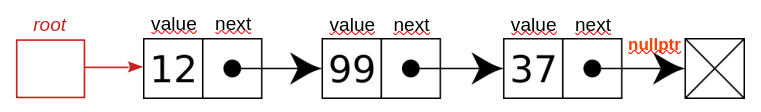
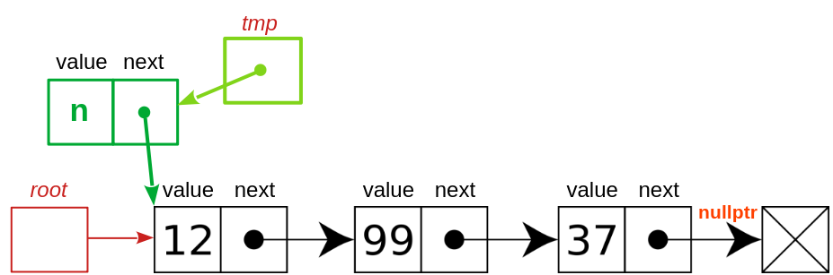
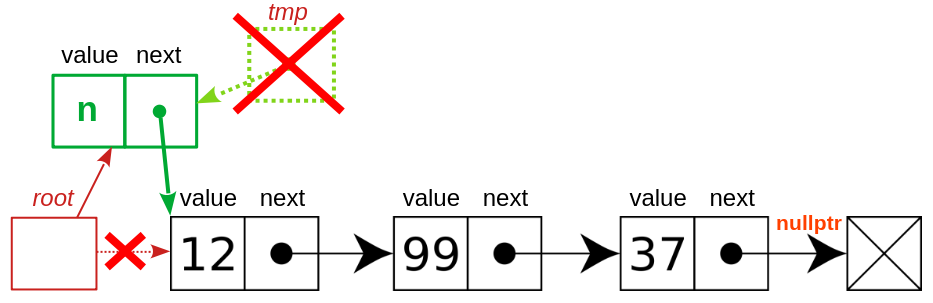
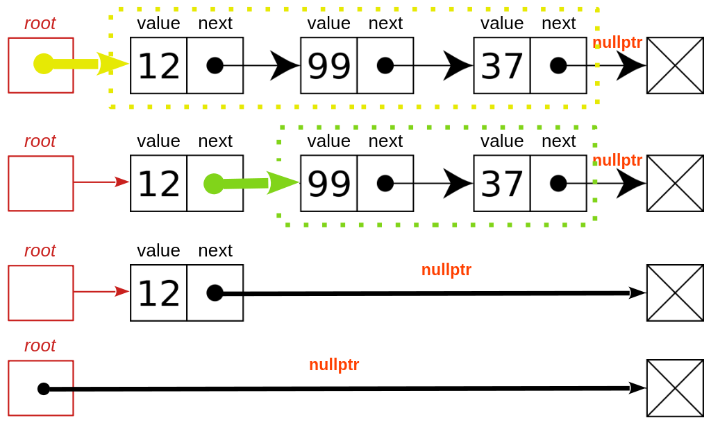
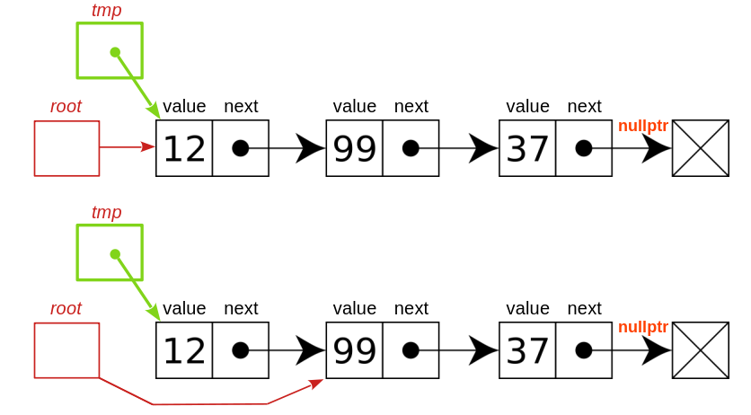
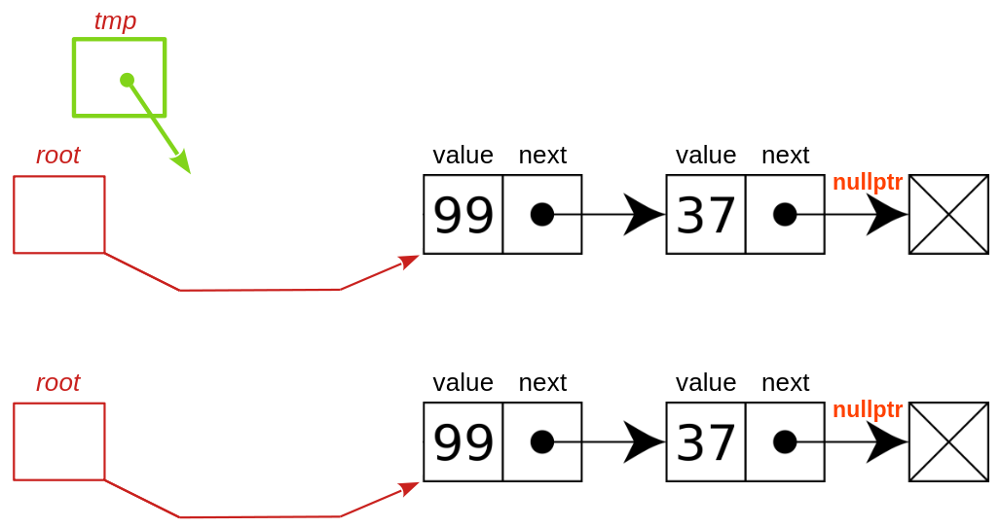
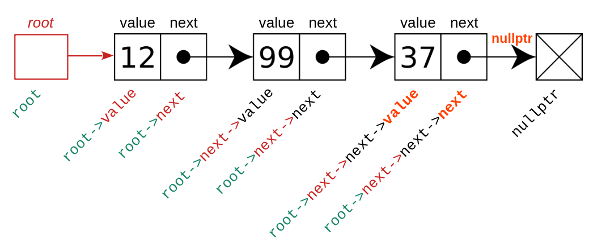

### Lista pojedynczo wiązana

Lista pojedynczo wiązana jest podstawową dynamiczną strukturą danych opisaną w setkach, jeśli nie tysiącach źródeł internetowych i książkach. Tutaj zajmę się nią z punktu widzenia programisty: jak "oprogramować" nawet nie tyle samą listę pojedynczo wiązaną, ale różne na niej operacje. 

Jak wiadomo, klasyczna implementacja listy opiera się na strukturze rekurencyjnej, czyli zwierającej wskaźnik do struktury tego samego typu, który dopiero definiujemy:

```c++   
struct Element
{
    int value;
    Element* next;
};
```

Trzeba przy tym pamiętać, że podręczniki (i ja tutaj) zwykle podają przykłady najprostszych implementacji, w których na liście przechowywane są liczby całkowite (`int`), jednak w praktyce mogą to być dowolne dane.

Samą listę można zilustrować za pomocą nieco przerobionej grafiki z [Wikipedii](https://en.wikipedia.org/wiki/Linked_list): 



To, co do niej dodałem, to nazwy pól (`value`, `next`), wartość ostatniego wskaźnika (`nullptr`) oraz uchwyt do listy (`root`). 

Ważna uwaga. Uchwyt może być zmienną zaalokowaną na stosie lub stercie, natomiast cała reszta powinna być alokowana dynamicznie na stercie operatorem `new`. W przeciwnym wypadku będziemy mieli poważny problem z poprawnym usunięciem takiej struktury danych z pamięci. Czy wiesz dlaczego? I kolejna uwaga. W powyższej strukturze użyteczne dane znajdują się w polach o nazwie `value`, natomiast cała reszta służy do organizacji listy, nadając jej odpowiednią formę.   

Zacznijmy od implementacji najbardziej potrzebnej funkcji, czyli takiej, która będzie dodawała do listy kolejny element ze składową `value` o dowolnej wartości `n`.  Nazwijmy ją `insert`. Potrzebuje ona 2 argumentów: wskaźnika do elementu, przed którym mamy wstawić nowy element (lub wskaźnika `nullptr` jeżeli lista jest pusta) oraz liczby, która ma być zapisana w polu `value` tego elementu. Zróbmy też odpowiedni rysunek pierwszego kroku:

     

W tym kroku tworzymy (na stercie!) nowy element listy. Inicjalizujemy jego składową `value` wartością zmiennej `n`, natomiast jego składowa `next` powinna wskazywać następny element listy. Czyli powinna mieć taką samą wartość, jaką ma `root`. Ponadto powinniśmy zauważyć, że skoro nowy element jest alokowany na stercie, to nie może mieć nazwy. Dlatego potrzebujemy zmiennej wskaźnikowej, w której `opertor new` zapisze jego adres. Stąd już gotowy kod:    

```c++   
Element* tmp = new Element{.value = n, .next = root};
```

Nieco na marginesie: składnia inicjalizatora, z nazwami pól struktury po kropkach, została oficjalnie włączona do standardu języka C++ wraz z jego wersją C++20. Jej użycie bardzo poprawia czytelność kodu.

Do rozwiązania pozostaje ostatni problem. Wiemy, że funkcja ma się nazywać `insert`, łatwo domyślamy się, że powinna w swoich argumentach otrzymywać `root` oraz `n`, ale w jaki sposób? Aby odpowiedzieć na to pytanie, wystarczy zastanowić się, czy funkcja potrzebuje dostępu do oryginału danego argumentu, czy też wystarczy jej kopia.     

Następnie musimy zmienić wartość `root`  ("przestawić wskaźnik") tak, by ten wskaźnik wskazywał nowy element, czyli to samo, na co wskazuje `tmp` . Graficznie chodzi o coś takiego:



Rozwiązanie jest bardzo proste:

```c++ 
root = tmp;  // odtąd root wskazuje na to, na co teraz wskazuje tmp
```

Mamy więc gotową treść funkcji `insert`:

```c++ 
{
    Element* tmp = new Element{.value = n, .next = root};
    root = tmp;
}
```

którą oczywiście moglibyśmy nawet skrócić do jednej instrukcji, 

```c++
root = new Element{.value = n, .next = root};
```

ale wersja z dwiema wierszami wydaje się nieco bardziej czytelna i łatwiejsza w debugowaniu. Gdyby ktoś zastanawiał się, co dzieje się ze zmienną `tmp`, to odpowiedź jest równie prosta: ponieważ jest to niestatyczna zmienna zdefiniowana w zakresie funkcji, zostanie ona automatycznie usunięta wraz z dojściem sterowania do klamry kończącej definicję funkcji.     

Zostaje ostatni problem: jak zdefiniować interfejs funkcji `insert`. Dla uproszczenia możemy przyjąć, że nie zwraca ona żadnej wartości (czyli: że jej wartość jest typu `void`). Jest też jasne, że funkcja ta potrzebuje dwóch argumentów: wskaźnika `root` na element, przed którym mamy dodać nowy element, oraz liczby `n` która ma zostać zapisana w tym nowym elemencie. Pozostaje więc rozstrzygnąć, w jaki sposób przekazać te dwa parametru do funkcji: przez wartość, wskaźnik, referencję czy może stałą referencję?

- Ponieważ `n` nie jest w funkcji zmieniane, a poza tym zajmuje tylko 4 bajty, a więc mniej niż każda implementacja referencji, przekazujemy tę zmienną przez wartość
- Ponieważ `root` jest zmieniane przez funkcję i zmiana ta MUSI być "zauważona" na zewnątrz, w punkcie, w którym funkcję `insert` wywołujemy, parametr ten powinien być przekazany przez referencję (w języku C nie ma referencji, więc tam `root` przekazywany byłby przez wskaźnik do wskaźnika na `int`, co zapisuje się jako  `int**`). 

I tak oto doszliśmy do kodu całej funkcji:

```c++
void insert(Element*& root, int n)
{
    Element* tmp = new Element{.value = n, .next = root};
    root = tmp;
}
```

Warto zapamiętać sposób przekazywania parametru `root`. Zapis `Element*& root` odczytujemy, idąc od prawej do lewej, następująco:`root` jest referencją (`&`) do wskaźnika (`*`) na zmienną typu `int`. Właśnie tego chcieliśmy, wszystko się zgadza.

Funkcji `insert` możemy użyć w prostym programie testowym, odtwarzającym listę z rysunku powyżej:

```c++
int main()
{
    Element* root = nullptr; // lista jest pusta, {}
    insert(root, 37);        // {37}
    insert(root, 99);        // {99 -> 37}  
    insert(root, 12);        // {12 -> 99 -> 37}
}
```

#### Usuwanie stosu

Stos, do którego tylko dodajemy elementy ma potencjalnie katastrofalną wadę: one alokowane są na stercie, a więc nie podlegają automatycznemu zarządzaniu przez kompilator. Grozi więc sytuacja, że w programie będziemy mieć wyciek pamięci. Potrzebujemy więc funkcji `free`, która będzie zwalniać wszystkie elementy stosu. Problem ten, w przeciwieństwie do `insert`, charakteryzuje się tym, że dotyczy nie jednego, a wszystkich elementów listy. W takich sytuacjach zwykle mamy dwie metody rozwiązania problemu: albo napiszemy funkcję rekurencyjną, albo zwykłą funkcję, w której umieścimy pętlę. 

##### Wersja rekurencyjna

Rozwiązania rekurencyjne problemów związanych z dynamicznymi strukturami danych są zwykle znacznie prostsze w implementacji i łatwiejsze do zrozumienia niż ich wersje pętlowe, zaczynamy więc od funkcji korzystającej z rekurencji:

```c++       
void free(Element*& root)
{
    if (root == nullptr)  // sprawdzamy warunek zakończenia rekurencji
        return;
    free(root->next);     // tu free wywołuje samą siebie, czyli - rekurencja
    delete root;          // fizyczne usunięcie elementu (zwolnienie pamięci)
    root = nullptr;       // informujemy świat, że za root juz nic nie ma
}
```

Każda funkcja rekurencyjna zwykle na samym początku sprawdza, czy może samodzielnie wykonać zlecone jej zadanie, czy też będzie musiała skorzystać z wywołania samej siebie rekurencyjnie. Taki charakter ma tu instrukcja `if`: jeżeli warunek `root == nullptr` jest spełniony, to lista jest pusta i nie ma czego z niej usuwać, możemy więc zakończyć naszą funkcję. W przeciwnym wypadku `root` wskazuje na jakiś element. Oznacza to, że `root->next` wskazuje na drugi element lub ma wartość `nullptr`, jeżeli on nie istnieje (tj. jeżeli lista jest jednoelementowa.). Postępujemy więc w sposób typowy dla rozwiązań rekurencyjnych: wywołujemy naszą funkcję, którą właśnie implementujemy, na zbiorze o jeden element mniejszym. Wskaźnikiem na zbiór o jeden element mniejszy jest `root->next`, co tłumaczy sens instrukcji `free(root->next)` . Zakładamy, że funkcja ta wykonała zlecone jej zadanie, a to oznacza, że po jej zakończeniu na liście  został tylko jeden element, ten wskazywany przez `root`. Usuwamy więc go z pamięci operatorem `delete` (a właściwie: zwalniamy pamięć, którą on zajmuje, wcześniej wywołując destruktor, o ile takowy został zdefiniowany) . Na koniec informujemy "świat", że lista jest pusta. W tym celu nie tylko piszemy `root = nullptr`, ale i przekazujemy `root` przez referencję.  Ilustruje to poniższy rysunek. 



Aby usunąć wszystkie elementy listy trójelementowej wskazywanej przez "żółty" wskaźnik, usuwamy dwa ostatnie elementy wskazywane przez "zielony wskaźnik", korzystając z wywołania rekurencyjnego (i zakładając, że ono zadziała). Następnie sami usuwamy ostatni element, jedyny, jaki pozostał. Po wykonaniu tych czynności `root` musi mieć wartość `nullptr`. 

##### Wersja z pętlą

Obsługa dynamicznych struktur danych bez rekurencji zawsze wymaga nieco głębszego pomyślunku. Na początku napiszmy funkcję, która usuwa tylko pierwszy element listy:

```c++
void free_first(Element*& root)
{
    if (root != nullptr)
    {
        auto tmp = root;
        root = root->next;
        delete tmp;
    }
}
```

- W powyższej funkcji najpierw sprawdzamy, czy pierwszy element w ogóle istnieje (`if (root != nullptr`)). Jeśli tak, to
  - zapamiętujemy jego położenie w zmiennej pomocniczej `tmp`. "Sztuczka" z `auto` upraszcza zapis. 
  - przestawiamy `root` na drugi element listy, jeśli taki istnieje, lub na `nullptr`, jeśli lista jest jednoelementowa. W każdym przypadku jest to wartość zapisana w `root->next`. 
  - usuwamy pierwszy element listy, jego adres odczytując z `tmp`. 
- w przeciwnym wypadku nie robimy nic.   

Jak powyższy kod uogólnić tak, by funkcja usuwała całą listę? Oczywiście można by się posłużyć rekurencją, ale przecież chcemy mieć rozwiązanie bez rekurencji, za to z pętlą. Najprostszym rozwiązaniem byłoby wykonanie tych samych instrukcji jeszcze raz, i jeszcze raz, aż `root` osiągnie wartość `nullptr`. Można to w dość prymitywny sposób zrobić następująco:

```c++ 
void free_in_loop(Element*& root)
{
start:
    if (root != nullptr)
    {
        auto tmp = root;
        root = root->next;
        delete tmp;
        goto start;
    }
}
```

W powyższym kodzie `start:` to etykieta (ang. `label`), która etykietuje, oznacza kolejną instrukcję, tu: instrukcję `if`. Inną zmianą w porównaniu do `free_first` jest instrukcja `goto start;` nakazująca przenieść sterowanie do miejsca oznaczonego etykietą `start`, czyli na początek instrukcji `if`. Oczywiście nikt przytomny nie używa instrukcji `goto`, jeśli nie widzi w tym jakiejś wyraźnej korzyści.  Tu takiej korzyści nie ma, gdyż powyższy kod można uprościć za pomocą instrukcji `while`:

```c++
void free_in_loop(Element*& root)
{
    while (root != nullptr)
    {
        auto tmp = root;
        root = root->next;
        delete tmp;
    }
}
```

Kolejne kroki tej pętli ilustrują poniższe rysunki (ostatni przedstawia działanie klamry "}" kończącej zakres pętli `while`, na której usuwana jest zmienna lokalna `tmp`):





#### Operator ->

Osobom nienawykłym do wskaźników w językach C lub C++ na początku pewną trudność sprawia `operator->`. Sprawę, mam nadzieję, wyjaśnia poniższy rysunek:

  

Problem w tym, że poza uchwytem do listy, `root`, cała jej zawartość leży na stercie. Są to więc zmienne nienazwane. Możemy jednak odnieść się do każdego elementu listy za pomocą wskaźnika  `root`, nazw składowych (tu: `value` lub `next`)  i operatora `->`. Na przykład na powyższym rysunku składowa typu `int` o wartości `12` zapisana w polu o nazwie `value` to `root->value`. Gdybyśmy wydali instrukcję

```c++
root->value = 88;
```

to z listy {12 -> 99 -> 37} otrzymalibyśmy listę {88 -> 99 ->37}. Podobne znaczenie mają wyrażenia w rodzaju `root->next->value` czy `root->next->next->next`.   

#### Suma elementów

Możemy teraz sami napisać różne funkcje działające na liście. Na przykład funkcję zwracającą sumę elementów listy.

##### Wersja rekurencyjna

```c++
int suma(const Element* root)
{
    if (root == 0)                         // sprawdzenie przypadku skrajnego
        return 0;
    return root->value + suma(root->next); // wywołanie rekurencyjne na n-1 elementach
}
```

Jak widać, kod jest naprawdę krótki i - jak mi się wydaje - czytelny. Z nowości warto zwrócić uwagę na to, że ponieważ `suma` nie modyfikuje listy, to nie ma sensu przekazywać `root` przez referencję. Stąd argumentem tej funkcji jest wskaźnik (funkcja działa na kopii `root`), zabezpieczony dodatkowo modyfikatorem `const`, żeby na pewno za jego pomocą przypadkowo nie zmienić zawartości listy.  

##### Wersja z pętlą

```c++
int suma(const Element* root)
{
    int wynik = 0;
    while (root != nullptr)
    {
        wynik += root->value;
        root = root->next;
    }
    return wynik;
}
```

Ten kod chyba już nie wymaga komentarza dotyczącego sposobu działania. Warto jednak zwrócić uwagę na inne aspekty tego kodu: wszystkie zmienne i nazwa funkcji mają starannie dobrane nazwy. Zapis jest ustandaryzowany (np. wcięcia na 4 spacje,  pojedyncze odstępy wokół niektórych operatorów, brak odstępów wokół innych, jak `->`). Modyfikator `const` i brak referencji informują, że funkcja nie będzie modyfikować listy, mimo że modyfikuje kopię zmiennej `root` w każdej instrukcji `root = root->next`. Wszystko to sprawia, że kod nie wymaga komentarza, "sam się komentuje". Właśnie tak należy pisać programy (w każdym języku programowania). 

#### Zerowanie listy     

Powiedzmy, że potrzebujemy funkcji `zero`, która każdemu elementowi listy nada wartość zero. Oto obie wersje:

##### Wersja rekurencyjna

```c++
void zero(Element* root)
{
    if (root == 0)
        return;
    root->value = 0;
    zero(root->next);
}
```

##### Wersja z pętlą

```c++  
void zero(Element* root)
{
    while (root != nullptr)
    {
        root->value = 0;
        root = root->next;
    }
}
```

Warto zwrócić uwagę na to, że ponieważ struktura listy nie ulega zmianie, `root` przekazywane jest przez wartość. Skoro jednak ta funkcja ma modyfikować pola `value`, to `root` nie może być wskaźnikiem na `const Element`.

### Testowanie

Sprawdzenie, czy rozwiązanie jakiegoś problemu związanego z dynamiczną strukturą danych jest prawidłowe, nie jest proste, gdyż operacje na wskaźnikach są dość trudne w diagnostyce. Dobrze jest przetestować swój kod na liście pustej, jedno- i kilkuelementowej. Istnieje kilka narzędzi pomagających diagnozować błędne posługiwanie się wskaźnikami. Oto kilka z nich (dostępnych dla kompilatora gcc) 

- Sanitizer. 

  - W kompilatorze gcc dodajemy flagi `-g -fsanitize=address`.  
  - W systemie CMake można gdzieś na początku skryptu dodać instrukcję 
    ```cmak
    set (CMAKE_CXX_FLAGS "${CMAKE_CXX_FLAGS} -fsanitize=address")
    ```

- valgind. Valgrind to zewnętrzny program, emulator i analizator wykonywania się programu. Uruchamiamy go komendą `valgrind ./a.out` lub `valgrind --leak-check=yes ./a.out`, gdzie `./a.out` to nazwa programu wykonywalnego poddawanego diagnostyce (skompilowanego raczej w trybie Debug).

#### Uwagi

Przedstawiony tu kod niby napisany jest w C++, ale użyte tu struktury danych to świat języka C. Otrzymany kod jest szybki, ale niebezpieczny w użyciu. Np. takie użycie zaprezentowanych tu funkcji, jak w poniższym programie, niemal na pewno doprowadzi do katastrofalnego padu programu. Czy wiesz, dlaczego? 

```c++  
int main()
{
    Element e{.value = 37, .next = nullptr};   
    Element* root = &e;
    insert(root, 99);
    insert(root, 12);
    std::cout << suma(root) << "\n";

    free_in_loop(root);
    std::cout << "koniec\n";
}    
```

Dlatego dynamiczne struktury danych w C++ implementuje się w klasach (jeszcze lepiej: w formie szablonów klas), z hermetyzacją danych i dobrze zdefiniowanymi interfejsem publicznym i niezmiennikami klasy.

### Problemy

1. Zaprojektuj i zaimplementuj funkcję `empty`, która zwracać będzie `true`, jeżeli lista jest pusta, lub `false`, jeżeli zawiera choć jeden element. 
1. Zaprojektuj i zaimplementuj funkcję `erase_second`, która usuwa dokładnie drugi element listy, o ile lista zawiera co najmniej 2 elementy. 
1. Zaprojektuj i zaimplementuj funkcję `size`, która zwraca liczbę elementów listy. Napisz wersję rekurencyjną i z pętlą. 
1. Zaprojektuj i zaimplementuj funkcję `print`, która wyświetla na konsoli wszystkie elementy listy. Napisz wersję rekurencyjną i z pętlą. 
1. Zaprojektuj i zaimplementuj funkcję `iota`, która wypełni istniejącą listę kolejnymi liczbami naturalnymi począwszy od 1. Czyli jeżeli mamy listę {2 -> 5 -> 78 -> -1}, to po wywołaniu funkcji `iota` na tej liście, zostanie ona zamieniona na listę {1 -> 2 -> 3 -> 4}. Napisz wersję rekurencyjną i z pętlą. 
1. Zaprojektuj i zaimplementuj funkcję `sum_even`, która wyznaczy sumę parzystych elementów listy. Czyli dla listy  {2 -> 5 -> 78 -> -1} powinniśmy otrzymać wynik 2 + 78, czyli 80. Napisz wersję rekurencyjną i z pętlą. 
1. Zaprojektuj i zaimplementuj funkcję `erase_last`, która będzie usuwać ostatni element listy, o ile lista nie jest pusta.
1. Zaprojektuj i zaimplementuj funkcję `join`, która łączy ze sobą dwie listy.
1. Zaprojektuj i zaimplementuj funkcję `remove_even`, która usuwa z listy wszystkie elementy parzyste. Na przykład dla listy {2 -> 5 -> 78 -> -1}  powinniśmy otrzymać listę {5 -> -1}. Napisz wersję rekurencyjną i z pętlą.
1. (dość trudne) Bez zaglądania do rozwiązań w internecie zaprojektuj i zaimplementuj funkcję `reverse`, która odwraca kolejność elementów listy. Na przykład dla listy {2 -> 5 -> 78 -> -1}  powinniśmy otrzymać listę {-1 -> 78 -> -> 5 ->  2}. Implementacja nie może przemieszczać elementów listy, wszystkie operacje należy wykonać wyłącznie na wskaźnikach.

Jeżeli potrafisz rozwiązać powyższe problemy, to ani wskaźniki, ani lista pojedynczo wiązana, ani nawet rekurencja nie są ci straszne. Zauważ, że nie napisałem, że należy wszystkie te problemy rozwiązać, tylko że należy umieć je rozwiązać.

