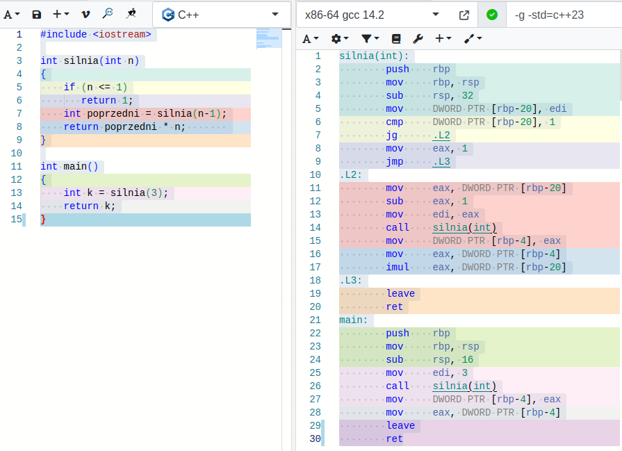

### Rekurencja

Rekurencja w  programowaniu to oczywiście wywoływanie funkcji przez samą siebie, bezpośrednio lub pośrednio, za pomocą innych funkcji. Oparte na rekurencji rozwiązania problemów informatycznych bardzo przypominają znaną w matematyce zasadę indukcji matematycznej:

>  Załóżmy, że mamy pewne zdanie matematyczne sparametryzowane liczbą naturalną $n$. Oznaczmy je przez $T(n)$. Jeżeli udowodnimy prawdziwość dwóch zdań: 
>  1. $T(1)$ jest prawdziwe
>  2. Dla każdego naturalnego  $k \ge 1$ prawdziwa jest implikacja $T(k) \implies T(k+1)$. 
>
>  to tym samym udowodnimy prawdziwość $T(n)$ dla każdego $n \ge 1$.   

Trywialny przykład: niech $T(n)$​ oznacza zdanie "Suma n jedynek wynosi n". Sprawdzamy warunek 1: "suma 1 jedynki wynosi 1". Jest to zdanie prawdziwe. Przechodzimy do punktu drugiego. Oznaczmy poszukiwaną sumę $n$​ jedynek przez $S(n)$​ (czyli $S(n) = 1 + 1 + \cdots + 1$​, gdzie liczba jedynek w sumie wynosi $n$​).  Mamy udowodnić, że jeżeli $S(n) = n$, to $S(n+1) = n + 1$. Załóżmy więc, zgodnie z założeniem indukcyjnym, że suma $n$ jedynek wynosi $n$, czyli że $S(n) = n$. W takim razie suma $n+1$ jedynek równa jest sumie $n$ jedynek  oraz jednej jedynki, czyli $S(n + 1) = S(n) +1$. Skoro jednak na mocy założenia indukcyjnego $S(N) = n$, to $S(n+1) = S(n) + 1 = n+1$, czyli udowodniliśmy prawdziwość zdania $ T(n+1)$, co kończy dowód, że $S(n) = n$​ dla każdego n. 

Mogłoby się wydawać, że powyższy przykład jest bezsensownie prosty. Spójrzmy jednak na kod poniższej funkcji wyznaczającej sumę $n$ jedynek:

```c++     
// zakładamy, że n >= 1
int suma_jedynek(int n) 
{
    if (n == 1)
        return 1;
    return suma_jedynek(n - 1) + 1;
}
```

Trudno nie zauważyć, że zapis tej funkcji dokładnie odpowiada powyżej opisanej metodzie indukcji matematycznej! Najpierw wyznaczamy wartość funkcji dla wartości minimalnej (tu: 1) i kończymy. Dla każdej innej wartości zakładamy, że napisaliśmy już funkcję rozwiązującą nasz problem dla $n-1$ i korzystamy z niej, by rozwiązać problem dla kolejnej wartości argumentu, czyli w tym przypadku dla $n$. Tak więc o ile w indukcji matematycznej dowodzimy, że coś jest prawdziwe, to w programowaniu problemów metodą rekurencyjną, rozwiązujemy problem dla wartości minimalnej, a następnie rozwiązujemy go dla wartości $n$ przy założeniu, że znamy już metodę rozwiązania problemu dla $n-1$, przy czym jest to właśnie ta "metoda", której kod właśnie tworzymy.  

Jeszcze jeden, nieco bardziej złożony przykład. Funkcja wyznaczająca wartość symbolu Newtona, czyli $N \choose k$. Jak pamiętamy,

1. ${N \choose 0} = 1$ 
2. ${N \choose k} = {N \choose k - 1} + {N \choose k}$  dla k = 1,2,...,N   

Przekształćmy tę definicję rekurencyjną w rekurencyjną implementację w C++:

```c++
int newton(int N, int k)
{
    if (k == 0)
        return 1;
    return newton(N, k - 1) + newton(N, k);
}
```

Prawda, że to bardzo proste? Rekurencyjne definicje funkcji idealnie nadają się do tworzenia na ich podstawie kodu odpowiadających im funkcji rekurencyjnych. Tak, wiem, że powyższa implementacja jest nieefektywna, ale jak sobie z tym poradzić, nie rezygnując z rekurencji, to już osobny temat.

#### Jak działa rekurencja?

Rekurencja to wdzięczny pretekst do omówienia sposobu, w jaki programy wykonywalne (skompilowane z kodów źródłowych napisanych w C/C++ lub podobnych językach) zarządzają pamięcią. 

Rozpatrzmy [prosty program](https://godbolt.org/z/nG6ej3vx7):

```c++   
#include <iostream>

int silnia(int n)
{
    if (n <= 1)
       return 1;
    int poprzedni = silnia(n-1);
    return poprzedni * n;       
}

int main()
{
    int k = silnia(3);
    return k;
}
```

Kompilator może przetłumaczyć go do następującego kodu w asemblerze (mniej więcej tak wyglądały programy nadzorujące pierwsze loty w kosmos i pisane przez ludzi; oczywiście tamten "asembler" był zupełnie inny):



Powyższy rysunek to zrzut ekranu z serwisu [Compiler Explorer](https://godbolt.org/z/nG6ej3vx7), który za pomocą różnych kolorów potrafi wskazać, które części programu w asemblerze odpowiadają którym częściom kodu źródłowego w C++. Nie ma potrzeby znać asemblera i386, żeby móc choćby z grubsza zorientować się, o co chodzi w powyższym kodzie, zwłaszcza jeśli znamy język angielski i możemy sobie "przetłumaczyć" mnemonik `cmp` na słowo *compare*, `sub` na *subtract*, `imul` na *integer multiplication* itp. Na przykład łatwo zauważyć, że w asemblerze nie ma zmiennych, których użyto w oryginalnym programie: `n`, `poprzedni` czy `k`, choć są w nim nazwy funkcji. Zamiast tych zmiennych mamy wyrażenia w rodzaju `DWORD PTR [rbp-20]`, które reprezentuje argument funkcji `silnia`, czyli `n`, czy też  `DWORD PTR [rbp-20]`, który w funkcji `silnia` reprezentuje zmienną `poprzedni`, natomiast w funkcji `main` odpowiada zmiennej `k`. Z kolei wyrażenia typu `edi` czy `eax` to nazwy [rejestrów procesora](https://pl.wikipedia.org/wiki/Rejestr_procesora).  

Przyjrzyjmy się asemblerowi początku `funkcji` silnia:

```assembly
silnia(int):
        push    rbp
        mov     rbp, rsp
        sub     rsp, 32
        mov     DWORD PTR [rbp-20], edi
        cmp     DWORD PTR [rbp-20], 1
        jg      .L2
        mov     eax, 1
        jmp     .L3
```

- Instrukcja `push rbp` zapisuje na stosie zawartość rejestru `rbp`, w którym procesor przechowuje bieżącą wartość ramki stosu (*frame pointer*).
- Instrukcja ` mov rbp, rsp` zapisuje w rejestrze `rbp`  wartość wskaźnika stosu przechowywaną w rejestrze `rsp`. 
- Instrukcja  `sub rsp, 32`  zmniejsza wartość rejestru `rsp` o 32, co łącznie z dwiema poprzednimi instrukcjami oznacza, że funkcja rezerwuje na stosie funkcji 32 bajty na własne potrzeby. Tu uwaga: w procesorach zgodnych z architekturą i386 zazwyczaj stos zajmuje najwyższe adresy i rośnie w dół, w stronę mniejszych adresów. Dlatego nowa wartość wskaźnika stosu jest mniejsza od poprzedniej, a jednocześnie stos rośnie a nie maleje.  
- Instrukcja `mov DWORD PTR [rbp-20], edi` przesyła wartość zapisaną w rejestrze `edi` pod adres o 20 bajtów mniejszy od wartości zapisanej w rejestrze `rbp`. Oznacza to, że 32-bitowy (co wynika z modyfikatora `DWORD`) argument `n` funkcji `silnia` jest do niej przekazywany właśnie w rejestrze `edi` i natychmiast zapisywany w pamięci pod adresem odpowiadającym zmiennej `n`. Adres ten nie jest znany w trakcie kompilacji, lecz wyznaczany *at runtime* względem bieżącego położenia ramki stosu. To jest kluczowa własność stosu funkcji. Adresy wszelkich zmiennych lokalnych w funkcji, jej argumentów i wartości wyznaczane są podczas działania programu (ang. *at runtime*) względem wartości zapisanej w rejestrze `rbp` (lub, zależnie od implementacji, `rsp`). Jeżeli funkcja `silnia` wywoła samą siebie, to każde wywołanie rozpocznie się od zarezerwowania na stosie funkcji miejsca na zmienne lokalne, argumenty i wartość funkcji. Każde jej wywołanie operować więc będzie na fizycznie innej pamięci. Innymi słowy, jeżeli `silnia` wywoła się rekurencyjnie, np. `silnia(3)` wywoła `silnia(2)`, ta zaś wywoła `silnia(1)`, to na stosie funkcji będą zarezerwowane trzy osobne, rozłączne bloki pamięci dla każdej z nich. Zmienna `n` w każdym z tych wywołań to inna zmienna. Podobnie zmienna `poprzedni` w każdym wywołaniu to inna zmienna. 
- Instrukcja `cmp DWORD PTR [rbp-20], 1` dokonuje porównania zawartości 4 bajtów (bo `DWORD`)  począwszy od komórki pamięci znajdującej się pod adresem o 20 bajtów mniejszym od wskaźnika ramki, `rbp`, z liczbą 1. Innymi słowy, mamy tu warunek instrukcji `if (n <= 1)`. 
- Instrukcja `jg .L2` testuje stan odpowiedniego rejestru procesora po porównaniu wykonanym w poprzedniej instrukcji. Jeżeli on "pozytywny", program skacze do instrukcji opatrzonej etykietą `.L2`. 
- W przeciwnym wypadku wykonuje się instrukcja `mov eax, 1`, która zapisuje w rejestrze `eax` wartość funkcji ustaloną na 1. 
- Instrukcja `jmp .L3` przenosi sterowanie do instrukcji opatrzonej etykietą `.L3`.  

Dalszą część kodu można przeanalizować w analogiczny sposób. 

Spójrzmy teraz, jak kompilator traktuje zmienne alokowane na stercie operatorem `new`. 

- Instrukcja 
   ```c++
   int* p = new int;
   ```
   tłumaczona jest na
   ```assembly
           mov     edi, 4
           call    operator new(unsigned long)
           mov     QWORD PTR [rbp-16], rax
   ```
   
   Pierwsza z instrukcji asemblera umieszcza w rejestrze `edi` rozmiar pamięci, jaka ma być zaalokowana na stercie. Druga instrukcja asemblera wywołuje funkcję `operator new` alokującą te pamięć. Trzecia instrukcja asemblera przepisuje wartość zwróconą przez funkcję `operator new` z rejestru `rax` do zmiennej, zapisanej 20 bajtów poniżej wskaźnika ramki stosu. My wiemy, że w kodzie źródłowym oznaczyliśmy tę pamięć identyfikatorem `p`. Dość skomplikowane operacje!
   
- Instrukcja 

   ```c++
   *p = 777;
   ```

   tłumaczona jest na

   ```assembly
           mov     rax, QWORD PTR [rbp-16]
           mov     DWORD PTR [rax], 777
   ```

   Pierwsza instrukcja asemblera pobiera z 4-bajtowej zmiennej całkowitej zapisanej pod adresem o 16 mniejszym od ramki stosu (czyli ze zmiennej `p`) do rejestru `rax`. Druga instrukcja asemblera zapisuje liczbę 777 do miejsca pod adresem zapisanym w rejestrze `rax`.   

- Instrukcja 

   ```c++
   int k = 99;
   ```

   tłumaczona jest na

   ```assembly
           mov     DWORD PTR [rbp-4], 99
   ```

   Powyższa instrukcja asemblera zapisuje liczbę 99 do miejsca o adresie o  4 bajty mniejszym od adresu zapisanego w rejestrze ramki stosu (czyli do zmiennej `k`). 

Widzimy, że obsługa zmiennych automatycznych, jak `k` i `p`, zawsze realizowana jest poprzez adresowanie względne względem bieżącej wartości ramki stosu (tu: stanu rejestru `rbp`). Ponadto użycie tych zmiennych nie wymaga jakiejś osobnej "alokacji" pamięci dla nich. Tymczasem obsługa zmiennych umieszczonych na stercie wymaga dość kosztownej alokacji (funkcją `operator new`, której wywołania kompilator nie optymalizuje nawet w trybie *Release*), natomiast samo ich użycie wymaga znajomości ich bezpośredniego adresu.
