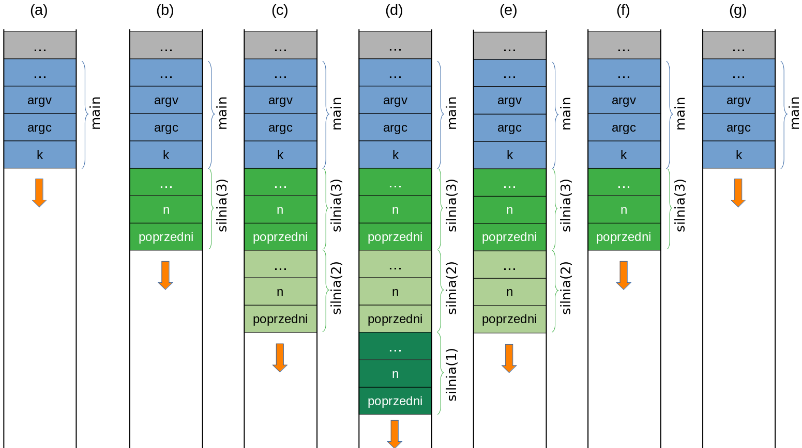

### Rekurencja

Rekurencja w  programowaniu to oczywiście wywoływanie funkcji przez samą siebie, bezpośrednio lub pośrednio, za pomocą innych funkcji. Oparte na rekurencji rozwiązania problemów informatycznych bardzo przypominają znaną w matematyce zasadę indukcji matematycznej:

>  Załóżmy, że mamy pewne zdanie matematyczne sparametryzowane liczbą naturalną $n$. Oznaczmy je przez $T(n)$. Jeżeli udowodnimy prawdziwość dwóch zdań: 
>  1. $T(1)$ jest prawdziwe
>  2. Dla każdego naturalnego  $k \ge 1$ prawdziwa jest implikacja $T(k) \implies T(k+1)$. 
>
>  to tym samym udowodnimy prawdziwość $T(n)$ dla każdego $n \ge 1$.   

Rozpatrzmy dość nieoczywisty, choć w sumie prosty przykład, w którym zdanie $T(n)$ oznacza "Liczba postaci $4^n - 30n - 1$ dzieli się przez 9". Aby udowodnić, że $T(n)$ jest prawdziwe dla każdej liczby naturalnej $n$, najpierw sprawdzamy prawdziwość $T(1)$: "Liczba $4^1 - 30\times1 -1$ dzieli się przez 9" jest zdaniem prawdziwym, bo   $4^1 - 30\times1 -1 = -27 = -3\times9$. Załóżmy więc, że ""Liczba postaci $4^n - 30n - 1$ jest podzielna przez 9" dla pewnego $n\ge1$. Oznaczmy $a_n = 4^n - 30n - 1$. Jak łatwo zauważyć, 
$$
a_{n} = 4a_{n-1} +9(10n - 13)
$$
Jeżeli więc $a_n$ jest podzielne przez 9, to $a_{n+1}$ również. Co kończy dowód.   

Spójrzmy na przykład kodu funkcji wyznaczającej wartość $a_n$ wg powyższego związku rekurencyjnego:

```c++     
// zakładamy, że n >= 1
int fun(int n) 
{
    if (n == 1)
        return -27;
    return fun(n - 1) + 90*n - 117;
```

Trudno nie zauważyć, że zapis tej funkcji dokładnie odpowiada powyżej opisanej metodzie indukcji matematycznej! Najpierw wyznaczamy wartość funkcji dla wartości minimalnej (tu: 1) i kończymy. Dla każdej innej wartości zakładamy, że napisaliśmy już funkcję rozwiązującą nasz problem dla $n-1$, po czym  korzystamy z niej, by rozwiązać problem dla kolejnej wartości argumentu, czyli w tym przypadku dla $n$. Jedyna chyba różnica polega na tym, że w indukcji matematycznej idziemy od wartości minimalnej w stronę nieskończoności, a w programowaniu problemów metodą rekurencyjną idziemy od pewnego $n$ w stronę wartości minimalnej (ogólnie: znanej wartości brzegowej). 

Jeszcze jeden, nieco bardziej złożony przykład. Funkcja wyznaczająca wartość symbolu Newtona, czyli $N \choose k$. Jak pamiętamy,

1. ${N \choose 0} = 1$ oraz ${N \choose N} = 0$
2. ${N \choose k} = {{N-1} \choose k - 1} + {{N-1} \choose k}$  dla k = 1,2,...,N   

Przekształćmy tę definicję rekurencyjną w rekurencyjną implementację w C++:

```c++
int newton(int N, int k)
{
    if (k == 0 || k == N)
        return 1;
    return newton(N - 1, k - 1) + newton(N - 1, k);
}
```

Prawda, że to bardzo proste? Rekurencyjne definicje funkcji idealnie nadają się do tworzenia na ich podstawie kodu odpowiadających im funkcji rekurencyjnych. Tak, wiem, że powyższa implementacja jest nieefektywna, ale jak sobie z tym poradzić, nie rezygnując z rekurencji, to już osobny temat. Warto przy tym zauważyć, 

#### Jak działa rekurencja?

Rekurencja to wdzięczny pretekst do omówienia sposobu, w jaki programy wykonywalne (skompilowane z kodów źródłowych napisanych w C/C++ lub podobnych językach) zarządzają pamięcią. 

Rozpatrzmy [prosty program](https://godbolt.org/z/nG6ej3vx7):

```c++   
#include <iostream>

int silnia(int n)
{
    if (n <= 1)
       return 1;
    int poprzedni = silnia(n-1);
    return poprzedni * n;       
}

int main()
{
    int k = silnia(3);
    return k;
}
```

Kompilator może przetłumaczyć go do następującego kodu w asemblerze (mniej więcej tak wyglądały programy nadzorujące pierwsze loty w kosmos i pisane przez ludzi; oczywiście tamten "asembler" był zupełnie inny):


Powyższy rysunek to zrzut ekranu z serwisu [Compiler Explorer](https://godbolt.org/z/nG6ej3vx7), który za pomocą różnych kolorów potrafi wskazać, które części programu w asemblerze odpowiadają którym częściom kodu źródłowego w C++. Nie ma potrzeby znać asemblera i386, żeby móc choćby z grubsza zorientować się, o co chodzi w powyższym kodzie, zwłaszcza jeśli znamy język angielski i możemy sobie "przetłumaczyć" mnemonik `cmp` na słowo *compare*, `sub` na *subtract*, `imul` na *integer multiplication* itp. Na przykład łatwo zauważyć, że w asemblerze nie ma zmiennych, których użyto w oryginalnym programie: `n`, `poprzedni` czy `k`, choć są w nim nazwy funkcji. Zamiast tych zmiennych mamy wyrażenia w rodzaju `DWORD PTR [rbp-20]`, które reprezentuje argument funkcji `silnia`, czyli `n`, czy też  `DWORD PTR [rbp-20]`, który w funkcji `silnia` reprezentuje zmienną `poprzedni`, natomiast w funkcji `main` odpowiada zmiennej `k`. Z kolei wyrażenia typu `edi` czy `eax` to nazwy [rejestrów procesora](https://pl.wikipedia.org/wiki/Rejestr_procesora).  

Przyjrzyjmy się asemblerowi początku `funkcji` silnia:

```assembly
silnia(int):
        push    rbp
        mov     rbp, rsp
        sub     rsp, 32
        mov     DWORD PTR [rbp-20], edi
        cmp     DWORD PTR [rbp-20], 1
        jg      .L2
        mov     eax, 1
        jmp     .L3
```

- Instrukcja `push rbp` zapisuje na stosie zawartość rejestru `rbp`, w którym procesor przechowuje bieżącą wartość ramki stosu (*frame pointer*).

- Instrukcja ` mov rbp, rsp` zapisuje w rejestrze `rbp`  wartość wskaźnika stosu przechowywaną w rejestrze `rsp`. 

- Instrukcja  `sub rsp, 32`  zmniejsza wartość rejestru `rsp` o 32, co łącznie z dwiema poprzednimi instrukcjami oznacza, że funkcja rezerwuje na stosie funkcji 32 bajty na własne potrzeby. Tu uwaga: w procesorach zgodnych z architekturą i386 zazwyczaj stos zajmuje najwyższe adresy i rośnie w dół, w stronę mniejszych adresów. Dlatego nowa wartość wskaźnika stosu jest mniejsza od poprzedniej, a jednocześnie stos rośnie a nie maleje.  

- Instrukcja `mov DWORD PTR [rbp-20], edi` przesyła wartość zapisaną w rejestrze `edi` pod adres o 20 bajtów mniejszy od wartości zapisanej w rejestrze `rbp`. Oznacza to, że 32-bitowy (co wynika z modyfikatora `DWORD`) argument `n` funkcji `silnia` jest do niej przekazywany właśnie w rejestrze `edi` i natychmiast zapisywany w pamięci pod adresem odpowiadającym zmiennej `n`. Adres ten nie jest znany w trakcie kompilacji, lecz wyznaczany *at runtime* względem bieżącego położenia ramki stosu. To jest kluczowa własność stosu funkcji. Adresy wszelkich zmiennych lokalnych w funkcji, jej argumentów i wartości wyznaczane są podczas działania programu (ang. *at runtime*) względem wartości zapisanej w rejestrze `rbp` (lub, zależnie od implementacji, `rsp`). Jeżeli funkcja `silnia` wywoła samą siebie, to każde wywołanie rozpocznie się od zarezerwowania na stosie funkcji miejsca na zmienne lokalne, argumenty i wartość funkcji. Każde jej wywołanie operować więc będzie na fizycznie innej pamięci. Innymi słowy, jeżeli `silnia` wywoła się rekurencyjnie, np. `silnia(3)` wywoła `silnia(2)`, ta zaś wywoła `silnia(1)`, to na stosie funkcji będą zarezerwowane trzy osobne, rozłączne bloki pamięci dla każdej z nich. Zmienna `n` w każdym z tych wywołań to inna zmienna. Podobnie zmienna `poprzedni` w każdym wywołaniu to inna zmienna. Ilustruje to poniższy rysunek, który schematycznie przedstawia ewolucję stanu stosu w przypadku programu, w którym funkcja `main` wywołuje `silnia(3)` (strzałka reprezentuje kierunek, w którym stos rośnie)

   

  - (a) Na początku na stosie wywołań funkcji (*call stack*) są umieszczone dane lokalne funkcji `main` (i funkcji, które ją wywołały - to ten szary kolor - funkcja `main` nie jest i nie może być pierwszą funkcją naszego programu, bo przecież trzeba zainicjalizować choćby zmienne globalne).
  - (b) Wywołanie funkcji `silnia(3)` powoduje przydzielenie jej na stosie pamięci niezbędnej do jej działania. Ta funkcja w trakcie swojego działania wywołuje `silnia(2)`.
  - (c)  Wywołanie funkcji `silnia(2)` powoduje przydzielenie jej na stosie pamięci niezbędnej do jej działania. Ta funkcja w trakcie swojego działania wywołuje `silnia(1)`.
  - (d) Wywołanie funkcji `silnia(1)` powoduje przydzielenie jej na stosie pamięci niezbędnej do jej działania. Ta funkcja jest w stanie wyznaczyć swoją wartość bez wywoływania innych funkcji. W chwili, gdy się wykonuje, na stosie wywołań funkcji (*call stack*) zarezerwowano pamięć na potrzeby funkcji `main` oraz trzech wywołań funkcji silnia:  `silnia(3)`, `silnia(2)` i `silnia(1)`. Każde z tych wywołań rezerwuje dla "swojej" funkcji osobny fragment pamięci.   
  - (e) Po zakończeniu działania funkcji `silnia(1)` zajmowana przez nią  na stosie zostaje pamięć zwolniona. Na stosie pozostaje pamięć zarezerwowana na potrzeby wywołań funkcji `main`, `silnia(3)` i `silnia(2)`. W tej chwili na szczycie stosu znajdują się dane potrzebne do działania funkcji `silnia(2)` i to ona jest wykonywana przez procesor. Funkcja ta jest już w stanie samodzielnie wyznaczyć swoją wartość. Pozostałe wywołania czekają na zakończenie wywołanych przez nie funkcji.
  - (f) Po zakończeniu działania funkcji `silnia(2)` zajmowana przez nią na stosie pamięć jest zwalniana. Na stosie funkcji pozostaje pamięć zarezerwowana na potrzeby wywołań funkcji `main` i `silnia(3)`. Funkcja  `silnia(3)` jest już w stanie samodzielnie wyznaczyć swoją wartość. W tej chwili na szczycie stosu znajdują się dane niezbędne do działania funkcji `silnia(3)` i to ona jest wykonywana przez procesor.
  - (g) Po zakończeniu działania funkcji `silnia(3)` zajmowana przez nią na stosie pamięć zostaje zwolniona. Na stosie pozostaje pamięć zarezerwowana na potrzeby wywołania funkcji `main`. Funkcja ta jest już w stanie samodzielnie wyznaczyć swoją wartość. W tej chwili na szczycie stosu znajdują się dane niezbędne do działania  funkcji `main` i to ona jest wykonywana przez procesor. 

- Instrukcja `cmp DWORD PTR [rbp-20], 1` dokonuje porównania zawartości 4 bajtów (bo `DWORD`)  począwszy od komórki pamięci znajdującej się pod adresem o 20 bajtów mniejszym od wskaźnika ramki, `rbp`, z liczbą 1. Innymi słowy, mamy tu warunek instrukcji `if (n <= 1)`. 

- Instrukcja `jg .L2` testuje stan odpowiedniego rejestru procesora po porównaniu wykonanym w poprzedniej instrukcji. Jeżeli jest on "pozytywny" (`n > 1`), program skacze (ang. ***j**umps*) do instrukcji opatrzonej etykietą `.L2`. 

- W przeciwnym wypadku wykonuje się instrukcja `mov eax, 1`, która zapisuje w rejestrze `eax` wartość funkcji równą 1. 

- Instrukcja `jmp .L3` przenosi sterowanie do instrukcji opatrzonej etykietą `.L3`.  

Dalszą część kodu można przeanalizować w analogiczny sposób. 

Spójrzmy teraz, jak kompilator traktuje zmienne alokowane na stercie operatorem `new`. 

- Instrukcja 
   ```c++
   int* p = new int;
   ```
   tłumaczona jest na
   ```assembly
           mov     edi, 4
           call    operator new(unsigned long)
           mov     QWORD PTR [rbp-16], rax
   ```
   
   Pierwsza z instrukcji asemblera umieszcza w rejestrze `edi` rozmiar pamięci, jaka ma być zaalokowana na stercie. Druga instrukcja asemblera wywołuje funkcję `operator new` alokującą te pamięć. Trzecia instrukcja asemblera przepisuje wartość zwróconą przez funkcję `operator new` z rejestru `rax` do zmiennej, zapisanej 20 bajtów poniżej wskaźnika ramki stosu. My wiemy, że w kodzie źródłowym oznaczyliśmy tę pamięć identyfikatorem `p`. Dość skomplikowane operacje!
   
- Instrukcja 

   ```c++
   *p = 777;
   ```

   tłumaczona jest na

   ```assembly
           mov     rax, QWORD PTR [rbp-16]
           mov     DWORD PTR [rax], 777
   ```

   Pierwsza instrukcja asemblera pobiera z 4-bajtowej zmiennej całkowitej zapisanej pod adresem o 16 mniejszym od ramki stosu (czyli ze zmiennej `p`) do rejestru `rax`. Druga instrukcja asemblera zapisuje liczbę 777 do miejsca pod adresem zapisanym w rejestrze `rax`.   

- Instrukcja 

   ```c++
   int k = 99;
   ```

   tłumaczona jest na

   ```assembly
           mov     DWORD PTR [rbp-4], 99
   ```

   Powyższa instrukcja asemblera zapisuje liczbę 99 do miejsca o adresie o  4 bajty mniejszym od adresu zapisanego w rejestrze ramki stosu (czyli do zmiennej `k`). 

Widzimy, że obsługa zmiennych automatycznych, jak `k` i `p`, zawsze realizowana jest poprzez adresowanie względne względem bieżącej wartości ramki stosu (tu: stanu rejestru `rbp`). Ponadto użycie tych zmiennych nie wymaga jakiejś osobnej "alokacji" pamięci dla nich. Tymczasem obsługa zmiennych umieszczonych na stercie wymaga dość kosztownej alokacji (funkcją `operator new`, której wywołania kompilator nie optymalizuje nawet w trybie *Release*), natomiast samo ich użycie wymaga znajomości ich bezpośredniego adresu.

#### Dalsza lektura bardzo nieobowiązkowa

- [Call stack](https://en.wikipedia.org/wiki/Call_stack) (lub bardzo skromna wersja tej strony w polskiej Wikipedii: [Stos procesora](https://pl.wikipedia.org/wiki/Stos_(informatyka)#Stos_procesora))
- [Przepełnienie stosu](https://pl.wikipedia.org/wiki/Przepe%C5%82nienie_stosu) 
- [Programowanie niskopoziomowe](https://ww2.ii.uj.edu.pl/~kapela/pn/print-lecture-and-sources.php) 
- Samodzielne eksperymenty w serwisie [Compiler explorer](https://godbolt.org/)
