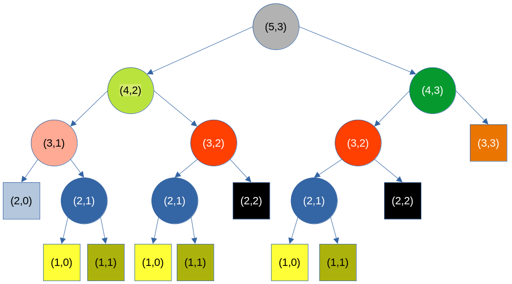

# Liczba kombinacji, czyli symbol Newtona

Naszym celem jest napisanie funkcji, która w sposób rekurencyjny wyznaczać będzie wartość symbolu Newtona $N \choose  k$, czyli liczby $k$​-elementowych podzbiorów zbioru $N$-elementowego. Symbol ten posiada znaną ze szkoły definicję rekurencyjną:

$$
{{n \choose k}={\begin{cases}1&{\mbox{dla }}k=0{\mbox{ lub }}k=n\\{n-1 \choose k-1}+{n-1 \choose k}&{\mbox{dla }}0<k<n\end{cases}}}
$$
W tym miejscu warto przytoczyć uzasadnienie tego wzoru rekurencyjnego na liczbę  $k$-elementowych podzbiorów zbioru $N$-elementowego w wersji, która przyda się w uzasadnieniu poprawności wzoru rekurencyjnego dla problemu plecakowego. 

- Otóż, po pierwsze, jasne jest, że w powyższym wzorze $N$ i $k$ są nieujemnymi liczbami całkowitymi, przy czym $0 \le k \le N$.   

- Po drugie, jeśli mamy $N$ różnych lampek i pytamy na ile sposobów możemy zapalić 0 z nich, to odpowiedź jest jasna: na jeden, po prostu nie zapalamy żadnej lampki. Podobnie jeżeli pytamy, na ile sposobów można wybrać do zapalenia $N$ lampek spośród $N$ lampek, to wynik ponownie wynosi 1 - po prostu musimy zapalić wszystkie $N$ lampek. Stąd ${N \choose k} = 1$ dla $k=0$ lub $k=N$.  

- Po trzecie, jeżeli pytamy, na ile sposobów można zapalić $k$ spośród $N$ lampek, przy czym $k >0$, to wybieramy jakąś konkretną lampkę i stwierdzamy, że albo należy ona do zbioru zapalonych lampek, albo nie należy. 

  - Jeżeli należy, to problem redukuje się nam do kwestii liczby wyborów $k-1$ lampek, które muszą być wybrane do zapalenia ze zbioru $N-1$ elementowego. 

  - Jeżeli zaś nie należy, to problem redukuje się do liczby wyborów $k$ lampek w zbiorze $N-1$ elementowym. 


​	Łącznie mamy więc ${N \choose k} = {N -1 \choose k - 1} + {N -1 \choose {k}} $ , c.b.d.o.

Implementacja powyższego wzoru rekurencyjnego jako funkcji rekurencyjnej w C++ jest prosta:

```c++        
int newton(int n, int k)
{
    if (k == 0 || k == n)
        return 1;
    return newton(n - 1, k) + newton(n - 1, k - 1);
}
```

Jeżeli jednak spróbujemy jej użyć np. w poniższym programie testowym wyznaczającym wartości $2k \choose k$ dla k = 0,...,16, to już mniej więcej przy k = 13 zaobserwujemy wyraźne zwolnienie programu. 

```c++
int main()
{
    for (int k = 0; k < 17; k++)
    {
        auto n = newton(2 * k, k);
        std::string msg = std::format("newton({}, {})\t= {}\n", 2 * k, k, n);
        std::cout << msg << std::flush;
    }
}
```

Co jest tego przyczyną? Spójrzmy na drzewo wywołań tej funkcji dla przypadku N = 5, k = 3:



Jak widać, funkcja `newton(5,3)` do wyznaczenia swojej wartości wywołuje się (z różnymi argumentami) 19 razy, a np. `newton(4, 2)` - 11 razy. Pozostawiam Czytelnikowi udowodnienie, że w ogólnym przypadku zdefiniowana powyżej funkcja `silnia` wywołana z argumentami `n, k` wywołuje się dokładnie $2{n \choose k} -1 $   razy. Najłatwiejszy dowód tego faktu można przeprowadzić metodą indukcji matematycznej.

Z powyższego rysunku można jeszcze wywnioskować dwie interesujące cechy funkcji `newton(n, k)`. Po pierwsze, drzewo jej wywołań przypomina drzewo binarne o wysokości *n* i na tej podstawie możemy spodziewać się, że liczba jej wywołań dla elementów centralnych w trójkącie Pasala (czyli argumentów postaci (`2*k, k`) odpowiadających symbolowi Newtona ${2k \choose k}$ ) będzie rzędu $2^n$, gdzie $n=2k$. Bardziej dokładne obliczenia pokazują, że wartość ta jest rzędu $2^{n}/\sqrt{n}$. Już dla n = 100, czyli dla próby wyznaczenia wartości ${100 \choose 50}$, oczywiście przy zastosowaniu arytmetyki o dostatecznie dużej precyzji, funkcja ta wywoływałaby się ok. $10^{29}$ razy. Nawet gdyby jedno wywołanie zajmowało tylko 10 ns, czas na wyznaczenie wartości ${100 \choose 50}$ tą metodą przekraczałby wiek Wszechświata. 

Drugą cechą powyższego grafu wywołań jest to, że część wywołań się powtarza. Na przykład `silnia(2,1)` wywoływana jest aż 3 razy. Sugeruje to prosty sposób uproszczenia drzewa wywołań. W tym celu wystarczyłoby wartość funkcji `silnia(n,k)` zapamiętać przy pierwszym jej wyliczeniu i potem używać już takiego gotowca w przyszłości w przypadku, gdy wartość `silnia` z akurat tymi parametrami będzie znowu potrzebna. Metodę tę nazywamy spamiętywaniem (ang. *[memoization](https://en.wikipedia.org/wiki/Memoization)*).   

Zanim ją omówię, spójrzmy na spodziewaną postać drzewa wywołań po zastosowaniu tej techniki.   


Drzewo to utworzyłem, po prostu usuwając z oryginalnego drzewa powtarzające się węzły wraz z ich poddrzewami.

Węzłów jest teraz 11. Niby niewiele mniej niż 19 w przypadku pominięcia spamiętywania, łatwo jednak wykazać, że liczba wywołań funkcji `silnia` ze spamiętywaniem nie może przekroczyć liczby elementów trójkąta Pascala w wierszach od 0 do $n-1$. Ponieważ jest ich $n(n+1)/2$, to złożoność takiego algorytmu  będzie co najwyżej kwadratowa, $O(n^2$). To jest gigantyczny postęp w porównaniu do wykładniczego $2^n$. Na przykład dla $n=100$ mamy ze spamiętywaniem nie więcej niż 5050 zamiast $10^{29}$ wywołań.

## Spamiętywanie (memoization)

### Wersja ze `std::map`
Najprostszy pojęciowo i najbardziej uniwersalny kod realizujący funkcję `newton` ze spamiętywaniem opiera się na mapie (`std::map`). Oczywiście zamiast funkcji posługujemy się teraz klasą, dzięki czemu możemy w jednym obiekcie umieścić zarówno funkcję, jak i stowarzyszoną z nią pamięć. 

#### Plik nagłówkowy

Plik nagłówkowy może wyglądać następująco:

```c++
class Newton
{
  public:
    Newton() = default;
    int operator()(int n, int k);
    int memoized_elements() const { return mapa.size(); }
  private:
    std::map<std::pair<int, int>, int> mapa;
};
```

Klasa ta ma 

- w części publicznej ("w interfejsie"):

  - konstruktor domyślny dostarczony przez kompilator (`Newton() = default;`)

  - operator wywołania funkcji służący jako wygodny interfejs dla obiektów klasy `Newton`. To ten operator służy do wyznaczania wartości symbolu Newtona.

  - funkcję `memoized_elements`, która zwraca liczbę elementów spamiętanych w danym obiekcie. Umieściłem ją tu z czystej ciekawości, choć i w poważnej implementacji miałaby swoje uzasadnienie. 

- w części prywatnej ("w implementacji"):
  - Obiekt klasy `std::map` z kluczem w postaci pary dwóch liczb typu `int` i wartością typu `int`. To w tym obiekcie będziemy spamiętywać wartości funkcji `newton` z argumentami `(n, k)`. Ponieważ `n` i `k` można reprezentować w typie `int`, stąd wybór typu klucza jako `std::pair<int, int>`. W przypadku większej liczby argumentów można się tu posłużyć krotką, czyli sablonem klasy `std::tuple`.

#### Plik z implementacją klasy 

Plik `cpp` może wyglądać następująco:

```c++     
#include "newton.h"

int Newton::operator()(int n, int k)
{
    if (k == 0 || k == n)
        return 1;

    auto it = mapa.find({n, k});
    int result;
    if (it == mapa.end())  // jeżeli mapa nie zawiera wartości dla (n, k)
    {
        result = operator()(n - 1, k - 1) + operator()(n - 1, k);
        mapa.insert({{n, k}, result});
    }
    else [[likely]]
    {
        result = it->second;
    }
    return result;
}
```

Jak widzimy, najpierw testujemy warunek zakończenia rekurencji (`k == 0 || k == n`). Postępujemy tak **zawsze**. 

Następnie sprawdzamy, czy dla danego zestawu argumentów, `n, k`,  wartość  $n \choose k$ nie została wcześniej zapisana w  obiekcie `mapa` (wyrażenie`if (it == mapa.end())`). W tym przypadku ustalamy wartość $n \choose k$​ na podstawie dwóch wywołań rekurencyjnych funkcji `operator()(int, int)`, a następnie umieszczamy ją w mapie. W przeciwnym wypadku odczytujemy gotową wartość z obiektu `mapa` za pomocą uzyskanego wcześniej iteratora `it`. Na marginesie, atrybut `[[likely]]` po słowie kluczowym `else` jest wskazówką dla kompilatora, że testowany w instrukcji `if` warunek zwykle nie będzie spełniony, co pozwala wygenerować nieco szybszy kod.

#### Użycie klasy 

Klasę `Newton` można użyć np. tak:

```c++
#include "newton.h"

#include <format>
#include <iostream>

int main()
{
    Newton newton;
    int last = 16;
    for (int k = 1; k <= last; k++)
    {
        auto n = 2 * k;
        auto result = newton(n, k);
        auto msg = std::format("newton({}, {}) = {}\n", n, k, result);
        std::cout << msg;
    }
    std::cout << "memoized: " << newton.memoized_elements() << "\n";
}
```

W funkcji `main` tworzymy obiekt `newton` klasy `Newton`. Następnie używamy go jak nazwy funkcji, np. w wyrażeniu `auto result = newton(n, k);`. Kod jest przejrzysty i chyba nie wymaga dalszego tłumaczenia, może poza wykorzystaniem `std::format`, za pomocą którego C++ usiłuje dostarczyć wygodnego  sposobu formatowania napisów, choć do Pythona jeszcze mu pod tym względem daleko. Ale akurat `std::format` to temat na inną opowieść.  Można nie wiedzieć, jak on działa, a i tak domyślić się bezbłędnie, o co chodzi w wyrażeniu, w którym `std::format` zostało użyte.  

### Wersja z `std::vector`

Przedstawiona powyżej wersja, w której dane przechowujemy w kontenerze typu `std::map`, jest uniwersalna, łatwa w implementacji i bezpieczna, jednak niespecjalnie efektywna, gdyż wyszukiwanie kluczy w `std::map` jest znacznie bardziej kosztowne niż np. w `std::vector`. Spróbujmy więc napisać wersję klasy `Newton`, w której dane będą przechowywane w kontenerze `std::vector`. Oto możliwa implementacja:

#### Deklaracja klasy 

```c++
class Newton
{
  public:
    Newton() = default;
    int operator()(int n, int k);

  private:
    constexpr int invalid_value() const { return -1; }
    std::vector<std::vector<int>> tab;
};
```

Deklaracja te w niewielkim stopniu różni się od wersji ze `std::map`.  Uwagę zwracać może funkcja `invalid_value() const`, w której typ wyniku uzupełniony jest modyfikatorem `constexpr`. To może dość okrężny, za to skuteczny sposób zdefiniowania stałej (tu: `-1`) jako nazwanej stałej czasu kompilacji. Warto też wrócić uwagę na to, że składowa `tab` to wektor wektorów, czyli tablica dwuwymiarowa. Umieścimy w niej kolejne wiersze trójkąta Pascala.  

#### Implementacja klasy

Plik nagłówkowy może wyglądać następująco:

```c++
#include "newton.h"

int Newton::operator()(int n, int k)
{
    if (k == 0 || k == n)
        return 1;

    if (tab.size() < n)
    {
        auto old_size = tab.size();
        tab.resize(n + 1);
        for (int i = old_size; i < tab.size(); i++)
        {
            tab[i].resize(i + 1, invalid_value());
        }
    }

    if (tab[n][k] < 0)
    {
        tab[n][k] = operator()(n - 1, k - 1) + operator()(n - 1, k);
    }
    return tab[n][k];
}
```

Powyższa definicja funkcji `operator()(int , int);` dość znacznie różni się od wersji opartej na `std::map`.  Przede wszystkim zakładam tu, że wartość `n` jest a priori nie znana, więc wektor `tab` początkowo jest pusty (podobnie było z `std::map`). Wynika to z... braku jawnego konstruktora, co wymusza na kompilatorze zainicjowanie składowej `tab` jej konstruktorem domyślnym, ten zaś konstruuje wektor pusty. Następnie przy każdym wywołaniu funkcji `operator()(int n, int k)` i sprawdzeniu, że nie możemy od razu wyznaczyć wartości tej funkcji (gdy `k == 0 || k == n`) , musimy sprawdzić, że wektor `tab` ma co najmniej `n + 1` elementów tak, by można było go indeksować . Jeżeli ich nie ma, to zwiększamy rozmiar tablicy do `n + 1`. Ponieważ elementami tablicy `tab` są tablice liczb, musimy rozszerzyć je do pożądanego rozmiaru, pamiętając, że n-ty wiersz trójkąta Pascala ma `n + 1` elementów i numery wiersza (`n`) liczymy od zera. Wszystkie nowe elementy inicjalizujemy wartością `-1` (zapisaną jako `invalid_value()`), która nie występuje w trójkącie Pascala. Za każdym razem, gdy będziemy potrzebować wartości $n \choose k$, a wartość odczytana z `tab[n][k]` będzie ujemna, stanowić to będzie dla nas sygnał, że właśnie po raz pierwszy wywołujemy funkcję ``operator()`  z tą konkretną parą argumentów `(n, k)`, dlatego musimy tę wartość wygenerować i zapisać w `tab[n, k]`.  Dzięki temu funkcja zawsze zwraca `tab[n, k]`. Taki rodzaj **inicjalizacji na błąd** jest typowym trickiem stosowanym w spamiętywaniu. Alternatywą byłoby użycie osobnej tablicy wartości typu `bool` przechowujących informację, czy element tablicy `tab[n. k]` zawiera poprawną wartość.

Warto jeszcze zauważyć, że aby rekurencyjnie wywołać przeciążony `operator()`, trzeba lekkiej ekwilibrystyki za składnią języka. Możemy napisać, jak powyżej, `operator()(n - 1, k - 1)`. Można by tu także użyć wyrażenia `(*this)(n - 1, k - 1)` lub nawet `this->operator()(n - 1, k - 1)`. 

Reasumując, wersja ze spamiętywaniem w kontenerze typu mapa (`std::map`) jest prostsza, gdyż łatwo sprawdzić, czy dany element jest w niej przechowywany, łatwo go z niej odczytać i łatwo do niej wstawić nową informację. Ceną za elegancję i bezpieczeństwo jest dość słaba wydajność (tj. szybkość działania). Wersja z `std::vector` prawdopodobnie działać będzie szybciej, ale może potrzebować więcej pamięci, a jej implementacja wymaga pilnowania, by przypadkiem nie sięgnąć poza rozmiar tablicy.
